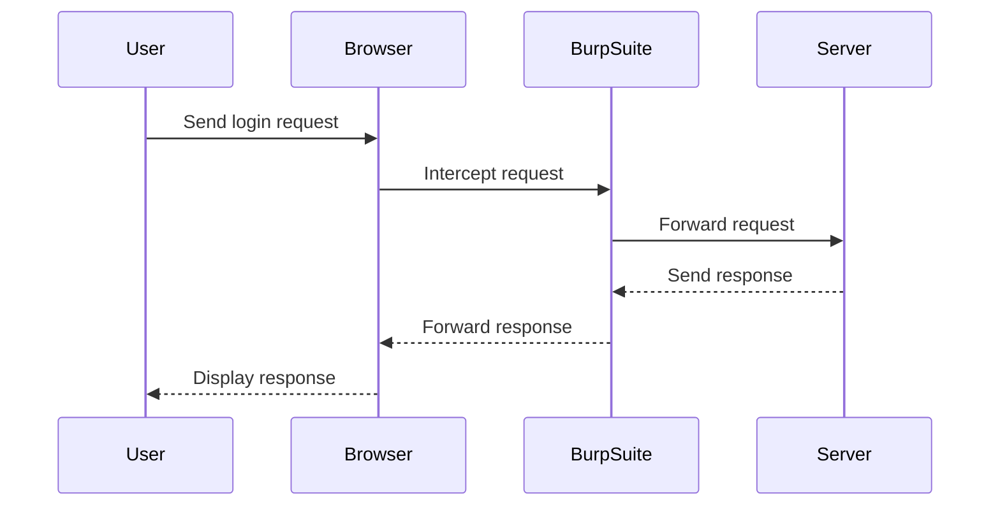

## Introduction to Authentication Vulnerabilities

Authentication vulnerabilities are critical weaknesses in web applications that allow attackers to bypass or manipulate authentication mechanisms. One such vulnerability is the brute-forcing of a "stay logged in" cookie. This type of vulnerability occurs when a web application uses a predictable or weakly generated cookie to maintain a user's session across browser sessions. By brute-forcing the cookie, an attacker can impersonate a legitimate user and gain unauthorized access to sensitive information.

### Background Theory

#### What is a "Stay Logged In" Cookie?

A "stay logged in" cookie, also known as a persistent session cookie, is a mechanism used by web applications to keep a user authenticated even after they close their browser. This is typically achieved by setting a long-lived cookie that contains a unique identifier for the user's session. When the user returns to the site, the cookie is sent with their request, and the server recognizes the user and maintains their session.

#### Why is Brute-Forcing a "Stay Logged In" Cookie a Vulnerability?

Brute-forcing a "stay logged in" cookie is a vulnerability because it allows an attacker to systematically guess the value of the cookie until they find a valid one. If the cookie is poorly designed or generated, it may be susceptible to brute-forcing attacks. This can lead to unauthorized access to user accounts, theft of personal data, and other malicious activities.

### Real-World Examples

#### Recent Breaches Involving "Stay Logged In" Cookies

One notable example of a breach involving "stay logged in" cookies is the LinkedIn breach in 2012. Hackers were able to access user accounts by exploiting a vulnerability in the way LinkedIn handled session management. The hackers used brute-forcing techniques to guess the values of session cookies, leading to unauthorized access to millions of user accounts.

Another example is the breach of the popular dating app Ashley Madison in 2015. The attackers exploited a vulnerability in the session management system, allowing them to brute-force session cookies and gain access to user accounts.

### Lab Setup and Environment

To understand and practice the brute-forcing of a "stay logged in" cookie, we will use the PortSwigger Web Security Academy. This lab environment provides a controlled and educational setting to explore and learn about web security vulnerabilities.

#### Accessing the Lab

1. **Sign Up**: Visit `https://portswigger.net/web-security` and click on the sign-up button to create an account.
2. **Navigate to the Lab**:
    - Log in to your account.
    - Click on the "Academy" tab.
    - Select "All Labs".
    - Search for "authentication".
    - Choose "Lab 9: Brutforcing a Stay Logged in Cookie".

### Understanding the Lab Scenario

In this lab, we are tasked with brute-forcing the "stay logged in" cookie for the user "Carlos". The goal is to gain access to Carlos' "My Accounts" page by exploiting the vulnerability in the cookie generation process.

### Tools and Techniques

#### Burp Suite Professional

We will use Burp Suite Professional, a comprehensive toolkit for web application security testing. Specifically, we will leverage the Intruder feature to perform the brute-forcing attack.

#### Setting Up Burp Suite

1. **Install Burp Suite**: Download and install Burp Suite Professional from the official website.
2. **Configure Proxy**: Set up Burp Suite as a proxy to intercept and modify HTTP requests.
3. **Browser Configuration**: Configure your browser to use Burp Suite as the proxy.

### Step-by-Step Attack Execution

#### Identifying the Target Cookie

1. **Log In as Carlos**: Navigate to the login page and log in as the user "Carlos".
2. **Intercept Requests**: Use Burp Suite to intercept the HTTP requests made during the login process.
3. **Identify the Cookie**: Look for the "stay logged in" cookie in the intercepted requests. This cookie will be used to maintain the session across browser sessions.

#### Configuring Burp Suite Intruder

1. **Send Request to Intruder**: Right-click on the request containing the "stay logged in" cookie and select "Send to Intruder".
2. **Set Payloads**: Configure the payloads to brute-force the cookie value. You can use a list of potential values or generate a custom list based on the cookie structure.
3. **Start Intruder**: Begin the brute-forcing process by clicking "Start Attack".

#### Analyzing the Response

1. **Monitor Responses**: Observe the responses from the server to identify successful attempts.
2. **Access Carlos' Account**: Once a valid cookie value is found, use it to access Carlos' "My Accounts" page.

### Full Example with Code

#### HTTP Request and Response

```http
GET /login HTTP/1.1
Host: vulnerable-app.com
Cookie: stay_logged_in=1234567890abcdef

HTTP/1.1 200 OK
Date: Mon, 20 Nov 2023 12:00:00 GMT
Server: Apache/2.4.41 (Ubuntu)
Content-Type: text/html; charset=UTF-8
Set-Cookie: stay_logged_in=1234567890abcdef; Path=/; HttpOnly
```

#### Brute-Forcing with Burp Suite



### Common Pitfalls and Mistakes

#### Predictable Cookie Values

One common mistake is generating predictable cookie values. If the cookie values follow a predictable pattern, they can be easily brute-forced. Ensure that the cookie values are randomly generated and sufficiently complex.

#### Lack of Rate Limiting

Another pitfall is the lack of rate limiting on login attempts. Without rate limiting, an attacker can perform rapid brute-forcing attacks. Implement rate limiting to slow down and deter brute-forcing attempts.

### How to Prevent / Defend Against Brute-Forcing Attacks

#### Secure Cookie Generation

1. **Randomness**: Generate cookie values using a cryptographically secure random number generator.
2. **Complexity**: Ensure that the cookie values are sufficiently complex and difficult to predict.

#### Rate Limiting

Implement rate limiting on login attempts to slow down brute-forcing attacks. For example:

```python
from flask import Flask, request
from time import sleep

app = Flask(__name__)

# Dictionary to store failed login attempts
failed_attempts = {}

@app.route('/login', methods=['POST'])
def login():
    username = request.form['username']
    password = request.form['password']

    # Check if the user has exceeded the allowed number of attempts
    if username in failed_attempts and failed_attempts[username] >= 5:
        sleep(5)  # Wait for 5 seconds before processing the request
        failed_attempts[username] += 1
    else:
        failed_attempts[username] = 1

    # Process the login attempt
    # ...

if __name__ == '__main__':
    app.run()
```

#### Two-Factor Authentication (2FA)

Implement two-factor authentication to add an additional layer of security. Even if an attacker gains access to the cookie, they would still need the second factor to authenticate.

#### Monitoring and Logging

Monitor and log login attempts to detect and respond to suspicious activity. Use tools like SIEM (Security Information and Event Management) systems to analyze and alert on potential brute-forcing attempts.

### Conclusion

Brute-forcing a "stay logged in" cookie is a serious vulnerability that can lead to unauthorized access to user accounts. By understanding the underlying mechanisms and implementing robust security measures, you can protect against such attacks. Always ensure that your web applications use strong, unpredictable session management practices and implement additional layers of security like rate limiting and two-factor authentication.

### Practice Labs

For hands-on practice with this topic, consider the following labs:

- **PortSwigger Web Security Academy**: Lab 9 - Brutforcing a Stay Logged in Cookie
- **OWASP Juice Shop**: Various labs related to session management and authentication vulnerabilities
- **DVWA (Damn Vulnerable Web Application)**: Labs related to session management and brute-forcing attacks

These labs provide a controlled environment to practice and reinforce your understanding of authentication vulnerabilities and how to defend against them.

---
<!-- nav -->
[[Web Security (PortSwigger)/13-Authentication Vulnerabilities/10-Lab 9 Brute forcing a stay logged in cookie/00-Overview|Overview]] | [[02-Authentication Vulnerabilities Brute Forcing a Stay Logged In Cookie|Authentication Vulnerabilities Brute Forcing a Stay Logged In Cookie]]
