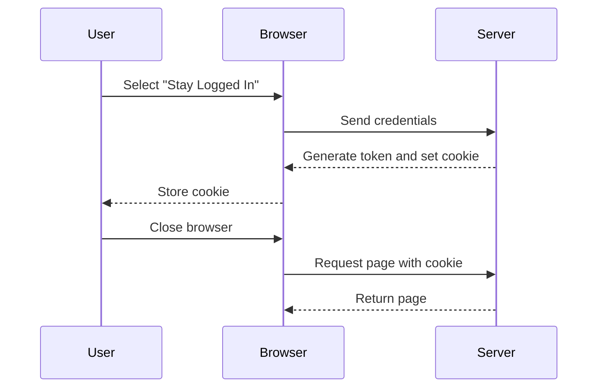

## Understanding Authentication Vulnerabilities

### Introduction to Authentication Mechanisms

Authentication is a critical component of web security, ensuring that users are who they claim to be. Common authentication methods include username/password combinations, multi-factor authentication (MFA), and session-based authentication. In this context, we will focus on session-based authentication, specifically the "stay logged in" feature, which often uses cookies to maintain user sessions.

### Stay Logged In Feature

The "stay logged in" feature allows users to remain authenticated even after closing their browser. This is typically implemented using a persistent cookie that contains a unique identifier for the user. When the user returns to the site, the server checks the cookie to determine if the user should be automatically logged in.

#### How Stay Logged In Works

When a user selects the "stay logged in" option, the server generates a unique token and stores it in a persistent cookie. This token is usually a combination of the username and a hashed password. Here’s a simplified breakdown:

1. **User Selection**: User selects "stay logged in."
2. **Token Generation**: Server generates a token combining the username and a hashed password.
3. **Cookie Storage**: Token is stored in a persistent cookie.
4. **Session Restoration**: On subsequent visits, the server checks the cookie and restores the session.

### Example of Stay Logged In Implementation

Let's consider a simple implementation where the token is a Base64 encoding of the username concatenated with a colon and an MD5 hash of the password.

```python
import base64
import hashlib

def generate_token(username, password):
    # Concatenate username and password
    combined = f"{username}:{password}"
    # Hash the combined string
    hashed_password = hashlib.md5(combined.encode()).hexdigest()
    # Encode the result in Base64
    token = base64.b64encode(hashed_password.encode()).decode()
    return token

# Example usage
username = "Carlos"
password = "peter"
token = generate_token(username, password)
print(token)
```

### Vulnerability Analysis: Brute Forcing Stay Logged In Cookies

One significant vulnerability associated with the "stay logged in" feature is the potential for brute-forcing the password. If the server does not implement proper brute-force protection mechanisms, attackers can attempt to guess the password by repeatedly submitting different passwords until they find the correct one.

#### Steps to Exploit the Vulnerability

1. **Capture the Cookie**: Intercept the cookie containing the hashed password.
2. **Brute Force the Password**: Use a dictionary or brute-force approach to guess the password.
3. **Submit the Correct Password**: Once the correct password is found, submit it to gain unauthorized access.

### Real-World Example: CVE-2021-44228 (Log4Shell)

While not directly related to the "stay logged in" feature, the Log4Shell vulnerability (CVE-2021-44228) demonstrates the importance of securing all aspects of web applications. This vulnerability allowed attackers to execute arbitrary code on servers running Apache Log4j, leading to widespread exploitation.

#### How to Capture and Analyze the Cookie

To capture and analyze the cookie, you can use tools like Burp Suite. Here’s a step-by-step guide:

1. **Intercept Traffic**: Use Burp Suite to intercept HTTP traffic.
2. **Select Relevant Traffic**: Identify the traffic related to the "stay logged in" feature.
3. **Verify the Cookie**: Ensure the cookie contains the hashed password.



### Brute Forcing the Password

Once the cookie is captured, the next step is to brute force the password. This involves generating a large number of password guesses and hashing them to compare against the captured token.

#### Code Example for Brute Forcing

```python
import base64
import hashlib

def brute_force_password(token, wordlist):
    for password in wordlist:
        combined = f"Carlos:{password}"
        hashed_password = hashlib.md5(combined.encode()).hexdigest()
        generated_token = base64.b64encode(hashed_password.encode()).decode()
        if generated_token == token:
            return password
    return None

# Example usage
token = "your_captured_token_here"
wordlist = ["peter", "carlos", "123456"]
correct_password = brute_force_password(token, wordlist)
print(f"Correct password: {correct_password}")
```

### Detection and Prevention

#### Detection

To detect brute-forcing attempts, you can monitor for repeated login failures or unusual patterns of login activity. Tools like intrusion detection systems (IDS) can help identify such patterns.

#### Prevention

1. **Implement Rate Limiting**: Limit the number of login attempts within a certain time frame.
2. **Use Strong Hashing Algorithms**: Avoid using weak algorithms like MD5. Instead, use stronger algorithms like bcrypt or scrypt.
3. **Multi-Factor Authentication (MFA)**: Require additional verification steps beyond just the password.
4. **Secure Coding Practices**: Ensure that sensitive data is handled securely and that proper input validation is performed.

#### Secure Code Example

Here’s an example of how to securely handle the "stay logged in" feature using bcrypt for hashing:

```python
import base64
import bcrypt

def generate_secure_token(username, password):
    # Hash the password using bcrypt
    hashed_password = bcrypt.hashpw(password.encode(), bcrypt.gensalt())
    # Combine username and hashed password
    combined = f"{username}:{hashed_password.decode()}"
    # Encode the result in Base64
    token = base64.b64encode(combined.encode()).decode()
    return token

# Example usage
username = "Carlos"
password = "peter"
secure_token = generate_secure_token(username, password)
print(secure_token)
```

### Hands-On Practice

For hands-on practice, you can use the following labs:

- **PortSwigger Web Security Academy**: Offers a variety of labs covering different web security topics, including authentication vulnerabilities.
- **OWASP Juice Shop**: A deliberately insecure web application for practicing web security skills.
- **DVWA (Damn Vulnerable Web Application)**: Another popular web application for learning about web security vulnerabilities.

These labs provide a safe environment to practice and understand the concepts discussed in this chapter.

### Conclusion

Understanding and securing the "stay logged in" feature is crucial for maintaining the integrity of web applications. By implementing strong hashing algorithms, rate limiting, and multi-factor authentication, you can significantly reduce the risk of brute-forcing attacks. Always ensure that sensitive data is handled securely and that proper input validation is performed to prevent unauthorized access.

---
<!-- nav -->
[[03-Setting Up the Environment|Setting Up the Environment]] | [[Web Security (PortSwigger)/13-Authentication Vulnerabilities/10-Lab 9 Brute forcing a stay logged in cookie/00-Overview|Overview]] | [[Web Security (PortSwigger)/13-Authentication Vulnerabilities/10-Lab 9 Brute forcing a stay logged in cookie/05-Practice Questions & Answers|Practice Questions & Answers]]
