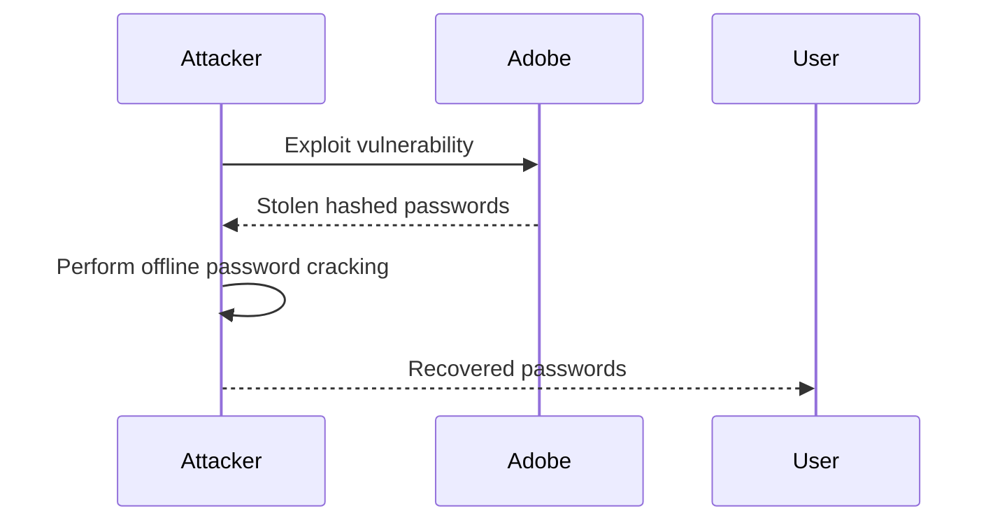
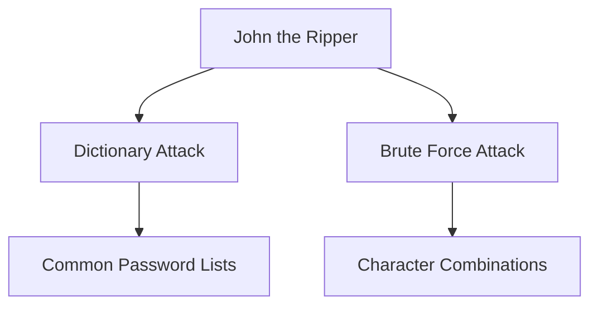
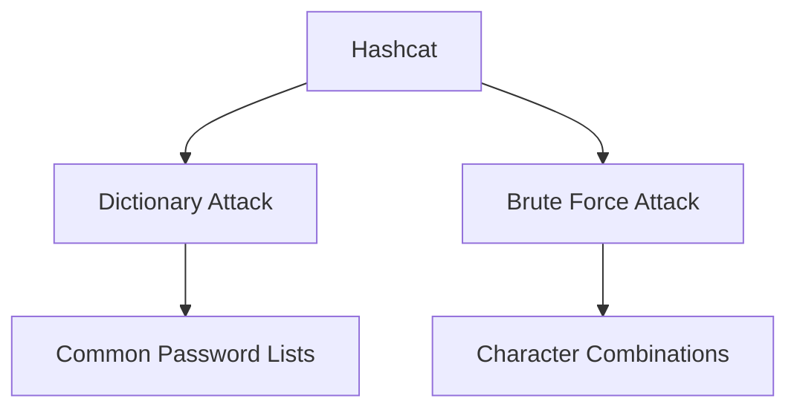
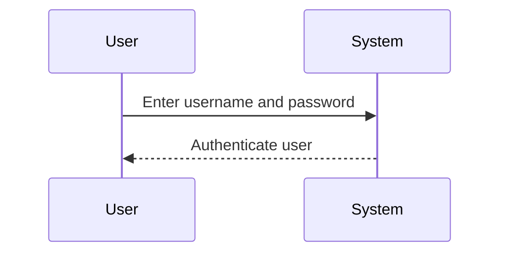
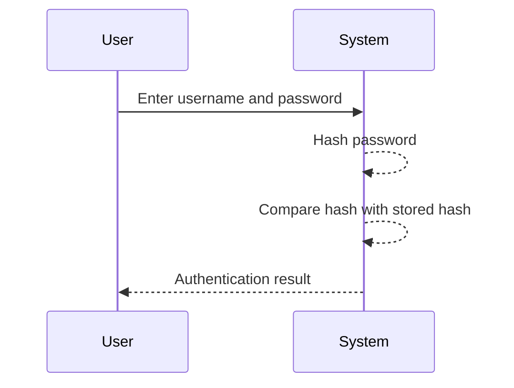

## Introduction to Authentication Vulnerabilities

Authentication vulnerabilities are critical weaknesses that allow attackers to bypass or manipulate the mechanisms designed to verify user identities. These vulnerabilities can lead to unauthorized access, data breaches, and other severe security issues. In this chapter, we will delve into one of the most common types of authentication vulnerabilities: offline password cracking. We will explore the underlying principles, recent real-world examples, and provide detailed steps on how to prevent such attacks.

### Background Theory

#### What is Authentication?

Authentication is the process of verifying the identity of a user, device, or system. It ensures that the entity attempting to access resources is indeed who they claim to be. Common methods of authentication include:

- **Username and Password**: The most widely used method, where users provide a unique identifier (username) and a secret (password).
- **Multi-Factor Authentication (MFA)**: Combines two or more independent verification methods, such as something the user knows (password), something the user has (smartphone), or something the user is (biometrics).

#### Why is Authentication Important?

Authentication is crucial because it forms the first line of defense against unauthorized access. Without proper authentication, attackers can easily impersonate legitimate users and gain access to sensitive information or systems.

### Offline Password Cracking

Offline password cracking refers to the process of attempting to guess or recover passwords from stolen hashed credentials. This type of attack is particularly dangerous because it does not rely on direct interaction with the target system, making it harder to detect.

#### How Does Offline Password Cracking Work?

1. **Credential Theft**: Attackers first steal hashed passwords from a database or other storage mechanism. This can happen through various means, such as SQL injection, phishing, or exploiting vulnerabilities in the system.
2. **Hash Analysis**: Once the hashes are obtained, attackers analyze them to determine the hashing algorithm used. Common algorithms include MD5, SHA-1, and bcrypt.
3. **Dictionary Attacks**: Attackers use precomputed lists of common passwords (dictionaries) to match the stolen hashes. Tools like John the Ripper and Hashcat are commonly used for this purpose.
4. **Brute Force Attacks**: If dictionary attacks fail, attackers may resort to brute force methods, trying every possible combination of characters until a match is found.

### Recent Real-World Examples

#### Example 1: LinkedIn Breach (CVE-2012-3955)

In 2012, LinkedIn suffered a massive data breach where approximately 6.5 million hashed passwords were stolen. The attackers used offline password cracking techniques to recover many of these passwords. This breach highlighted the importance of using strong hashing algorithms and implementing additional security measures.


#### Example 2: Adobe Breach (CVE-2013-2094)

In 2013, Adobe experienced a significant data breach where over 150 million user records, including hashed passwords, were compromised. The attackers used offline password cracking to recover many of these passwords. This incident underscored the need for robust password storage practices and the importance of multi-factor authentication.



### Tools and Techniques

#### John the Ripper

John the Ripper is a popular open-source password cracking tool. It supports a wide range of hashing algorithms and can be used to perform both dictionary and brute force attacks.



#### Hashcat

Hashcat is another powerful password cracking tool that supports multiple platforms and hashing algorithms. It is known for its speed and efficiency in cracking complex passwords.



### Practical Lab Setup

For this lab, we will use the community edition of a password cracking tool, such as John the Ripper or Hashcat. The goal is to understand how offline password cracking works and how to defend against it.

#### Step 1: Log in Using Regular Account

First, we need to log in to the system using the regular account provided. This step helps us understand the authentication process and identify potential vulnerabilities.



#### Step 2: Analyze Authentication Function

Next, we analyze the authentication function to understand how passwords are stored and verified. This step is crucial for identifying weaknesses that can be exploited.



### Common Pitfalls and Mistakes

#### Weak Passwords

Using weak or common passwords significantly increases the risk of successful offline password cracking. It is essential to enforce strong password policies and educate users about the importance of choosing secure passwords.

#### Insufficient Hashing Algorithms

Using weak hashing algorithms, such as MD5 or SHA-1, makes it easier for attackers to crack passwords. Stronger algorithms like bcrypt or Argon2 should be used to protect passwords.

### How to Prevent / Defend Against Offline Password Cracking

#### Secure Password Storage

To prevent offline password cracking, it is crucial to store passwords securely. This involves using strong hashing algorithms and implementing additional security measures.

##### Vulnerable Code Example

```python
# Vulnerable code: Storing passwords using MD5
import hashlib

def store_password(password):
    hashed_password = hashlib.md5(password.encode()).hexdigest()
    return hashed_password
```

##### Secure Code Example

```python
# Secure code: Storing passwords using bcrypt
import bcrypt

def store_password(password):
    salt = bcrypt.gensalt()
    hashed_password = bcrypt.hashpw(password.encode(), salt)
    return hashed_password
```

#### Multi-Factor Authentication (MFA)

Implementing multi-factor authentication adds an extra layer of security, making it much harder for attackers to gain unauthorized access even if they manage to crack a password.

##### Example Configuration

```json
{
  "mfa_enabled": true,
  "mfa_methods": ["sms", "email", "authenticator_app"]
}
```

#### Password Policies

Enforcing strong password policies, such as requiring a minimum length, complexity, and regular password changes, can significantly reduce the risk of successful offline password cracking.

##### Example Policy

```json
{
  "min_length": 12,
  "require_uppercase": true,
  "require_lowercase": true,
  "require_numbers": true,
  "require_special_chars": true,
  "change_frequency": "90 days"
}
```

### Hands-On Labs

To practice and reinforce your understanding of offline password cracking and how to defend against it, consider the following labs:

- **PortSwigger Web Security Academy**: Offers interactive labs on various web security topics, including authentication vulnerabilities.
- **OWASP Juice Shop**: A deliberately insecure web application for practicing web security skills.
- **DVWA (Damn Vulnerable Web Application)**: A PHP/MySQL web application that demonstrates common web application vulnerabilities.

These labs provide practical experience in identifying and mitigating authentication vulnerabilities, helping you develop the skills needed to protect systems from offline password cracking attacks.

### Conclusion

Understanding and defending against offline password cracking is crucial for maintaining the security of web applications and systems. By implementing strong password storage practices, enforcing multi-factor authentication, and adhering to robust password policies, organizations can significantly reduce the risk of unauthorized access. Through hands-on labs and real-world examples, you can gain the knowledge and skills needed to effectively protect against these types of attacks.

---
<!-- nav -->
[[01-Introduction to Authentication Vulnerabilities and Offline Password Cracking|Introduction to Authentication Vulnerabilities and Offline Password Cracking]] | [[Web Security (PortSwigger)/13-Authentication Vulnerabilities/11-Lab 10 Offline password cracking/00-Overview|Overview]] | [[03-Introduction to Cross-Site Scripting (XSS)|Introduction to Cross-Site Scripting (XSS)]]
