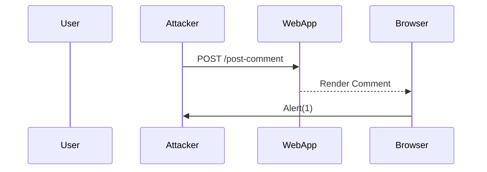

## Detailed Explanation of the Example Provided

In the lecture transcript, the example focuses on a reflected XSS vulnerability in a blog post application. Let's break down the steps and concepts involved in this example.

### Step-by-Step Breakdown

1. **Identify the Injection Point**:
   - The application reflects user input in the comment field of a blog post.
   - The attacker finds a place where user input is reflected back to the user without proper sanitization.

2. **Inject the Script**:
   - The attacker injects a simple script into the comment field.
   - The script is designed to pop up an alert box with the number `1` when executed.

3. **Execute the Script**:
   - When the user views the post, the browser executes the injected script.
   - The result is an alert box with the number `1`, confirming the successful execution of the script.

### Code Example

Let's look at the code example provided in the lecture transcript:

#### HTML Form

```html
<form action="/post-comment" method="POST">
    <input type="text" name="name" placeholder="Name">
    <textarea name="comment" placeholder="Comment"></textarea>
    <input type="submit" value="Post Comment">
</form>
```

#### Injected Script

```html
<script>alert(1)</script>
```

#### Full HTTP Request and Response

#### HTTP Request

```http
POST /post-comment HTTP/1.1
Host: example.com
Content-Type: application/x-www-form-urlencoded
Content-Length: 46

name=test&comment=%3Cscript%3Ealert(1)%3C%2Fscript%3E
```

#### HTTP Response

```http
HTTP/1.1 200 OK
Date: Tue, 01 Aug 2023 12:00:00 GMT
Content-Type: text/html; charset=UTF-8
Content-Length: 123

<!DOCTYPE html>
<html>
<head>
    <title>Blog Post</title>
</head>
<body>
    <div>
        <strong>test</strong>: <script>alert(1)</script>
    </div>
</body>
</html>
```

### Mermaid Diagram

A mermaid diagram can help visualize the flow of the attack:



### Pitfalls and Common Mistakes

1. **Improper Input Validation**:
   - Failing to validate and sanitize user inputs can lead to XSS vulnerabilities.
   - Always validate and sanitize user inputs before rendering them in the HTML.

2. **Missing Output Encoding**:
   - Failing to encode user inputs before rendering them in the HTML can lead to XSS vulnerabilities.
   - Always encode user inputs before rendering them in the HTML.

3. **Weak Content Security Policy (CSP)**:
   - Failing to implement a strong CSP can make it easier for attackers to inject and execute malicious scripts.
   - Always implement a strong CSP to restrict the sources of executable scripts.

### How to Prevent / Defend Against XSS

#### Detection

Use automated tools to scan your application for XSS vulnerabilities. Regularly review and update your security policies.

#### Prevention

1. **Input Validation**: Always validate and sanitize user inputs.
2. **Output Encoding**: Encode all user inputs before rendering them in the HTML.
3. **Content Security Policy (CSP)**: Implement CSP to restrict the sources of executable scripts.

#### Secure Coding Fixes

Compare the vulnerable and secure versions of the code to understand the differences:

#### Vulnerable Code

```python
def post_comment(name, comment):
    return f"<div><strong>{name}</strong>: {comment}</div>"
```

#### Secure Code

```python
import html

def post_comment(name, comment):
    safe_name = html.escape(name)
    safe_comment = html.escape(comment)
    return f"<div><strong>{safe_name}</strong>: {safe_comment}</div>"
```

### Hands-On Labs

To practice and reinforce your understanding of XSS vulnerabilities, consider the following labs:

- **PortSwigger Web Security Academy**: Offers interactive labs to learn about XSS and other web security topics.
- **OWASP Juice Shop**: A deliberately insecure web application for practicing web security skills.
- **DVWA (Damn Vulnerable Web Application)**: A PHP/MySQL web application that demonstrates insecure coding practices.

### Conclusion

Understanding and preventing XSS vulnerabilities is crucial for securing web applications. By following best practices and using secure coding techniques, you can significantly reduce the risk of XSS attacks.

---

---
<!-- nav -->
[[06-Cross-Site Scripting (XSS) Vulnerability|Cross-Site Scripting (XSS) Vulnerability]] | [[Web Security (PortSwigger)/13-Authentication Vulnerabilities/11-Lab 10 Offline password cracking/00-Overview|Overview]] | [[08-Understanding Authentication Vulnerabilities|Understanding Authentication Vulnerabilities]]
