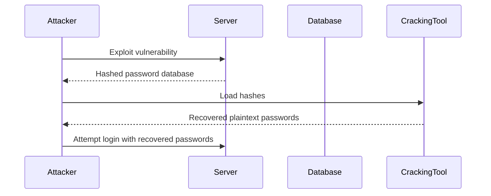

## Understanding Authentication Vulnerabilities

### Introduction to Authentication Vulnerabilities

Authentication vulnerabilities are critical weaknesses in web applications that allow attackers to bypass authentication mechanisms and gain unauthorized access to sensitive resources. These vulnerabilities can arise due to poor implementation, weak security practices, or outdated technologies. In this section, we will delve into the details of one such vulnerability: offline password cracking.

### What is Offline Password Cracking?

Offline password cracking is an attack technique where an attacker gains access to a hashed password database and attempts to crack the passwords using various methods, such as brute force, dictionary attacks, or rainbow tables. This type of attack is particularly dangerous because it does not rely on online interactions with the target system, making it harder to detect and mitigate.

#### Why Does Offline Password Cracking Matter?

Offline password cracking is significant because it allows attackers to bypass traditional security measures such as rate limiting and account lockouts. Once an attacker has obtained the hashed passwords, they can perform the cracking process offline, using powerful computing resources to try millions of password combinations per second.

### How Does Offline Password Cracking Work?

To understand offline password cracking, let's break down the process:

1. **Data Exfiltration**: The first step is to obtain the hashed password database. This can happen through various means, such as SQL injection, misconfigured servers, or stolen backups.
   
2. **Hash Analysis**: Once the attacker has the hashed passwords, they analyze the hash algorithm used. Common algorithms include MD5, SHA-1, and bcrypt.

3. **Cracking Process**: The attacker uses specialized tools to attempt to crack the hashes. These tools can employ different techniques:
   - **Brute Force**: Trying every possible combination of characters.
   - **Dictionary Attack**: Using a list of common passwords.
   - **Rainbow Tables**: Precomputed tables of hash outputs for common inputs.

4. **Password Recovery**: If successful, the attacker recovers the plaintext passwords, which can then be used to gain unauthorized access to the system.

### Real-World Examples

Recent breaches have highlighted the dangers of offline password cracking:

- **Equifax Breach (2017)**: Hackers exploited a vulnerability in Apache Struts to gain access to Equifax’s systems and steal personal data, including hashed passwords. Although Equifax used strong hashing algorithms, the sheer volume of data and the use of weak passwords made it possible for attackers to recover many passwords.
  
- **Yahoo Breach (2013-2014)**: Yahoo suffered a massive breach where hackers stole hashed passwords. Despite using bcrypt, the use of weak passwords allowed attackers to recover many plaintext passwords.

### Code Example: Hashed Password Database

Let's consider a simple example of a hashed password database:

```sql
CREATE TABLE users (
    id INT PRIMARY KEY,
    username VARCHAR(50),
    password_hash VARCHAR(255)
);

INSERT INTO users (id, username, password_hash) VALUES
(1, 'alice', '$2a$10$z3wXJYKQyjZmNqRtUvWxOeFgHjKlMnOpQrStUvWx'),
(2, 'bob', '$2a$10$z3wXJYKQyjZmNqRtUvWxOeFgHjKlMnOpQrStUvWx');
```

In this example, the `password_hash` column contains bcrypt hashes of the passwords.

### How to Prevent / Defend Against Offline Password Cracking

#### Detection

To detect potential offline password cracking attempts, organizations should implement the following measures:

- **Monitor Access Logs**: Regularly review access logs for unusual activity, such as repeated login attempts or access to the password database.
- **Use Intrusion Detection Systems (IDS)**: Implement IDS to monitor network traffic and detect suspicious patterns indicative of data exfiltration.

#### Prevention

Preventing offline password cracking involves several best practices:

- **Strong Hashing Algorithms**: Use strong, modern hashing algorithms like bcrypt, scrypt, or Argon2. Avoid weak algorithms like MD5 and SHA-1.
- **Salted Hashes**: Always use salts when hashing passwords. Salts are random values added to each password before hashing, making it much harder to crack multiple passwords simultaneously.
- **Rate Limiting**: Implement rate limiting on login attempts to slow down brute force attacks.
- **Account Lockout Policies**: Automatically lock accounts after a certain number of failed login attempts.
- **Multi-Factor Authentication (MFA)**: Require MFA for additional security, even if passwords are compromised.

#### Secure Coding Fixes

Here is an example of how to securely store passwords using bcrypt in Python:

```python
import bcrypt

# Generate a salt
salt = bcrypt.gensalt()

# Hash a password
password = b"mysecretpassword"
hashed_password = bcrypt.hashpw(password, salt)

# Store the hashed password in the database
# ...

# Verify a password
if bcrypt.checkpw(password, hashed_password):
    print("Password matches")
else:
    print("Password does not match")
```

### Mermaid Diagram: Offline Password Cracking Process



### Practice Labs

For hands-on practice with authentication vulnerabilities, consider the following labs:

- **PortSwigger Web Security Academy**: Offers comprehensive modules on authentication vulnerabilities, including offline password cracking.
- **OWASP Juice Shop**: A deliberately insecure web application for practicing various security attacks, including authentication vulnerabilities.
- **DVWA (Damn Vulnerable Web Application)**: Provides a range of web application vulnerabilities, including weak authentication mechanisms.

By thoroughly understanding the concepts, techniques, and defenses related to offline password cracking, you can better protect web applications from these types of attacks.

---
<!-- nav -->
[[07-Detailed Explanation of the Example Provided|Detailed Explanation of the Example Provided]] | [[Web Security (PortSwigger)/13-Authentication Vulnerabilities/11-Lab 10 Offline password cracking/00-Overview|Overview]] | [[Web Security (PortSwigger)/13-Authentication Vulnerabilities/11-Lab 10 Offline password cracking/09-Practice Questions & Answers|Practice Questions & Answers]]
