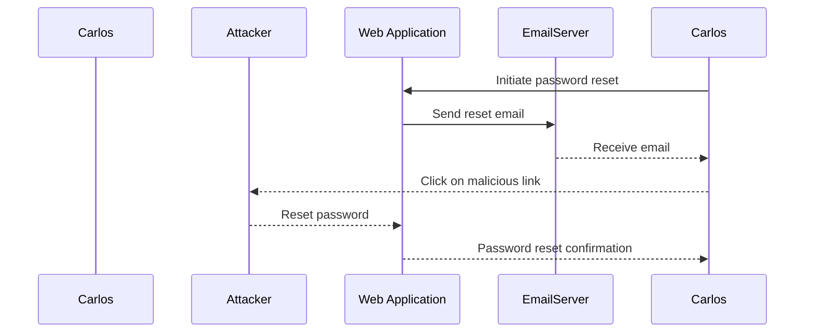

## Introduction to Authentication Vulnerabilities

Authentication vulnerabilities are among the most critical issues in web security. They allow attackers to impersonate legitimate users, gain unauthorized access to sensitive information, and perform actions that could compromise the integrity and confidentiality of a system. One such vulnerability is **Password Reset Poisoning**, which exploits weaknesses in the password reset functionality of web applications.

### What is Password Reset Poisoning?

Password reset poisoning occurs when an attacker manipulates the process of resetting a user’s password. Typically, this involves sending a malicious link to the victim via email or another communication channel. When the victim clicks on the link, the attacker gains control over the password reset process, potentially allowing them to reset the victim's password and take over their account.

### Why Does Password Reset Poisoning Matter?

Password reset mechanisms are designed to help users regain access to their accounts if they forget their passwords. However, these mechanisms can be exploited by attackers to bypass authentication controls. This vulnerability is particularly dangerous because it often relies on social engineering—convincing the victim to click on a seemingly legitimate link. Once the attacker has access to the account, they can perform various malicious activities, including stealing sensitive data, making unauthorized transactions, or spreading malware.

### How Does Password Reset Poisoning Work?

To understand how password reset poisoning works, let's break down the typical steps involved:

1. **User Requests Password Reset**: A legitimate user requests a password reset by entering their username or email address into the application.
2. **Email Sent to User**: The application sends an email to the user containing a link to reset their password. This link usually includes a unique token that is valid for a short period.
3. **Attacker Intercepts Email**: An attacker intercepts the email or convinces the user to click on a malicious link.
4. **Malicious Link Clicked**: The user clicks on the malicious link, which redirects them to a page controlled by the attacker.
5. **Token Manipulation**: The attacker uses the token to reset the user’s password, thereby gaining access to the account.

### Real-World Examples

One notable example of password reset poisoning occurred in the Equifax breach in 2017. Attackers exploited vulnerabilities in the password reset functionality to gain unauthorized access to user accounts. This breach affected approximately 147 million people and resulted in significant financial and reputational damage.

Another example is the LinkedIn breach in 2012, where attackers used stolen email addresses and passwords to reset the passwords of other users. This allowed them to access sensitive information and spread malware through the platform.

### Lab Setup

In this lab, we will simulate a scenario where an attacker can exploit a password reset vulnerability to gain access to a user's account. We will use the Web Security Academy provided by PortSwigger as our testing environment.

#### Accessing the Lab

1. **Sign Up**: Visit `https://portswigger.net/web-security` and click on the sign-up button to create an account.
2. **Navigate to Labs**: Once logged in, navigate to the Academy section and select all labs.
3. **Search for Authentication Labs**: Use the search function to find the authentication labs.
4. **Select Lab 11**: Locate and open Lab 11 titled “Password Reset Poisoning via Middleware.”

### Understanding the Scenario

In this lab, the user Carlos is prone to clicking on any links in emails he receives. Our goal is to exploit a vulnerability in the password reset functionality to access Carlos’ account.

#### Tools Used

- **Burp Suite**: A comprehensive toolkit for web application security testing.
- **Web Browser**: For interacting with the web application.

### Step-by-Step Exploitation

1. **Log into Your Account**:
    - Use the provided credentials to log into your own account.
    - Note that any emails sent to this account can be read via the email client on the exploit server.

2. **Initiate Password Reset**:
    - Navigate to the password reset functionality of the web application.
    - Enter Carlos’ email address and initiate the password reset process.

3. **Intercept the Email**:
    - Use Burp Suite to intercept the email sent to Carlos.
    - The email contains a link with a unique token that can be used to reset the password.

4. **Manipulate the Token**:
    - Modify the token in the intercepted email to ensure it points to a page controlled by the attacker.
    - Send the modified email to Carlos.

5. **Carlos Clicks the Link**:
    - When Carlos clicks the link, the attacker gains control over the password reset process.
    - The attacker can now reset Carlos’ password and log into his account.

### Detailed Example

Let's walk through a detailed example of how this exploitation might look in practice.

#### Initial Request

When Carlos initiates the password reset process, the following HTTP request is sent:

```http
POST /reset-password HTTP/1.1
Host: vulnerable-app.com
Content-Type: application/x-www-form-urlencoded

email=carlos@example.com
```

#### Email Sent

The application sends an email to Carlos with a link to reset his password:

```plaintext
Dear Carlos,

Please click on the following link to reset your password:
https://vulnerable-app.com/reset?token=abc123
```

#### Intercepting the Email

Using Burp Suite, we intercept the email and modify the token:

```plaintext
Dear Carlos,

Please click on the following link to reset your password:
https://attacker-controlled.com/reset?token=abc123
```

#### Carlos Clicks the Link

When Carlos clicks the link, he is redirected to the attacker-controlled page, which resets his password.

### Mermaid Diagrams

Let's visualize the attack chain using a mermaid diagram:



### Common Pitfalls

- **Social Engineering**: Users may fall for phishing attempts and click on malicious links.
- **Weak Tokens**: Tokens used in password reset processes should be strong and unique to prevent manipulation.
- **Insufficient Validation**: Applications should validate tokens and ensure they are used within a short time frame.

### How to Prevent / Defend

#### Detection

- **Monitor Logs**: Regularly review logs for suspicious activity related to password reset requests.
- **Anomaly Detection**: Implement anomaly detection systems to identify unusual patterns in password reset requests.

#### Prevention

- **Strong Tokens**: Use strong, unique tokens for password reset processes.
- **Time Limits**: Set strict time limits for password reset tokens to reduce the window of opportunity for attackers.
- **Multi-Factor Authentication (MFA)**: Require MFA for password reset processes to add an additional layer of security.

#### Secure Coding Fixes

Here is an example of how to implement a secure password reset process:

**Vulnerable Code**:

```python
def send_reset_email(email):
    token = generate_token()
    send_email(email, f"https://app.com/reset?token={token}")
```

**Secure Code**:

```python
def send_reset_email(email):
    token = generate_secure_token()
    send_email(email, f"https://app.com/reset?token={token}")
    set_token_expiration(token, timedelta(minutes=5))
```

#### Configuration Hardening

Ensure that your application’s configuration is hardened against password reset poisoning attacks:

- **Rate Limiting**: Implement rate limiting on password reset requests to prevent brute-force attacks.
- **IP Blacklisting**: Block IP addresses that exhibit suspicious behavior related to password reset requests.

### Complete Example

Let's provide a complete example of a secure password reset process, including the HTTP request and response:

#### HTTP Request

```http
POST /reset-password HTTP/1.1
Host: secure-app.com
Content-Type: application/json

{
    "email": "carlos@example.com"
}
```

#### HTTP Response

```http
HTTP/1.1 200 OK
Content-Type: application/json

{
    "message": "Reset email sent",
    "token": "secure-token-123",
    "expiration": "2023-10-15T12:00:00Z"
}
```

### Conclusion

Password reset poisoning is a serious vulnerability that can be exploited by attackers to gain unauthorized access to user accounts. By understanding the mechanics of this attack and implementing robust security measures, organizations can significantly reduce the risk of such vulnerabilities. Always ensure that your password reset processes are secure and that you monitor for suspicious activity to detect and respond to potential threats.

### Practice Labs

For hands-on experience with password reset poisoning, consider the following labs:

- **PortSwigger Web Security Academy**: Lab 11 - Password Reset Poisoning via Middleware.
- **OWASP Juice Shop**: Explore the password reset functionality and attempt to exploit it.
- **DVWA**: Use the low-security settings to practice exploiting password reset vulnerabilities.

By practicing these exercises, you can gain a deeper understanding of how to identify and mitigate password reset poisoning vulnerabilities in real-world scenarios.

---
<!-- nav -->
[[Web Security (PortSwigger)/13-Authentication Vulnerabilities/12-Lab 11 Password reset poisoning via middleware/00-Overview|Overview]] | [[02-Authentication Vulnerabilities Password Reset Poisoning via Middleware|Authentication Vulnerabilities Password Reset Poisoning via Middleware]]
