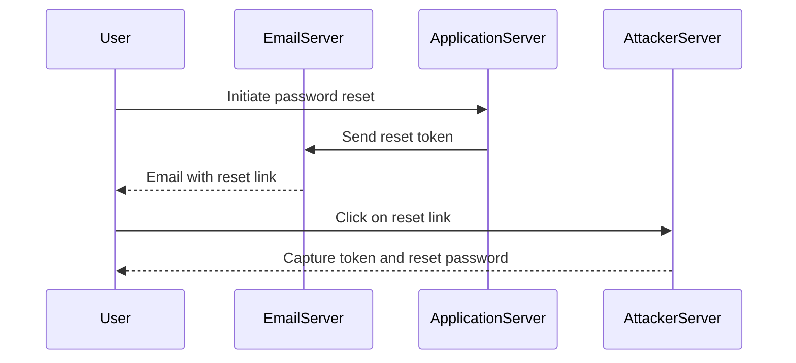

## Authentication Vulnerabilities: Password Reset Poisoning via Middleware

### Background Theory

Authentication vulnerabilities are critical weaknesses in web applications that can lead to unauthorized access and data breaches. One such vulnerability is password reset poisoning, which exploits weaknesses in the password reset functionality of an application. This type of attack often leverages middleware configurations that mishandle HTTP headers, leading to unintended behavior.

### Understanding the Attack Scenario

In the given scenario, the attacker aims to manipulate the password reset process by injecting a malicious `X-Forwarded-Host` header. This header is typically used in reverse proxy setups to pass the original host information to the backend server. However, if the application improperly trusts this header, it can be exploited to redirect the password reset link to a malicious server.

#### Key Concepts

1. **Password Reset Process**:
    - A user initiates a password reset by entering their email address.
    - The system sends a temporary token to the user's email.
    - The user clicks on the link containing the token to reset the password.
    - The system verifies the token and allows the user to set a new password.

2. **HTTP Headers**:
    - **X-Forwarded-Host**: This header is used to indicate the original host that made the request to the proxy server.
    - **Security Implications**: If the application trusts this header without proper validation, it can be manipulated to redirect the user to a malicious site.

### Detailed Attack Walkthrough

Let's break down the attack step-by-step:

1. **Initial Request**:
    - The user initiates a password reset request by entering their email address.
    - The system sends a temporary token to the user's email.

2. **Email Reception**:
    - The user receives an email with a link to reset the password.
    - The link contains a temporary token tied to the user's session.

3. **Malicious Header Injection**:
    - The attacker crafts a request to the password reset endpoint.
    - They include the `X-Forwarded-Host` header with a value pointing to their exploit server.

4. **Server Response**:
    - The server processes the request and generates a password reset link.
    - Due to improper handling of the `X-Forwarded-Host` header, the server appends the token to the attacker's specified host.

5. **User Interaction**:
    - The user clicks on the link, which now points to the attacker's server.
    - The attacker captures the temporary token and uses it to reset the user's password.

### Example Code and HTTP Requests

Let's illustrate the attack with a detailed example:

#### Initial Password Reset Request

```http
POST /forgot-password HTTP/1.1
Host: example.com
Content-Type: application/x-www-form-urlencoded

email=user@example.com
```

#### Email Received by User

The user receives an email with a link like:

```
https://example.com/reset-password?token=abc123
```

#### Malicious Request with X-Forwarded-Host Header

```http
GET /reset-password?token=abc123 HTTP/1.1
Host: example.com
X-Forwarded-Host: attacker-server.com
```

#### Server Response

The server generates a response with the password reset form, but the URL is now:

```
https://attacker-server.com/reset-password?token=abc123
```

### Mermaid Diagrams

#### Attack Flow Diagram



### Real-World Examples

Recent real-world examples of similar attacks include:

- **CVE-2021-21972**: A vulnerability in the WordPress plugin "WP GraphQL" allowed attackers to inject arbitrary headers, including `X-Forwarded-Host`, leading to potential password reset poisoning.
- **CVE-2022-22965**: A vulnerability in the "Drupal" CMS allowed attackers to manipulate the `X-Forwarded-Host` header, leading to unauthorized access to user accounts.

### How to Prevent / Defend

#### Detection

- **Logging and Monitoring**: Implement logging for all password reset requests and monitor for unusual patterns, such as requests with unexpected `X-Forwarded-Host` headers.
- **Security Tools**: Use tools like Burp Suite or OWASP ZAP to test for vulnerabilities related to header manipulation.

#### Prevention

1. **Header Validation**:
    - Ensure that the `X-Forwarded-Host` header is validated against a whitelist of trusted hosts.
    - Reject requests with invalid or unexpected `X-Forwarded-Host` values.

2. **Secure Coding Practices**:
    - Avoid trusting user-supplied headers without proper validation.
    - Use secure coding libraries and frameworks that handle header validation correctly.

#### Secure Code Fix

##### Vulnerable Code

```python
def handle_password_reset(request):
    token = request.GET.get('token')
    host = request.headers.get('X-Forwarded-Host', request.host)
    reset_url = f"https://{host}/reset-password?token={token}"
    return reset_url
```

##### Fixed Code

```python
def handle_password_reset(request):
    token = request.GET.get('token')
    trusted_hosts = ['example.com']
    host = request.headers.get('X-Forwarded-Host', request.host)
    if host not in trusted_hosts:
        host = request.host
    reset_url = f"https://{host}/reset-password?token={token}"
    return reset_url
```

### Configuration Hardening

1. **Web Server Configuration**:
    - Configure the web server to validate and sanitize incoming headers.
    - Use middleware to enforce header validation rules.

2. **Application Configuration**:
    - Configure the application to trust only specific headers and hosts.
    - Implement rate limiting and IP blocking for suspicious activity.

### Hands-On Labs

For practical experience with this vulnerability, consider the following labs:

- **PortSwigger Web Security Academy**: Offers a module on password reset vulnerabilities and header injection attacks.
- **OWASP Juice Shop**: Provides a realistic environment to practice exploiting and defending against various web security vulnerabilities, including password reset poisoning.

By thoroughly understanding and implementing these preventive measures, developers and security professionals can significantly reduce the risk of password reset poisoning attacks.

---
<!-- nav -->
[[Web Security (PortSwigger)/13-Authentication Vulnerabilities/12-Lab 11 Password reset poisoning via middleware/01-Introduction to Authentication Vulnerabilities|Introduction to Authentication Vulnerabilities]] | [[Web Security (PortSwigger)/13-Authentication Vulnerabilities/12-Lab 11 Password reset poisoning via middleware/00-Overview|Overview]] | [[Web Security (PortSwigger)/13-Authentication Vulnerabilities/12-Lab 11 Password reset poisoning via middleware/03-Practice Questions & Answers|Practice Questions & Answers]]
