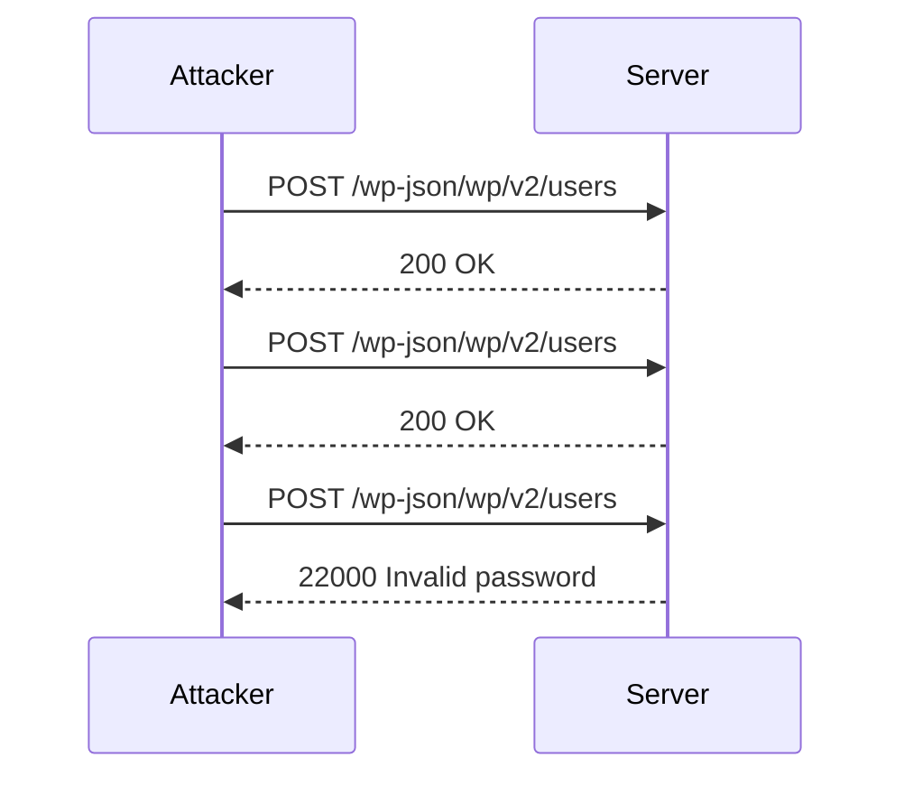

## Introduction to Authentication Vulnerabilities

In the realm of web security, authentication vulnerabilities are among the most critical issues faced by developers and security professionals. These vulnerabilities can lead to unauthorized access to sensitive information, compromise of user accounts, and even full system takeover. One such vulnerability is the **password brute force attack**, which exploits weaknesses in the password change functionality of web applications.

### What is a Password Brute Force Attack?

A password brute force attack is a method used by attackers to gain unauthorized access to a user's account by systematically trying different combinations of characters until the correct password is found. This type of attack is particularly effective against weak or commonly used passwords.

#### Why Does Password Brute Force Matter?

Password brute force attacks are significant because they can bypass even strong authentication mechanisms if the underlying implementation is flawed. They can also be automated, making them highly scalable and efficient for attackers. Moreover, these attacks can be difficult to detect and mitigate, especially if the application does not have proper rate limiting or account lockout mechanisms.

### How Does a Password Brute Force Attack Work?

To understand how a password brute force attack works, let's break down the process:

1. **Identify the Target**: The attacker first identifies a user account that they want to compromise. This could be through social engineering, reconnaissance, or simply guessing common usernames like `admin` or `carlos`.

2. **Obtain a List of Candidate Passwords**: The attacker compiles a list of potential passwords. This list can come from various sources, such as leaked password databases, common password lists, or custom dictionaries.

3. **Exploit Weaknesses in Password Change Functionality**: Many web applications allow users to change their passwords through a form-based interface. If this functionality is not properly secured, an attacker can use it to attempt multiple password guesses without triggering account lockout mechanisms.

4. **Automate the Attack**: Using tools like Burp Suite Intruder, the attacker automates the process of sending multiple password guesses to the server. Each guess is sent as a separate request, and the server responds accordingly.

5. **Analyze Responses**: The attacker analyzes the server's responses to determine whether a particular password guess was successful. Successful guesses typically result in a different response compared to failed attempts.

### Real-World Example: CVE-2021-21972

One real-world example of a password brute force vulnerability is CVE-2021-21972, which affected the WordPress REST API. This vulnerability allowed attackers to perform brute force attacks on user passwords by exploiting the lack of rate limiting on the `/wp-json/wp/v2/users` endpoint. By repeatedly sending password guesses, attackers could eventually gain access to user accounts.



### Lab Setup: Password Brute Force via Password Change

In this lab, we will simulate a scenario where an attacker uses a list of candidate passwords to brute force Carlos' account and access his My Account page. We will use Burp Suite Intruder to automate the attack.

#### Step-by-Step Instructions

1. **Access the Lab**:
   - Visit the Web Security Academy at [portswigger.net/web-security](https://portswigger.net/web-security).
   - Sign up for an account if you haven't already.
   - Navigate to the Academy section and select all labs.
   - Search for the authentication labs and find lab number 12 titled "Password Brutforce via Password Change".

2. **Set Up Burp Suite**:
   - Ensure you are using the professional version of Burp Suite, as the community edition has limitations on the Intruder functionality.
   - Configure your browser to use Burp Suite as a proxy.

3. **Capture the Password Change Request**:
   - Log in to the application and navigate to the password change functionality.
   - Capture the request in Burp Suite's Proxy tab.

4. **Configure Burp Suite Intruder**:
   - Send the captured request to Intruder.
   - Set the attack type to "Cluster Bomb".
   - Identify the password field and mark it as a payload position.
   - Load the list of candidate passwords into the payload set.

5. **Run the Attack**:
   - Start the attack and monitor the responses.
   - Look for successful login attempts based on the server's response.

### Full HTTP Request and Response Example

Here is a complete example of the HTTP request and response during the password change process:

```http
POST /change-password HTTP/1.1
Host: vulnerable-app.com
User-Agent: Mozilla/5.0 (Windows NT 10.0; Win64; x64) AppleWebKit/537.36 (KHTML, like Gecko) Chrome/91.0.4472.124 Safari/537.36
Content-Type: application/x-www-form-urlencoded
Content-Length: 43
Cookie: session=abc123

current_password=oldpassword&new_password=password123
```

```http
HTTP/1.1 200 OK
Date: Tue, 14 Sep 2021 12:00:00 GMT
Server: Apache/2.4.41 (Ubuntu)
Content-Type: text/html; charset=UTF-8
Content-Length: 1234
Connection: close

<!DOCTYPE html>
<html>
<head>
<title>Password Changed</title>
</head>
<body>
<h1>Password Changed Successfully</h1>
<p>Your password has been updated.</p>
</body>
</html>
```

### Common Pitfalls and Detection

When performing a password brute force attack, several pitfalls can arise:

1. **Rate Limiting**: Modern web applications often implement rate limiting to prevent brute force attacks. This can cause the attack to fail or slow down significantly.
2. **Account Lockout Mechanisms**: Some systems lock out accounts after a certain number of failed login attempts, making brute force attacks impractical.
3. **CAPTCHA**: CAPTCHA mechanisms can be used to prevent automated attacks by requiring human interaction.

To detect brute force attacks, organizations can use tools like intrusion detection systems (IDS) and security information and event management (SIEM) systems. These tools can analyze patterns of failed login attempts and alert administrators to potential brute force attacks.

### How to Prevent / Defend Against Password Brute Force Attacks

#### Secure Coding Practices

1. **Implement Rate Limiting**: Limit the number of login attempts from a single IP address within a given time frame.
2. **Use CAPTCHA**: Require users to pass a CAPTCHA test before allowing them to reset their password.
3. **Account Lockout Mechanisms**: Implement account lockout policies that temporarily disable accounts after a certain number of failed login attempts.

#### Configuration Hardening

1. **Enable Two-Factor Authentication (2FA)**: Require users to provide a second form of authentication, such as a one-time code sent to their phone.
2. **Use Strong Password Policies**: Enforce strong password requirements, such as minimum length, complexity, and expiration.

#### Secure Code Examples

Here is an example of how to implement rate limiting in a web application:

```python
from flask import Flask, request, jsonify
from flask_limiter import Limiter

app = Flask(__name__)
limiter = Limiter(app, key_func=lambda: request.remote_addr)

@app.route('/login', methods=['POST'])
@limiter.limit("10/minute")
def login():
    username = request.form['username']
    password = request.form['password']
    # Perform login logic here
    return jsonify({"status": "success"})

if __name__ == '__main__':
    app.run()
```

And here is an example of how to implement account lockout mechanisms:

```python
from flask import Flask, request, jsonify
from flask_login import LoginManager, UserMixin, login_user, logout_user, login_required
from sqlalchemy import create_engine, Column, Integer, String, Boolean
from sqlalchemy.ext.declarative import declarative_base
from sqlalchemy.orm import sessionmaker

Base = declarative_base()

class User(Base, UserMixin):
    __tablename__ = 'users'
    id = Column(Integer, primary_key=True)
    username = Column(String(50), unique=True)
    password = Column(String(100))
    failed_attempts = Column(Integer, default=0)
    locked_out = Column(Boolean, default=False)

engine = create_engine('sqlite:///users.db')
Session = sessionmaker(bind=engine)
session = Session()

app = Flask(__name__)
login_manager = LoginManager()
login_manager.init_app(app)

@login_manager.user_loader
def load_user(user_id):
    return session.query(User).get(int(user_id))

@app.route('/login', methods=['POST'])
def login():
    username = request.form['username']
    password = request.form['password']
    user = session.query(User).filter_by(username=username).first()
    
    if user and user.locked_out:
        return jsonify({"status": "error", "message": "Account locked out"})
    
    if user and user.password == password:
        user.failed_attempts = 0
        user.locked_out = False
        session.commit()
        login_user(user)
        return jsonify({"status": "success"})
    
    if user:
        user.failed_attempts += 1
        if user.failed_attempts >= 5:
            user.locked_out = True
        session.commit()
    
    return jsonify({"status": "error", "message": "Invalid credentials"})

if __name__ == '__main__':
    app.run()
```

### Hands-On Practice Labs

For hands-on practice, you can use the following labs:

- **PortSwigger Web Security Academy**: Offers a variety of labs related to authentication vulnerabilities, including password brute force attacks.
- **OWASP Juice Shop**: A deliberately insecure web application that includes challenges related to authentication and authorization.
- **DVWA (Damn Vulnerable Web Application)**: Another popular web application for learning about web security vulnerabilities, including authentication issues.

By practicing in these environments, you can gain a deeper understanding of how to identify and mitigate authentication vulnerabilities in real-world scenarios.

### Conclusion

Authentication vulnerabilities, particularly those related to password brute force attacks, pose significant risks to web applications. By understanding the mechanics of these attacks and implementing robust security measures, developers and security professionals can protect against unauthorized access and ensure the integrity of user accounts.

---
<!-- nav -->
[[Web Security (PortSwigger)/13-Authentication Vulnerabilities/13-Lab 12 Password brute force via password change/00-Overview|Overview]] | [[02-Authentication Vulnerabilities Password Brute Force via Password Change|Authentication Vulnerabilities Password Brute Force via Password Change]]
