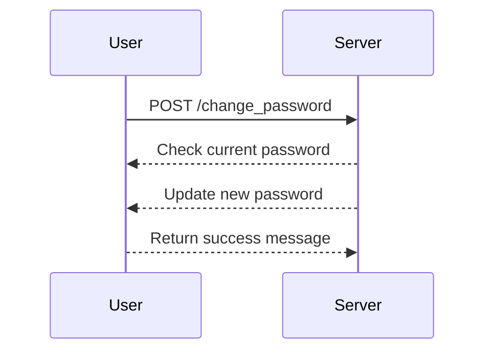
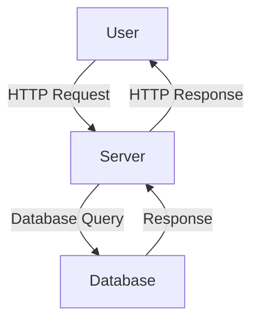

## Broken Authentication Vulnerability: Password Brute Force via Password Change

### Background Theory

Broken authentication is one of the most critical vulnerabilities in web applications, often leading to unauthorized access and data breaches. This vulnerability occurs when an application fails to properly implement authentication mechanisms, allowing attackers to bypass or manipulate these mechanisms. One specific type of broken authentication vulnerability is the password brute force attack via the password change functionality.

### What is a Password Brute Force Attack?

A password brute force attack is a method used by attackers to guess a user’s password through repeated attempts. This can be done manually or using automated tools that try different combinations of characters until the correct password is found. In the context of a password change feature, an attacker might exploit weaknesses in the implementation to reset passwords and gain unauthorized access.

### Why Does This Matter?

Password brute force attacks are particularly dangerous because they can lead to unauthorized access to sensitive information. Once an attacker gains access, they can perform various malicious activities such as stealing personal data, modifying records, or even taking control of the entire system. Real-world examples of such breaches include:

- **CVE-2021-21972**: A vulnerability in Microsoft Exchange Server allowed attackers to bypass authentication and execute arbitrary code.
- **Equifax Data Breach (2017)**: An attacker exploited a vulnerability in Apache Struts to gain unauthorized access to sensitive data.

### How Does a Password Brute Force Attack Work?

To understand how a password brute force attack works, let's consider the typical steps involved:

1. **Identify the Target**: The attacker identifies a user account or a set of accounts they want to target.
2. **Exploit Weaknesses**: The attacker looks for weaknesses in the password change functionality, such as lack of rate limiting, weak password complexity requirements, or predictable password reset questions.
3. **Automate the Attack**: Using automated tools, the attacker tries different password combinations until the correct one is found.

### Example Scenario: Password Change Functionality

Consider a web application that allows users to change their passwords. The following is a simplified example of how this might be implemented:

```python
@app.route('/change_password', methods=['POST'])
def change_password():
    current_password = request.form['current_password']
    new_password = request.form['new_password']
    
    # Check if the current password is correct
    if check_password(current_password):
        # Update the password
        update_password(new_password)
        return "Password changed successfully."
    else:
        return "Incorrect current password."
```

### Vulnerability Analysis

The above code snippet lacks several important security measures:

1. **Rate Limiting**: There is no rate limiting mechanism to prevent brute force attacks.
2. **Complexity Requirements**: The new password does not have any complexity requirements.
3. **Error Messages**: The error messages provide feedback to the attacker about whether the current password was correct.

### Real-World Example: CVE-2021-21972

In the CVE-2021-21972 vulnerability, attackers were able to bypass authentication in Microsoft Exchange Server by exploiting a deserialization flaw. This allowed them to execute arbitrary code and gain unauthorized access to the server.

### How to Prevent / Defend Against Password Brute Force Attacks

#### Detection

To detect password brute force attacks, you can monitor login attempts and look for patterns such as:

- Multiple failed login attempts from the same IP address.
- Failed login attempts with a high frequency.
- Successful logins followed by immediate failed attempts.

#### Prevention

To prevent password brute force attacks, implement the following security measures:

1. **Rate Limiting**: Implement rate limiting to restrict the number of login attempts within a certain time frame.
2. **Complexity Requirements**: Enforce strong password complexity requirements, such as minimum length, character types, and no dictionary words.
3. **Account Lockout**: Implement account lockout policies after a certain number of failed login attempts.
4. **Two-Factor Authentication (2FA)**: Require two-factor authentication to add an additional layer of security.
5. **Secure Error Messages**: Avoid providing detailed error messages that could help attackers.

#### Secure Code Fix

Here is an example of how the password change functionality can be improved to prevent brute force attacks:

```python
from flask import Flask, request
import time

app = Flask(__name__)

# Dictionary to track failed login attempts
failed_attempts = {}

@app.route('/change_password', methods=['POST'])
def change_password():
    current_password = request.form['current_password']
    new_password = request.form['new_password']
    ip_address = request.remote_addr
    
    # Check if the IP address has exceeded the maximum number of attempts
    if ip_address in failed_attempts:
        if time.time() - failed_attempts[ip_address]['timestamp'] < 600:  # 10 minutes
            return "Too many failed attempts. Please try again later."
    
    # Check if the current password is correct
    if check_password(current_password):
        # Update the password
        update_password(new_password)
        return "Password changed successfully."
    else:
        # Increment the failed attempt counter
        if ip_address not in failed_attempts:
            failed_attempts[ip_address] = {'count': 0}
        failed_attempts[ip_address]['count'] += 1
        failed_attempts[ip_address]['timestamp'] = time.time()
        
        if failed_attempts[ip_address]['count'] >= 5:
            return "Too many failed attempts. Please try again later."
        else:
            return "Incorrect current password."

def check_password(password):
    # Placeholder function to check the password
    return True

def update_password(password):
    # Placeholder function to update the password
    pass
```

### Mermaid Diagrams

#### Sequence Diagram for Password Change



#### Network Topology



### Practice Labs

For hands-on practice with this topic, consider the following labs:

- **PortSwigger Web Security Academy**: Offers a comprehensive set of labs covering various web security topics, including broken authentication.
- **OWASP Juice Shop**: A deliberately insecure web application for practicing web security skills.
- **DVWA (Damn Vulnerable Web Application)**: A PHP/MySQL web application that is riddled with vulnerabilities for educational purposes.

By thoroughly understanding and implementing these security measures, you can significantly reduce the risk of password brute force attacks and protect your web application from unauthorized access.

---
<!-- nav -->
[[02-Authentication Vulnerabilities Password Brute Force via Password Change|Authentication Vulnerabilities Password Brute Force via Password Change]] | [[Web Security (PortSwigger)/13-Authentication Vulnerabilities/13-Lab 12 Password brute force via password change/00-Overview|Overview]] | [[04-Understanding Authentication Vulnerabilities Password Brute Force via Password Change|Understanding Authentication Vulnerabilities Password Brute Force via Password Change]]
