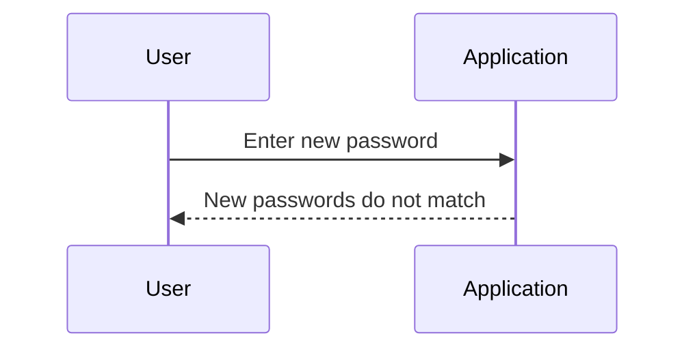
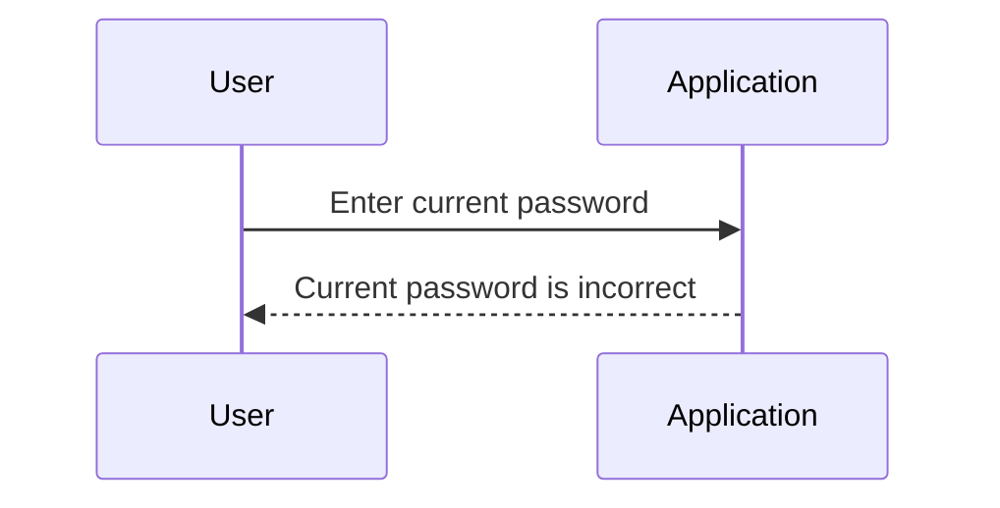
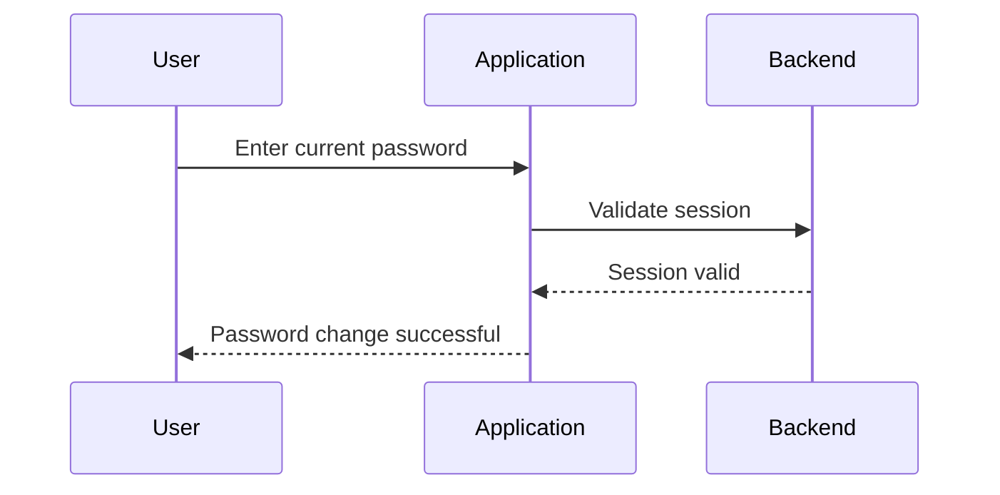
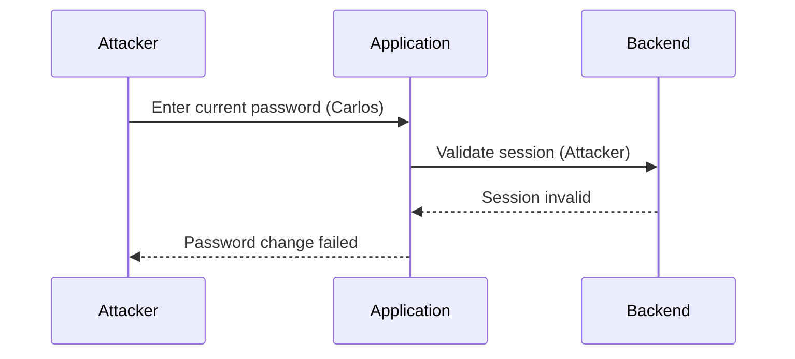

## Understanding Authentication Vulnerabilities: Password Brute Force via Password Change

### Background Theory

Authentication vulnerabilities are among the most critical issues in web security. They can allow attackers to gain unauthorized access to systems, steal sensitive data, and perform malicious actions. One such vulnerability is the ability to brute force a password through a password change functionality. This scenario often arises due to poor implementation of authentication mechanisms and lack of proper security measures.

### Scenario Overview

In the given scenario, we have a web application that allows users to change their passwords. The application checks if the new passwords match and verifies the current password. However, there are several potential vulnerabilities in this process:

1. **Password Matching**: The application checks if the new passwords match.
2. **Current Password Verification**: The application verifies the current password.
3. **User Session Validation**: The application should validate if the password change request corresponds to the user associated with the session.

### Detailed Analysis

#### Password Matching

When a user attempts to change their password, the application checks if the new passwords match. This is a basic validation step to ensure that the user did not make a typo. However, this step alone does not provide robust security.



#### Current Password Verification

The application also verifies the current password to ensure that the user is authorized to change the password. This is a crucial step to prevent unauthorized changes.



#### User Session Validation

A critical aspect of this process is validating the user session. The application should check if the password change request corresponds to the user associated with the session. This prevents an attacker from changing another user's password.



### Potential Vulnerability: Lack of User Session Validation

If the application fails to validate the user session, an attacker can change another user's password by simply providing the correct current password and new passwords that match. This is a significant vulnerability because it allows an attacker to bypass the intended security measures.



### Exploiting the Vulnerability

An attacker can exploit this vulnerability by brute-forcing the current password field. If the application lacks proper brute-force protection, the attacker can systematically try different passwords until they find the correct one.

#### Example Attack

Consider the following HTTP request to change a password:

```http
POST /change_password HTTP/1.1
Host: example.com
Content-Type: application/x-www-form-urlencoded

current_password=wrongpassword&new_password1=newpassword&new_password2=newpassword
```

Response:

```http
HTTP/1.1 400 Bad Request
Content-Type: application/json

{
    "error": "Current password is incorrect"
}
```

If the attacker tries the correct password:

```http
POST /change_password HTTP/1.1
Host: example.com
Content-Type: application/x-www-form-urlencoded

current_password=correctpassword&new_password1=newpassword&new_password2=newpassword
```

Response:

```http
HTTP/1.1 200 OK
Content-Type: application/json

{
    "message": "Password changed successfully"
}
```

### Real-World Examples

Recent breaches and CVEs highlight the importance of securing password change functionalities. For instance, the breach at LinkedIn in 2012 exposed millions of user passwords due to weak password storage practices. Similarly, the Equifax breach in 2017 exposed sensitive data due to vulnerabilities in their authentication mechanisms.

### How to Prevent / Defend

#### Detection

To detect such vulnerabilities, organizations should implement logging and monitoring mechanisms. Logs should capture all password change attempts, including the IP address, timestamp, and result of the attempt. Monitoring tools can alert administrators to suspicious activity, such as multiple failed password change attempts from the same IP address.

#### Prevention

1. **Session Validation**: Ensure that the application validates the user session before processing a password change request.
2. **Brute-Force Protection**: Implement rate limiting and account lockout mechanisms to prevent brute-force attacks. For example, limit the number of failed login attempts within a certain time frame.
3. **Secure Coding Practices**: Use secure coding practices to prevent common vulnerabilities such as SQL injection and cross-site scripting (XSS).

#### Secure Code Fix

Here is an example of how to securely implement password change functionality:

**Vulnerable Code:**

```python
def change_password(current_password, new_password1, new_password2):
    if new_password1 != new_password2:
        return "New passwords do not match"
    if not verify_current_password(current_password):
        return "Current password is incorrect"
    update_password(new_password1)
    return "Password changed successfully"
```

**Secure Code:**

```python
def change_password(session_id, current_password, new_password1, new_password2):
    if new_password1 != new_password2:
        return "New passwords do not match"
    if not verify_session(session_id):
        return "Invalid session"
    if not verify_current_password(current_password):
        return "Current password is incorrect"
    update_password(new_password1)
    return "Password changed successfully"
```

#### Configuration Hardening

Ensure that the application server and database are configured securely. Disable unnecessary services, restrict access to sensitive files, and use strong encryption for storing passwords.

### Practice Labs

For hands-on practice, consider the following labs:

- **PortSwigger Web Security Academy**: Offers a comprehensive set of labs covering various web security topics, including authentication vulnerabilities.
- **OWASP Juice Shop**: A deliberately insecure web application for practicing web security skills.
- **DVWA (Damn Vulnerable Web Application)**: A PHP/MySQL web application that is riddled with vulnerabilities for educational purposes.

These labs provide practical experience in identifying and mitigating authentication vulnerabilities.

### Conclusion

Understanding and mitigating authentication vulnerabilities is crucial for maintaining the security of web applications. By implementing proper session validation, brute-force protection, and secure coding practices, organizations can significantly reduce the risk of unauthorized access and data breaches. Regularly testing and auditing authentication mechanisms is essential to ensure the continued security of web applications.

---
<!-- nav -->
[[03-Broken Authentication Vulnerability Password Brute Force via Password Change|Broken Authentication Vulnerability Password Brute Force via Password Change]] | [[Web Security (PortSwigger)/13-Authentication Vulnerabilities/13-Lab 12 Password brute force via password change/00-Overview|Overview]] | [[Web Security (PortSwigger)/13-Authentication Vulnerabilities/13-Lab 12 Password brute force via password change/05-Practice Questions & Answers|Practice Questions & Answers]]
