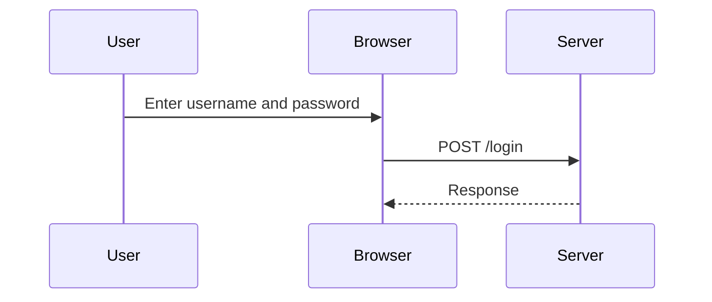

## Introduction to Authentication Vulnerabilities

Authentication vulnerabilities are among the most critical issues in web application security. They allow attackers to gain unauthorized access to user accounts, leading to potential data breaches, financial losses, and reputational damage. One specific type of authentication vulnerability is the **Broken Brute Force Protection**, which occurs when an application fails to effectively limit the rate at which an attacker can attempt to guess a user's password. This lab focuses on a variant of this vulnerability where multiple credentials can be submitted in a single request, making brute-forcing more efficient.

### Background Theory

#### What is Authentication?

Authentication is the process of verifying the identity of a user or system. In web applications, this typically involves a user providing a username and password, which the server then checks against stored credentials. If the credentials match, the user is authenticated and granted access to the application.

#### Why is Authentication Important?

Authentication is crucial because it ensures that only authorized users can access sensitive information and perform actions within the application. Without proper authentication mechanisms, an attacker could impersonate legitimate users and gain unauthorized access.

#### How Does Authentication Work?

The typical workflow for authentication involves the following steps:

1. **User Input**: The user provides their username and password.
2. **Transmission**: The credentials are transmitted to the server, usually over HTTPS to ensure confidentiality.
3. **Validation**: The server validates the credentials against a stored database of usernames and hashed passwords.
4. **Session Establishment**: If the credentials are valid, the server establishes a session for the user, often using a session token.

### Real-World Examples

#### Recent Breaches Due to Authentication Vulnerabilities

One notable example is the **Equifax breach** in 2017, where attackers exploited a vulnerability in Apache Struts to gain access to sensitive data. While this was not solely an authentication issue, weak authentication practices contributed to the severity of the breach.

Another example is the **Yahoo breach** in 2013, where hackers stole data from over 3 billion user accounts. Weak password storage practices and lack of proper authentication mechanisms were significant factors in this breach.

### Lab Overview

In this lab, we will explore a scenario where an application is vulnerable to a **Broken Brute Force Protection** vulnerability, specifically allowing multiple credentials to be submitted in a single request. Our goal is to exploit this vulnerability to brute-force Carlos' password and gain access to his account.

### Setting Up the Lab Environment

To access the lab, follow these steps:

1. Visit the Web Security Academy website at [portswigger.net/web-security](https://portswigger.net/web-security).
2. Click on the sign-up button to create an account if you don't already have one.
3. Log in to your account.
4. Navigate to the Academy section.
5. Select "All Labs".
6. Search for "authentication labs".
7. Choose lab number 13 titled "Broken Brute Force Protection, Multiple Credentials per Request".

### Understanding the Vulnerability

#### What is Broken Brute Force Protection?

Broken Brute Force Protection occurs when an application does not effectively limit the rate at which an attacker can attempt to guess a user's password. This can happen due to several reasons, such as:

- Lack of rate limiting on login attempts.
- Absence of account lockout mechanisms after a certain number of failed attempts.
- Failure to implement CAPTCHA or other challenge-response mechanisms.

#### Why is This Vulnerable?

When an application allows multiple credentials to be submitted in a single request, it significantly reduces the time required to brute-force a password. Instead of sending individual requests for each password guess, an attacker can send multiple guesses in a single request, drastically increasing the efficiency of the brute-force attack.

### Exploiting the Vulnerability

#### Step-by-Step Mechanics

To exploit this vulnerability, we need to:

1. Identify the endpoint where the login request is sent.
2. Craft a request that includes multiple sets of credentials.
3. Send the request to the server and analyze the response.

Let's walk through the process in detail.

#### Identifying the Login Endpoint

First, we need to identify the endpoint where the login request is sent. This can be done by inspecting the network traffic using Burp Suite or a similar tool.



#### Crafting the Request

Next, we need to craft a request that includes multiple sets of credentials. The exact format of the request will depend on the application's implementation, but a common approach is to use a JSON payload.

Here is an example of a JSON payload with multiple sets of credentials:

```json
{
  "credentials": [
    { "username": "Carlos", "password": "test1" },
    { "username": "Carlos", "password": "test2" },
    { "username": "Carlos", "password": "test3" }
  ]
}
```

We can send this request using Burp Suite or a similar tool.

#### Sending the Request

Using Burp Suite, we can intercept and modify the login request to include our crafted payload. Here is an example of the full HTTP request:

```http
POST /login HTTP/1.1
Host: vulnerable-app.example.com
Content-Type: application/json
Content-Length: 123

{
  "credentials": [
    { "username": "Carlos", "password": "test1" },
    { "username": "Carlos", "password": "test2" },
    { "username": "Carlos", "password": "test3" }
  ]
}
```

#### Analyzing the Response

After sending the request, we need to analyze the response to determine if any of the provided passwords were correct. The server should respond with a success message if the correct password is found.

Here is an example of the full HTTP response:

```http
HTTP/1.1 200 OK
Content-Type: application/json
Content-Length: 56

{
  "status": "success",
  "message": "Login successful"
}
```

If the response indicates a failure, we can try different sets of passwords until we find the correct one.

### Common Pitfalls

#### Rate Limiting Bypass

One common pitfall is bypassing rate limiting mechanisms. Some applications may implement rate limiting on individual login attempts but fail to consider multiple credentials in a single request. This can be exploited by sending multiple guesses in a single request, effectively bypassing the rate limiting.

#### Account Lockout Mechanisms

Another pitfall is the absence of account lockout mechanisms. If an application does not lock out an account after a certain number of failed login attempts, an attacker can continue to brute-force the password indefinitely.

### How to Prevent / Defend

#### Detection

To detect this vulnerability, you can use automated tools like Burp Suite Intruder or similar tools to test the login endpoint with multiple sets of credentials. Look for responses that indicate a successful login.

#### Prevention

To prevent this vulnerability, implement the following measures:

1. **Rate Limiting**: Implement rate limiting on login attempts to prevent brute-forcing. Limit the number of login attempts from a single IP address within a certain time frame.
2. **Account Lockout**: Implement account lockout mechanisms that temporarily disable an account after a certain number of failed login attempts.
3. **CAPTCHA**: Use CAPTCHA or other challenge-response mechanisms to prevent automated brute-forcing.
4. **Secure Password Storage**: Ensure that passwords are stored securely using strong hashing algorithms like bcrypt or Argon2.

#### Secure Coding Fixes

Here is an example of a secure coding fix for implementing rate limiting:

```python
from flask import Flask, request
from flask_limiter import Limiter

app = Flask(__name__)
limiter = Limiter(app, key_func=lambda: request.remote_addr)

@app.route('/login', methods=['POST'])
@limiter.limit("10/minute")  # Limit to 10 login attempts per minute
def login():
    username = request.form['username']
    password = request.form['password']
    # Validate credentials and return appropriate response
```

Here is an example of a secure coding fix for implementing account lockout:

```python
from flask import Flask, request
from flask_limiter import Limiter

app = Flask(__name__)
limiter = Limiter(app, key_func=lambda: request.remote_addr)

@app.route('/login', methods=['POST'])
@limiter.limit("10/minute", error_message="Too many login attempts. Please try again later.")
def login():
    username = request.form['username']
    password = request.form['password']
    # Check if account is locked out
    if is_account_locked_out(username):
        return "Account is locked out. Please try again later."
    # Validate credentials and return appropriate response
```

### Conclusion

In this lab, we explored a scenario where an application is vulnerable to a **Broken Brute Force Protection** vulnerability, specifically allowing multiple credentials to be submitted in a single request. By understanding the mechanics of this vulnerability and implementing proper prevention measures, we can significantly reduce the risk of unauthorized access to user accounts.

### Practice Labs

For hands-on practice, you can use the following labs:

- **PortSwigger Web Security Academy**: Offers a variety of labs related to authentication vulnerabilities, including broken brute force protection.
- **OWASP Juice Shop**: A deliberately insecure web application for practicing web security skills.
- **DVWA (Damn Vulnerable Web Application)**: Another popular web application for learning about web security vulnerabilities.

By completing these labs, you can gain practical experience in identifying and exploiting authentication vulnerabilities, as well as implementing effective defenses.

---
<!-- nav -->
[[Web Security (PortSwigger)/13-Authentication Vulnerabilities/14-Lab 13 Broken brute force protection multiple credentials per request/00-Overview|Overview]] | [[02-Authentication Vulnerabilities Broken Brute Force Protection with Multiple Credentials Per Request|Authentication Vulnerabilities Broken Brute Force Protection with Multiple Credentials Per Request]]
