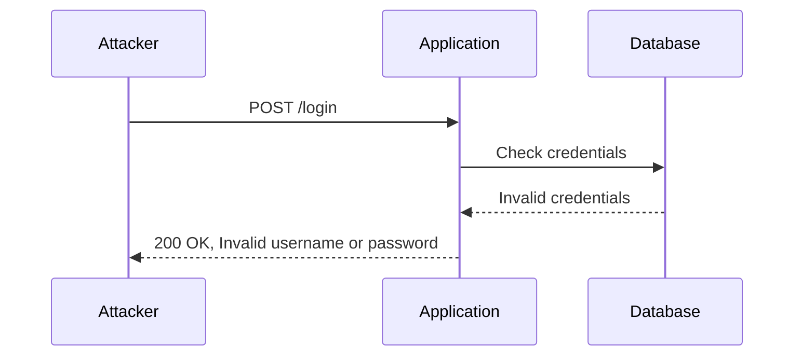

## Authentication Vulnerabilities: Broken Brute Force Protection with Multiple Credentials per Request

### Introduction

Authentication vulnerabilities are among the most critical issues in web security. They can allow attackers to gain unauthorized access to systems, steal sensitive data, and perform malicious actions. One such vulnerability is broken brute force protection, which occurs when an application does not effectively limit the number of login attempts or does not properly handle multiple credentials provided in a single request. This chapter will delve into the details of this vulnerability, including its mechanics, real-world examples, and methods to prevent and defend against it.

### Understanding the Vulnerability

#### What is Broken Brute Force Protection?

Broken brute force protection refers to a scenario where an authentication mechanism does not adequately protect against automated attacks that attempt to guess user credentials. In the context of this chapter, we focus on a specific variant where an attacker can submit multiple credentials in a single request, significantly increasing the efficiency of brute force attacks.

#### Why Does This Matter?

When an application allows multiple credentials to be submitted in a single request, it can drastically reduce the time required to perform a brute force attack. Instead of making hundreds or thousands of individual requests, an attacker can send a single request containing many potential passwords, thereby bypassing rate limiting mechanisms and increasing the likelihood of success.

#### How Does It Work Under the Hood?

To understand how this vulnerability works, let's break down the process:

1. **Request Format**: The attacker crafts a request that includes multiple usernames and/or passwords.
2. **Application Processing**: The application processes the request and checks each credential combination.
3. **Response Handling**: If any of the provided credentials are valid, the application grants access; otherwise, it returns an error message.

This behavior can be exploited by sending a large number of potential passwords in a single request, significantly reducing the time needed to perform a brute force attack.

### Real-World Examples

#### Recent CVEs and Breaches

One notable example of this vulnerability is the breach at LinkedIn in 2012, where attackers used a combination of brute force and dictionary attacks to compromise millions of accounts. Although this breach did not specifically involve multiple credentials per request, it highlights the importance of robust authentication mechanisms.

Another example is the breach at Yahoo in 2013, where attackers gained access to user data using stolen credentials. While the exact method used is not publicly known, it underscores the risks associated with weak authentication practices.

### Detailed Example

Let's consider a hypothetical scenario where an attacker wants to brute force the password for a user named `Carlos`. The attacker knows that the application allows multiple passwords to be submitted in a single request.

#### Crafting the Request

The attacker would craft a request that includes a list of potential passwords. Here’s an example of how this might look:

```python
import requests

url = "http://example.com/login"
data = {
    "username": "Carlos",
    "password": "password1,password2,password3,...,password100"
}

response = requests.post(url, data=data)
print(response.text)
```

In this example, the attacker sends a POST request to the login endpoint with a single parameter `password` containing a comma-separated list of potential passwords.

#### Application Response

If the application processes the request correctly, it will check each password in the list and return a response indicating whether any of the passwords were correct. For instance, the response might look like this:

```http
HTTP/1.1 200 OK
Content-Type: application/json

{
    "status": "success",
    "message": "Login successful"
}
```

Alternatively, if none of the passwords are correct, the response might look like this:

```http
HTTP/1.1 200 OK
Content-Type: application/json

{
    "status": "error",
    "message": "Invalid username or password"
}
```

### Mermaid Diagrams

Let's visualize the attack process using a sequence diagram:



### Pitfalls and Common Mistakes

#### Not Limiting Login Attempts

One common mistake is not implementing rate limiting on login attempts. Without rate limiting, an attacker can quickly exhaust the list of potential passwords, increasing the likelihood of success.

#### Not Validating Input Properly

Another mistake is not properly validating input. If the application does not validate the format of the `password` parameter, an attacker can easily exploit this vulnerability.

### How to Prevent / Defend

#### Detection

To detect this vulnerability, you can monitor login attempts for unusual patterns, such as a large number of failed login attempts within a short period. Additionally, you can use tools like Burp Suite or OWASP ZAP to simulate attacks and identify weaknesses.

#### Prevention

To prevent this vulnerability, implement the following measures:

1. **Rate Limiting**: Limit the number of login attempts from a single IP address within a given time frame.
2. **Input Validation**: Ensure that the `password` parameter is properly validated and does not accept multiple values.
3. **Account Lockout**: Implement account lockout mechanisms after a certain number of failed login attempts.

#### Secure Coding Fixes

Here’s an example of how to securely handle login requests:

**Vulnerable Code:**

```python
import requests

url = "http://example.com/login"
data = {
    "username": "Carlos",
    "password": "password1,password2,password3,...,password100"
}

response = requests.post(url, data=data)
print(response.text)
```

**Secure Code:**

```python
import requests

url = "http://example.com/login"
data = {
    "username": "Carlos",
    "password": "password1"
}

response = requests.post(url, data=data)
print(response.text)
```

In the secure version, the `password` parameter only accepts a single value, preventing the attacker from submitting multiple passwords in a single request.

### Complete Example

Let’s walk through a complete example, including the full HTTP request and response, and the expected result.

#### Full HTTP Request

```http
POST /login HTTP/1.1
Host: example.com
Content-Type: application/x-www-form-urlencoded
Content-Length: 100

username=Carlos&password=password1,password2,password3,...,password100
```

#### Full HTTP Response

```http
HTTP/1.1 200 OK
Content-Type: application/json
Content-Length: 56

{
    "status": "error",
    "message": "Invalid username or password"
}
```

#### Expected Result

The application should return an error message indicating that the username or password is invalid.

### Hands-On Labs

For hands-on practice, you can use the following labs:

- **PortSwigger Web Security Academy**: This lab provides a comprehensive set of exercises to practice identifying and exploiting authentication vulnerabilities.
- **OWASP Juice Shop**: This lab includes various authentication-related challenges, including broken brute force protection.
- **DVWA (Damn Vulnerable Web Application)**: This lab offers a range of web application vulnerabilities, including authentication-related issues.

### Conclusion

Understanding and preventing broken brute force protection with multiple credentials per request is crucial for maintaining the security of web applications. By implementing proper rate limiting, input validation, and account lockout mechanisms, you can significantly reduce the risk of such attacks. Always stay vigilant and regularly test your applications for vulnerabilities to ensure they remain secure.

---
<!-- nav -->
[[02-Authentication Vulnerabilities Broken Brute Force Protection with Multiple Credentials Per Request|Authentication Vulnerabilities Broken Brute Force Protection with Multiple Credentials Per Request]] | [[Web Security (PortSwigger)/13-Authentication Vulnerabilities/14-Lab 13 Broken brute force protection multiple credentials per request/00-Overview|Overview]] | [[Web Security (PortSwigger)/13-Authentication Vulnerabilities/14-Lab 13 Broken brute force protection multiple credentials per request/04-Practice Questions & Answers|Practice Questions & Answers]]
