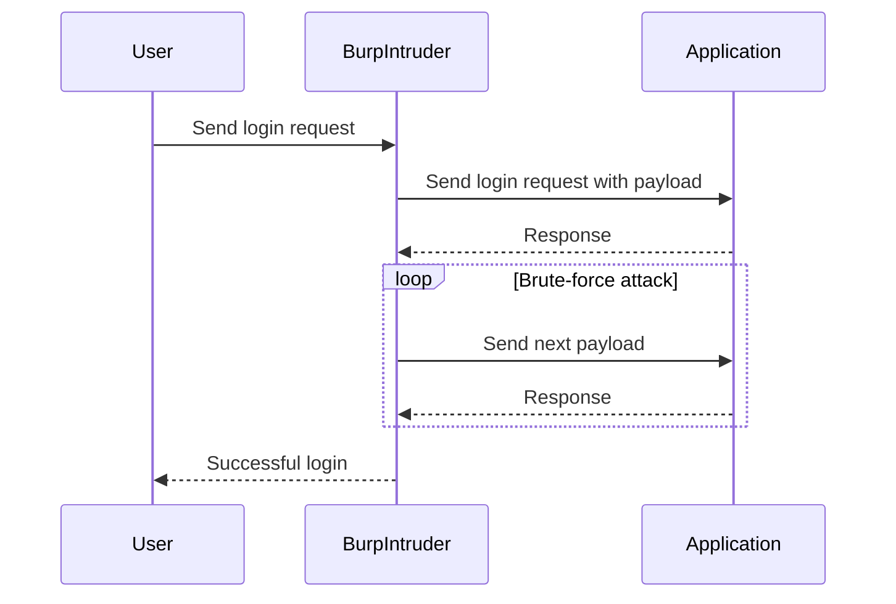
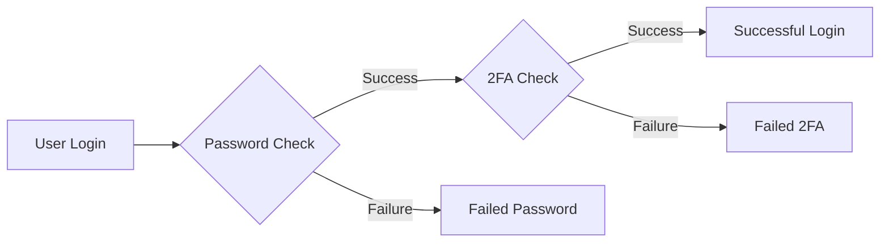

## Introduction to Authentication Vulnerabilities

Authentication vulnerabilities are critical weaknesses that can allow attackers to gain unauthorized access to user accounts. One such vulnerability is the bypassing of Two-Factor Authentication (2FA) through brute-force attacks. This chapter delves into the details of how an attacker might exploit a 2FA system and provides comprehensive guidance on how to defend against such attacks.

### Background Theory

Two-Factor Authentication (2FA) is a security process in which users provide two different authentication factors to verify their identity. Typically, these factors include something the user knows (like a password) and something the user possesses (like a mobile phone receiving a verification code).

#### Why 2FA Matters

2FA significantly enhances security by adding an additional layer of protection. Even if an attacker gains access to a user’s password, they would still need the second factor to authenticate successfully. However, as we will see, 2FA is not infallible and can be bypassed through various means, including brute-force attacks.

### Scenario Setup

In our scenario, we assume that there was a breach of the application or other applications that Carlos uses, and his password was dumped on the internet. We have gained access to Carlos’ password, but we do not have his 2FA token. Our goal is to exploit the application to obtain Carlos’ 2FA token and then log into his account.

### Tools and Environment

For this exercise, we will be using Burp Suite Professional Edition. Burp Suite is a powerful toolkit for web application security testing. The professional version includes features like Intruder and Macro functionalities, which are essential for automating the brute-force attack.

### Step-by-Step Attack Execution

#### Logging In with Known Password

1. **Access the Lab**: Open the lab environment and navigate to the login page.
2. **Enter Credentials**: Enter Carlos’s username and the known password (`Montoya`).

```plaintext
Username: Carlos
Password: Montoya
```

3. **Submit Login Request**: Click the login button. You will be prompted to enter a four-digit security code.

#### Capturing Requests with Burp Suite

1. **Enable Burp Proxy**: Ensure that Burp Suite is configured as a proxy and that all traffic is routed through it.
2. **Capture Login Request**: The login request is a POST request. Capture this request in Burp Suite.

```http
POST /login HTTP/1.1
Host: example.com
Content-Type: application/x-www-form-urlencoded
Content-Length: 26

username=Carlos&password=Montoya
```

3. **Capture Code Request**: The request responsible for sending the four-digit code is a GET request. Capture this request as well.

```http
GET /get-code HTTP/1.1
Host: example.com
Cookie: session_id=abc123
```

#### Setting Up Burp Intruder

1. **Send Requests to Repeater**: Send both captured requests to Burp Repeater.
2. **Configure Intruder**:
    - Set the target URL to the login endpoint.
    - Add the four-digit security code as a payload position.
    - Configure the payload list with all possible combinations (0000 to 9999).



#### Executing the Brute-Force Attack

1. **Start the Attack**: Initiate the brute-force attack using Burp Intruder.
2. **Monitor Responses**: Watch for successful login attempts. The correct four-digit code will result in a successful login.

### Real-World Examples

#### Recent Breaches and CVEs

One notable example is the breach of a popular social media platform in 2021, where millions of user passwords were exposed. Although 2FA was enabled, many users did not have it properly set up, leading to widespread account compromises.

#### CVE-2021-3116

CVE-2021-3116 is a vulnerability in a widely used authentication library that allowed attackers to bypass 2FA by exploiting a timing side-channel. This highlights the importance of robust 2FA implementations and regular security audits.

### How to Prevent / Defend Against 2FA Bypass

#### Detection

1. **Log Monitoring**: Implement logging and monitoring of authentication attempts. Look for patterns of failed login attempts that could indicate a brute-force attack.
2. **Rate Limiting**: Apply rate limiting to limit the number of login attempts within a given time frame.

```json
{
  "rate_limit": {
    "max_attempts": 5,
    "time_window": "1 minute"
  }
}
```

#### Prevention

1. **Strong 2FA Implementation**: Ensure that 2FA is implemented correctly and securely. Use time-based one-time passwords (TOTP) or push notifications instead of SMS-based codes.
2. **Multi-Factor Authentication Policies**: Enforce strong multi-factor authentication policies across all user accounts.



#### Secure Coding Fixes

1. **Vulnerable Code Example**:

```python
def authenticate(username, password, code):
    if check_password(username, password):
        if check_2fa_code(code):
            return True
        else:
            return False
    else:
        return False
```

2. **Secure Code Example**:

```python
def authenticate(username, password, code):
    if check_password(username, password):
        if check_2fa_code(code):
            return True
        else:
            log_failed_2fa_attempt(username)
            return False
    else:
        log_failed_password_attempt(username)
        return False
```

#### Configuration Hardening

1. **Web Server Configuration**: Harden web server configurations to prevent unauthorized access.

```nginx
server {
    listen 80;
    server_name example.com;

    location /login {
        auth_basic "Restricted";
        auth_basic_user_file /etc/nginx/.htpasswd;
    }
}
```

2. **Database Configuration**: Ensure database configurations are secure and do not expose sensitive information.

```sql
GRANT SELECT, INSERT, UPDATE ON database.table TO 'user'@'localhost';
```

### Conclusion

Understanding and defending against 2FA bypass attacks is crucial for maintaining the security of web applications. By implementing strong 2FA mechanisms, monitoring authentication attempts, and enforcing strict security policies, organizations can significantly reduce the risk of unauthorized access.

### Practice Labs

For hands-on practice, consider the following labs:

- **PortSwigger Web Security Academy**: Offers detailed modules on 2FA bypass and brute-force attacks.
- **OWASP Juice Shop**: Provides a vulnerable web application for practicing various security exploits.
- **DVWA (Damn Vulnerable Web Application)**: Another excellent resource for learning about web application security vulnerabilities.

By thoroughly understanding and practicing these concepts, you can become proficient in identifying and mitigating 2FA bypass vulnerabilities.

---
<!-- nav -->
[[Web Security (PortSwigger)/13-Authentication Vulnerabilities/15-Lab 14 2FA bypass using a brute force attack/00-Overview|Overview]] | [[02-Introduction to Two-Factor Authentication (2FA) Bypass Using Brute Force Attacks|Introduction to Two-Factor Authentication (2FA) Bypass Using Brute Force Attacks]]
