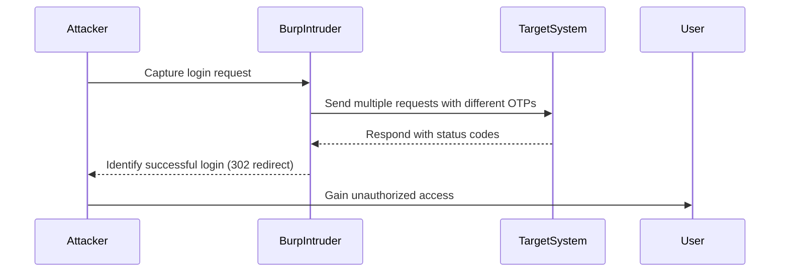

## Introduction to Two-Factor Authentication (2FA) Bypass Using Brute Force Attacks

Two-Factor Authentication (2FA) is a security measure designed to provide an additional layer of protection beyond the traditional username and password combination. This method typically involves a second factor, such as a one-time passcode sent via SMS, email, or generated by an authenticator app. While 2FA significantly enhances security, it can still be vulnerable to various attacks, including brute force attacks.

### What is a Brute Force Attack?

A brute force attack is a method used to gain unauthorized access to a system by systematically trying all possible combinations of passwords or passcodes until the correct one is found. In the context of 2FA, an attacker might attempt to guess the one-time passcode generated by the 2FA mechanism.

### Why Does Brute Force Matter in 2FA?

Brute force attacks against 2FA are particularly concerning because they can undermine the security benefits provided by the second factor. If an attacker can guess the one-time passcode, they can bypass the 2FA mechanism and gain unauthorized access to the system.

### How Does a Brute Force Attack Work Against 2FA?

In a typical scenario, an attacker would attempt to log in to a system multiple times, each time with a different one-time passcode. The goal is to eventually guess the correct passcode and gain access. This process can be automated using tools like Burp Suite, which allows for scripting and automation of the attack.

### Real-World Example: CVE-2021-44228 (Log4Shell)

While not directly related to 2FA, the Log4Shell vulnerability (CVE-2021-44228) demonstrates how vulnerabilities can be exploited to gain unauthorized access to systems. In this case, attackers could inject malicious code into logs, leading to remote code execution. Once inside the system, an attacker might attempt to bypass 2FA mechanisms using brute force techniques.

### Lab Setup: Bypassing 2FA Using Burp Suite

To understand how a brute force attack against 2FA works, let's walk through a practical example using Burp Suite. We will simulate an attack on a system that uses 2FA and demonstrate how to automate the attack using Burp Intruder.

#### Step-by-Step Guide

1. **Set Up the Target System**: Ensure you have a test environment set up with a system that uses 2FA. This could be a web application or any service that requires a username, password, and one-time passcode.

2. **Capture the Login Request**: Use Burp Suite to capture the login request. This request should include the username, password, and one-time passcode.

3. **Configure Burp Intruder**: Set up Burp Intruder to send multiple requests with different one-time passcodes. You will need to configure the payload positions and the list of potential passcodes.

4. **Run the Attack**: Execute the attack and monitor the responses. Look for a successful login indicated by a 302 redirect or other success indicators.

### Detailed Example: Brute Force Attack Using Burp Suite

Let's go through a detailed example of how to perform a brute force attack using Burp Suite.

#### Capture the Login Request

First, capture the login request using Burp Suite. Here is an example of a raw HTTP request:

```http
POST /login HTTP/1.1
Host: target.example.com
Content-Type: application/x-www-form-urlencoded
Content-Length: 43

username=admin&password=secret&otp=123456
```

#### Configure Burp Intruder

Next, configure Burp Intruder to send multiple requests with different one-time passcodes. Here is an example of how to set up the payload:

```plaintext
username=admin&password=secret&otp=%s
```

The `%s` placeholder will be replaced with different passcodes from your list.

#### Run the Attack

Execute the attack and monitor the responses. Here is an example of a successful login response:

```http
HTTP/1.1 302 Found
Date: Mon, 01 Jan 2024 12:00:00 GMT
Server: Apache/2.4.41 (Ubuntu)
Location: /dashboard
Content-Length: 0
Connection: close
```

### Mermaid Diagram: Attack Flow

Here is a mermaid diagram illustrating the attack flow:



### Common Pitfalls and Detection

#### Common Pitfalls

1. **Rate Limiting**: Many systems implement rate limiting to prevent brute force attacks. Ensure you account for this in your attack strategy.
2. **Account Lockout**: Some systems lock out accounts after multiple failed login attempts. Be aware of this and adjust your approach accordingly.
3. **CAPTCHA**: Systems may use CAPTCHAs to prevent automated attacks. Automating around CAPTCHAs can be challenging.

#### Detection

Detection of brute force attacks can be done using various methods:

1. **Logging and Monitoring**: Monitor login attempts and look for patterns indicative of brute force attacks.
2. **Rate Limiting**: Implement rate limiting to slow down attackers.
3. **Behavioral Analysis**: Use behavioral analysis to identify unusual login patterns.

### How to Prevent / Defend Against Brute Force Attacks

#### Secure Coding Fixes

Here is an example of a vulnerable login endpoint and its secure counterpart:

**Vulnerable Code:**

```python
@app.route('/login', methods=['POST'])
def login():
    data = request.form
    username = data.get('username')
    password = data.get('password')
    otp = data.get('otp')

    user = User.query.filter_by(username=username).first()
    if user and user.check_password(password) and user.validate_otp(otp):
        return redirect('/dashboard')
    else:
        return 'Login Failed'
```

**Secure Code:**

```python
@app.route('/login', methods=['POST'])
def login():
    data = request.form
    username = data.get('username')
    password = data.get('password')
    otp = data.get('otp')

    user = User.query.filter_by(username=username).first()
    if user and user.check_password(password) and user.validate_otp(otp):
        return redirect('/dashboard')
    else:
        # Increment failed login attempts
        user.failed_attempts += 1
        db.session.commit()

        if user.failed_attempts >= 5:
            # Lock account for 30 minutes
            user.locked_until = datetime.utcnow() + timedelta(minutes=30)
            db.session.commit()

        return 'Login Failed'
```

#### Configuration Hardening

Implement the following configurations to harden your system against brute force attacks:

1. **Rate Limiting**: Configure rate limiting on login endpoints.
2. **Account Lockout**: Implement account lockout policies.
3. **CAPTCHA**: Use CAPTCHAs to prevent automated attacks.

### Complete Example: Full HTTP Request and Response

Here is a complete example of the full HTTP request and response:

**Request:**

```http
POST /login HTTP/1.1
Host: target.example.com
Content-Type: application/x-www-form-urlencoded
Content-Length: 43

username=admin&password=secret&otp=123456
```

**Response:**

```http
HTTP/1.1 302 Found
Date: Mon, 01 Jan 2024 12:00:00 GMT
Server: Apache/2.4.41 (Ubuntu)
Location: /dashboard
Content-Length: 0
Connection: close
```

### Practice Labs

For hands-on practice, consider the following labs:

- **PortSwigger Web Security Academy**: Offers a variety of labs focused on web security, including 2FA bypass scenarios.
- **OWASP Juice Shop**: A deliberately insecure web application for practicing web security skills.
- **DVWA (Damn Vulnerable Web Application)**: Another intentionally vulnerable web application for learning web security.

These labs provide a safe environment to practice and understand the concepts discussed in this chapter.

### Conclusion

Understanding and defending against brute force attacks on 2FA mechanisms is crucial for maintaining the security of web applications. By implementing secure coding practices, configuring rate limiting and account lockout policies, and using CAPTCHAs, you can significantly reduce the risk of such attacks. Always stay vigilant and continuously monitor your systems for signs of brute force activity.

---
<!-- nav -->
[[Web Security (PortSwigger)/13-Authentication Vulnerabilities/15-Lab 14 2FA bypass using a brute force attack/01-Introduction to Authentication Vulnerabilities|Introduction to Authentication Vulnerabilities]] | [[Web Security (PortSwigger)/13-Authentication Vulnerabilities/15-Lab 14 2FA bypass using a brute force attack/00-Overview|Overview]] | [[03-Introduction to Two-Factor Authentication (2FA)|Introduction to Two-Factor Authentication (2FA)]]
