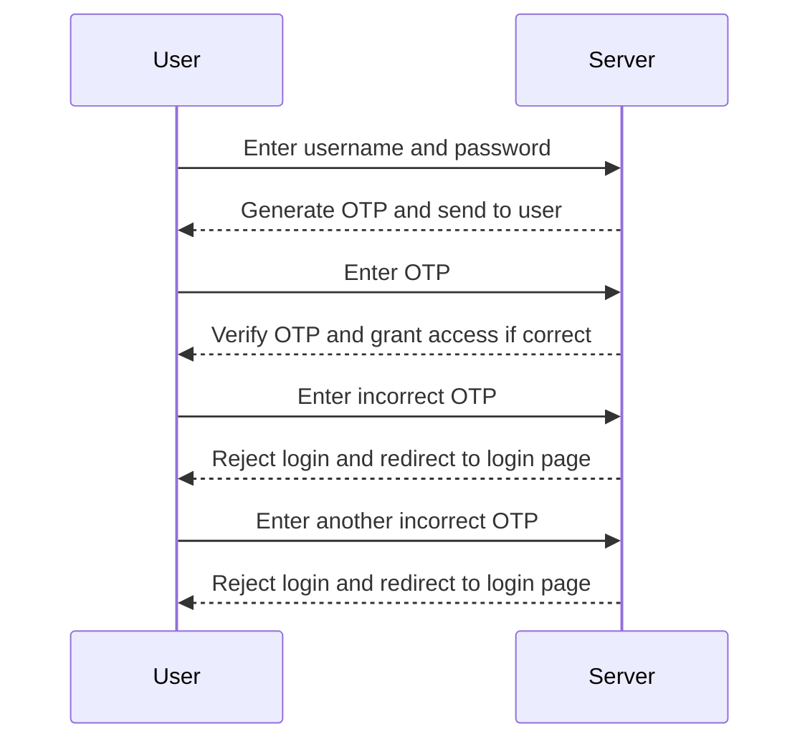

## Brute Force Attacks on 2FA

A brute force attack is a method used by attackers to guess the correct credentials by systematically trying all possible combinations. In the context of 2FA, this involves repeatedly attempting to guess the correct OTP.

### Scenario Analysis

Let's consider the scenario described in the lecture:

1. **Sending Requests**: The attacker sends multiple login requests to the server, each time with a different OTP.
2. **Incorrect Codes**: After two incorrect codes, the server redirects the user back to the login page.
3. **No Lockout Mechanism**: The server does not implement a lockout mechanism after multiple failed attempts, allowing the attacker to continue guessing.

### Detailed Steps

1. **Initial Login Attempt**:
    - User enters username and password.
    - Server generates an OTP and sends it to the user.
    - User enters the OTP.
    - Server verifies the OTP and grants access if correct.

2. **Incorrect OTP Entry**:
    - User enters an incorrect OTP.
    - Server rejects the login attempt and redirects to the login page.
    - User tries another incorrect OTP.
    - Server rejects the login attempt and redirects to the login page.

3. **No Lockout Mechanism**:
    - Since there is no lockout mechanism, the user can continue to try different OTPs indefinitely.
    - This allows an attacker to automate the process of guessing the correct OTP.

### Code Example

Here is a simplified example of how an attacker might automate the brute force attack:

```python
import requests

# Target URL
url = "https://example.com/login"

# List of potential OTPs
otps = ["123456", "654321", "112233", "332211"]

for otp in otps:
    # Prepare the login data
    data = {
        "username": "montoya",
        "password": "password123",
        "otp": otp
    }

    # Send the login request
    response = requests.post(url, data=data)

    # Check if the login was successful
    if "Welcome" in response.text:
        print(f"Login successful with OTP: {otp}")
        break
    else:
        print(f"Incorrect OTP: {otp}")
```

### Mermaid Diagram



---
<!-- nav -->
[[04-Lab 14 2FA Bypass Using a Brute Force Attack|Lab 14 2FA Bypass Using a Brute Force Attack]] | [[Web Security (PortSwigger)/13-Authentication Vulnerabilities/15-Lab 14 2FA bypass using a brute force attack/00-Overview|Overview]] | [[06-Detection and Prevention of Brute Force Attacks|Detection and Prevention of Brute Force Attacks]]
