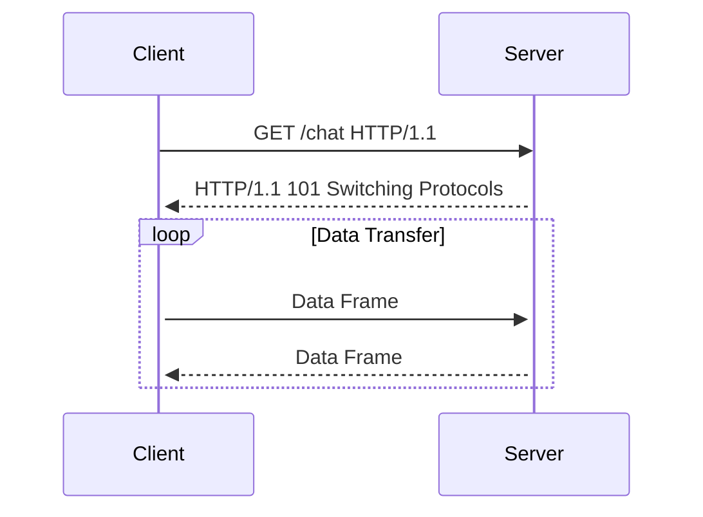

## Introduction to WebSockets Vulnerabilities

WebSockets provide a full-duplex communication channel over a single TCP connection between a client and a server. This technology allows for real-time data exchange, making it ideal for applications such as chat systems, live updates, and multiplayer games. However, the flexibility and power of WebSockets also introduce potential security vulnerabilities, particularly related to Cross-Site Scripting (XSS).

### What are WebSockets?

WebSockets enable two-way communication between a client and a server. Unlike traditional HTTP requests, which are stateless and require a new connection for each request, WebSSockets maintain a persistent connection. This allows for efficient data transfer and real-time interaction.

#### How WebSockets Work

When a WebSocket connection is established, the client sends an HTTP request to the server with an `Upgrade` header set to `websocket`. The server responds with a `101 Switching Protocols` status code, indicating that the connection is now a WebSocket connection. Once the connection is established, both the client and the server can send data frames to each other.



### Cross-Site Scripting (XSS)

Cross-Site Scripting (XSS) is a type of security vulnerability that occurs when an attacker injects malicious scripts into a trusted website. These scripts can execute in the context of the victim's browser, potentially leading to unauthorized actions such as stealing cookies, session tokens, and other sensitive information.

#### Types of XSS

There are three main types of XSS:

1. **Stored XSS**: Malicious scripts are stored on the server and are served to users.
2. **Reflected XSS**: Malicious scripts are included in the URL and are reflected back to the user.
3. **DOM-based XSS**: Malicious scripts are executed within the DOM (Document Object Model) of the webpage.

### Real-World Examples of XSS Vulnerabilities

Recent real-world examples of XSS vulnerabilities include:

- **CVE-2021-21972**: A stored XSS vulnerability in WordPress plugins allowed attackers to inject malicious scripts into comments.
- **CVE-2022-22965**: A reflected XSS vulnerability in the Microsoft SharePoint web application allowed attackers to inject scripts into URLs.

### Testing for XSS in WebSockets

To test for XSS vulnerabilities in WebSockets, we need to understand how data is exchanged between the client and the server. In the given scenario, the client sends a message to the server, and the server reflects the message back to the client. This reflection process can be exploited for XSS attacks.

#### Example Scenario

Consider a chat application where users can send messages to each other. The client sends a message to the server, and the server reflects the message back to all connected clients. If the server does not properly sanitize the input, an attacker can inject malicious scripts.

### Step-by-Step XSS Exploitation

Let's walk through the steps to exploit an XSS vulnerability in WebSockets.

#### Step 1: Identify the Input Field

In the given scenario, the input field is the message box where users can type their messages. We need to determine if the input is reflected back to the client without proper sanitization.

#### Step 2: Craft the XSS Payload

A simple XSS payload can be crafted using HTML tags and JavaScript. For example, we can use an `` tag with an `onerror` attribute to execute a JavaScript alert.

```html

```

This payload will attempt to load an image with a non-existent source (`src="1"`). When the image fails to load, the `onerror` attribute will execute the JavaScript code inside the `alert` function.

#### Step 3: Send the Payload

We need to send the crafted payload to the server through the WebSocket connection. The server will reflect the payload back to the client, and if the input is not sanitized, the JavaScript code will execute.

```javascript
// Client-side code to send the payload
const socket = new WebSocket('ws://example.com/chat');
socket.onopen = () => {
    const payload = '';
    socket.send(payload);
};
```

#### Step 4: Observe the Response

If the server reflects the payload back to the client without proper sanitization, the JavaScript code will execute, and an alert box will appear on the client's browser.

### Real-World Example: CVE-2021-21972

In the case of CVE-2021-21972, a stored XSS vulnerability was found in several WordPress plugins. Attackers could inject malicious scripts into comments, which were then stored on the server and reflected back to users.

#### Exploit Details

The attacker could craft a comment containing an XSS payload, such as:

```html
<script>alert('XSS')</script>
```

When a user viewed the comment, the JavaScript code would execute, potentially leading to further attacks.

### How to Prevent / Defend Against XSS in WebSockets

To prevent XSS attacks in WebSockets, it is crucial to implement proper input validation and output encoding. Here are some best practices:

#### Input Validation

Validate all user inputs to ensure they meet the expected format and content. For example, if the input is supposed to be a name, validate that it contains only letters and spaces.

```javascript
function validateInput(input) {
    const regex = /^[a-zA-Z\s]+$/;
    return regex.test(input);
}
```

#### Output Encoding

Encode all user inputs before reflecting them back to the client. This ensures that any malicious scripts are rendered harmless.

```javascript
function encodeOutput(output) {
    return output.replace(/&/g, '&amp;')
                 .replace(/</g, '&lt;')
                 .replace(/>/g, '&gt;')
                 .replace(/"/g, '&quot;')
                 .replace(/'/g, '&#x27;');
}
```

#### Secure Coding Practices

Implement secure coding practices to prevent XSS attacks. For example, avoid using `innerHTML` to insert user inputs into the DOM. Instead, use `textContent`.

```javascript
const userInput = '';
const safeInput = encodeOutput(userInput);
document.getElementById('message').textContent = safeInput;
```

### Detection and Prevention Tools

Several tools can help detect and prevent XSS vulnerabilities:

- **OWASP ZAP**: An open-source web application security scanner that can detect XSS vulnerabilities.
- **Burp Suite**: A comprehensive toolkit for web application security testing, including XSS detection.
- **Content Security Policy (CSP)**: A security feature that helps prevent XSS attacks by specifying which sources of content are allowed to be executed.

#### Content Security Policy (CSP)

Implementing CSP can significantly reduce the risk of XSS attacks. CSP allows you to specify which sources of content are allowed to be executed.

```http
Content-Security-Policy: default-src 'self'; script-src 'self';
```

This policy restricts scripts to only those loaded from the same origin.

### Real-World Example: CVE-2-2022-22965

In the case of CVE-2022-22965, a reflected XSS vulnerability was found in the Microsoft SharePoint web application. Attackers could inject scripts into URLs, leading to unauthorized actions.

#### Exploit Details

The attacker could craft a URL containing an XSS payload, such as:

```http
https://sharepoint.example.com/page?param=<script>alert('XSS')</script>
```

When a user clicked on the link, the JavaScript code would execute, potentially leading to further attacks.

### How to Prevent / Defend Against Reflected XSS in WebSockets

To prevent reflected XSS attacks in WebSockets, it is crucial to implement proper input validation and output encoding. Here are some best practices:

#### Input Validation

Validate all user inputs to ensure they meet the expected format and content. For example, if the input is supposed to be a URL, validate that it contains only valid characters.

```javascript
function validateURL(url) {
    const regex = /^https?:\/\/[\w.-]+\.[a-zA-Z]{2,}(\/[\w./-]*)*$/;
    return regex.test(url);
}
```

#### Output Encoding

Encode all user inputs before reflecting them back to the client. This ensures that any malicious scripts are rendered harmless.

```javascript
function encodeOutput(output) {
    return output.replace(/&/g, '&amp;')
                 .replace(/</g, '&lt;')
                 .replace(/>/g, '&gt;')
                 .replace(/"/g, '&quot;')
                 .replace(/'/g, '&#x27;');
}
```

#### Secure Coding Practices

Implement secure coding practices to prevent reflected XSS attacks. For example, avoid using `innerHTML` to insert user inputs into the DOM. Instead, use `textContent`.

```javascript
const userInput = '<script>alert("XSS")</script>';
const safeInput = encodeOutput(userInput);
document.getElementById('message').textContent = safeInput;
```

### Detection and Prevention Tools

Several tools can help detect and prevent reflected XSS vulnerabilities:

- **OWASP ZAP**: An open-source web application security scanner that can detect reflected XSS vulnerabilities.
- **Burp Suite**: A comprehensive toolkit for web application security testing, including reflected XSS detection.
- **Content Security Policy (CSP)**: A security feature that helps prevent reflected XSS attacks by specifying which sources of content are allowed to be executed.

#### Content Security Policy (CSP)

Implementing CSP can significantly reduce the risk of reflected XSS attacks. CSP allows you to specify which sources of content are allowed to be executed.

```http
Content-Security-Policy: default-src 'self'; script-src 'self';
```

This policy restricts scripts to only those loaded from the same origin.

### Hands-On Labs for WebSockets Vulnerabilities

To practice and gain hands-on experience with WebSockets vulnerabilities, consider the following labs:

- **PortSwigger Web Security Academy**: Offers interactive labs to learn about various web security vulnerabilities, including XSS.
- **OWASP Juice Shop**: A deliberately insecure web application for practicing web security skills.
- **DVWA (Damn Vulnerable Web Application)**: A PHP/MySQL web application that is riddled with vulnerabilities for educational purposes.

These labs provide a controlled environment to practice identifying and exploiting XSS vulnerabilities in WebSockets.

### Conclusion

WebSockets provide powerful real-time communication capabilities, but they also introduce potential security vulnerabilities, particularly related to Cross-Site Scripting (XSS). By understanding how WebSockets work, crafting and sending XSS payloads, and implementing proper input validation and output encoding, you can effectively prevent and defend against XSS attacks. Utilizing tools like OWASP ZAP and Burp Suite, and practicing with hands-on labs, can further enhance your skills in detecting and mitigating these vulnerabilities.

---
<!-- nav -->
[[Web Security (PortSwigger)/14-WebSockets Vulnerabilities/01-Lab 1 Manipulating WebSocket messages to exploit vulnerabilities/00-Overview|Overview]] | [[02-Introduction to WebSockets|Introduction to WebSockets]]
