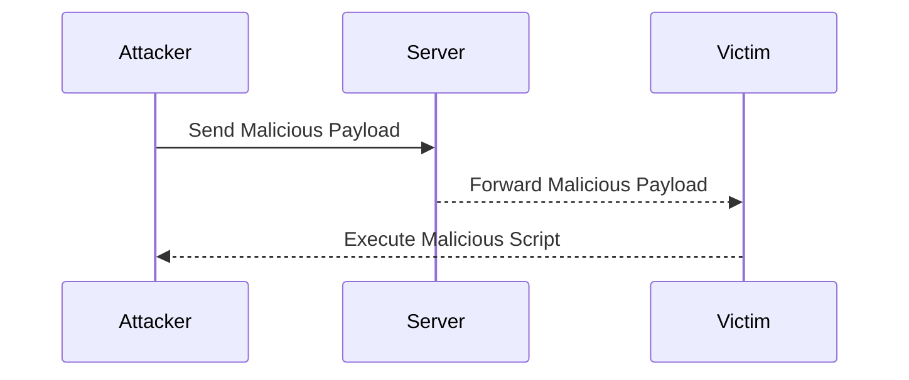
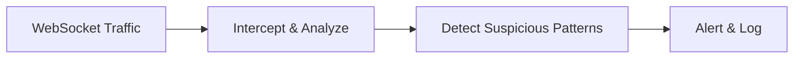

## Cross-Site Scripting (XSS) in WebSockets

Cross-Site Scripting (XSS) is a type of security vulnerability typically found in web applications. In the context of WebSockets, XSS occurs when an attacker injects malicious scripts into WebSocket messages that are then executed by other users' browsers.

### Example Scenario

Consider a live chat application where users can send messages to each other via WebSockets. If the application does not properly sanitize user input, an attacker can inject JavaScript code into their messages. When another user receives and processes the message, the injected script runs in their browser, potentially stealing sensitive information or performing unauthorized actions.

#### Real-World Example

In 2021, a vulnerability was discovered in a popular live chat application that allowed attackers to inject JavaScript into WebSocket messages. This led to a widespread XSS attack affecting thousands of users. The vulnerability was exploited by injecting a script that stole session cookies, allowing attackers to impersonate victims.

### Exploiting XSS in WebSockets

To demonstrate how an attacker might exploit an XSS vulnerability in WebSockets, let's walk through a step-by-step process using a hypothetical live chat application.

#### Step 1: Establish WebSocket Connection

First, the attacker establishes a WebSocket connection to the live chat server.

```javascript
const socket = new WebSocket('ws://example.com/chat');

socket.addEventListener('open', function (event) {
    console.log('WebSocket connection established');
});
```

#### Step 2: Inject Malicious Payload

Next, the attacker crafts a malicious payload and sends it through the WebSocket connection.

```javascript
const maliciousPayload = '<script>alert("XSS Attack!");</script>';

socket.send(maliciousPayload);
```

#### Step 3: Forward the Message

The attacker ensures that the malicious message is forwarded to other users. This can be done by interacting with the live chat interface or using tools like Burp Suite to intercept and modify WebSocket messages.



### Detection and Prevention

#### Detection

To detect potential XSS vulnerabilities in WebSocket messages, organizations can implement monitoring and logging mechanisms. Tools like Burp Suite can be used to intercept and analyze WebSocket traffic for suspicious patterns.



#### Prevention

Preventing XSS vulnerabilities in WebSockets requires proper input validation and output encoding. Here are some best practices:

1. **Input Validation**: Ensure that all user inputs are validated against a strict set of rules. For example, reject any input containing HTML tags or JavaScript code.

2. **Output Encoding**: Encode all user inputs before sending them through the WebSocket connection. This prevents the browser from interpreting the input as executable code.

3. **Content Security Policy (CSP)**: Implement a Content Security Policy to restrict the sources of executable content. This can help mitigate the impact of XSS attacks.

#### Secure Coding Fix

Here is an example of how to securely handle WebSocket messages in a live chat application:

**Vulnerable Code**

```javascript
// Vulnerable code
socket.onmessage = function(event) {
    const message = event.data;
    document.getElementById('chat').innerHTML += message;
};
```

**Secure Code**

```javascript
// Secure code
socket.onmessage = function(event) {
    const message = event.data;
    const sanitizedMessage = DOMPurify.sanitize(message); // Using DOMPurify for sanitization
    document.getElementById('chat').appendChild(document.createTextNode(sanitizedMessage));
};
```

### Configuration Hardening

To further harden the WebSocket implementation, consider the following configuration settings:

1. **Enable TLS**: Ensure that all WebSocket connections are encrypted using TLS to protect data in transit.

2. **Rate Limiting**: Implement rate limiting to prevent abuse of the WebSocket connection. This can help mitigate denial-of-service attacks.

3. **Session Management**: Use secure session management techniques to ensure that WebSocket sessions are properly authenticated and authorized.

### Hands-On Practice

For hands-on practice with WebSocket vulnerabilities, consider the following labs:

- **PortSwigger Web Security Academy**: Offers a series of labs focused on WebSocket security, including XSS and other vulnerabilities.
- **OWASP Juice Shop**: Contains several WebSocket-based challenges that simulate real-world vulnerabilities.

By thoroughly understanding and practicing the concepts covered in this chapter, you will be better equipped to identify and mitigate WebSocket vulnerabilities in your applications.

---
<!-- nav -->
[[Web Security (PortSwigger)/14-WebSockets Vulnerabilities/01-Lab 1 Manipulating WebSocket messages to exploit vulnerabilities/03-Common Pitfalls and Mistakes|Common Pitfalls and Mistakes]] | [[Web Security (PortSwigger)/14-WebSockets Vulnerabilities/01-Lab 1 Manipulating WebSocket messages to exploit vulnerabilities/00-Overview|Overview]] | [[05-How to Prevent  Defend Against WebSocket Vulnerabilities|How to Prevent  Defend Against WebSocket Vulnerabilities]]
