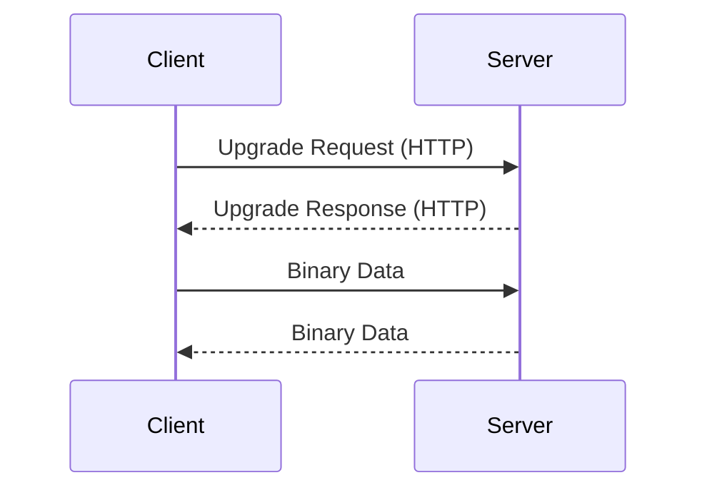

## Understanding WebSockets and Their Vulnerabilities

WebSockets provide a full-duplex communication channel over a single TCP connection between a client and a server. This allows for real-time data exchange, which is essential for applications like chat systems, live updates, and collaborative tools. However, this real-time communication can introduce vulnerabilities if not properly secured.

### What Are WebSockets?

WebSockets are an advanced technology that enables two-way communication between a client and a server. Unlike traditional HTTP requests, which are stateless and require a new connection for each request, WebSockets maintain a persistent connection. This allows for efficient and immediate data transfer in both directions.

#### How WebSockets Work

When a WebSocket connection is established, the initial handshake is performed using the HTTP protocol. Once the handshake is successful, the connection switches to a binary protocol for data transfer. This binary protocol is more efficient and allows for lower latency compared to repeated HTTP requests.



### URL Encoding and Its Role in Security

URL encoding is a method used to encode special characters in a URL. It replaces spaces with `%20` and other special characters with their corresponding hexadecimal codes. This is necessary because certain characters have special meanings in URLs and can cause issues if not encoded properly.

In the context of WebSockets, URL encoding can be used to bypass certain security mechanisms. For instance, if a client-side script is designed to filter out potentially harmful characters, encoding these characters might allow them to pass through undetected.

#### Example of URL Encoding

Consider the following string:

```
<script>alert('XSS')</script>
```

If this string is URL encoded, it becomes:

```
%3Cscript%3Ealert%28%27XSS%27%29%3C%2Fscript%3E
```

This encoded string can be sent over a WebSocket connection and might bypass client-side filters that look for unencoded `<script>` tags.

### Interception and Manipulation of WebSocket Messages

Intercepting WebSocket messages can reveal vulnerabilities in the application's security mechanisms. By manipulating the messages, an attacker can test whether the server-side logic is as robust as the client-side logic.

#### Using Tools to Intercept WebSocket Messages

Tools like Burp Suite, Wireshark, and Fiddler can be used to intercept and manipulate WebSocket messages. These tools allow you to view, modify, and resend WebSocket frames, providing insight into the data being exchanged.

##### Example Using Burp Suite

To intercept WebSocket messages using Burp Suite:

1. **Enable Proxy**: Start Burp Suite and enable the proxy.
2. **Configure Browser**: Set your browser to use Burp Suite as a proxy.
3. **Intercept Traffic**: In Burp Suite, go to the "Proxy" tab and enable interception.
4. **Send WebSocket Message**: From your application, send a WebSocket message.
5. **Intercept and Modify**: Burp Suite will intercept the message. You can modify the message and send it again.

Here is an example of a WebSocket message intercepted and modified using Burp Suite:

```plaintext
GET /ws HTTP/1.1
Host: example.com
Upgrade: websocket
Connection: Upgrade
Sec-WebSocket-Key: dGhlIHNhbXBsZSBub25jZQ==
Sec-WebSocket-Version: 13

```

After modifying the message, you can send it back to the server:

```plaintext
GET /ws HTTP/1.1
Host: example.com
Upgrade: websocket
Connection: Upgrade
Sec-WebSocket-Key: %24%24%24%24%24%24%24%24%24%24%24%24%24%24%24%24%24%24%24%24%24%24%24%24%24%24%24%24%24%24%24%24%24%24%24%24%24%24%24%24%24%24%24%24%24%24%24%24%24%24%24%24%24%24%24%24%24%24%24%24%24%24%24%24%24%24%24%24%24%24%24%24%24%24%24%24%24%24%24%24%24%24%24%24%24%24%24%24%24%24%24%24%24%24%24%24%24%24%24%24%24%24%24%24%24%24%24%24%24%24%24%24%24%24%24%24%24%24%24%24%24%24%24%24%24%24%24%24%24%24%24%24%24%24%24%24%24%24%24%24%24%24%24%24%24%24%24%24%24%24%24%24%24%24%24%24%24%24%24%24%24%24%24%24%24%24%24%24%24%24%24%24%24%24%24%24%24%24%24%24%24%24%24%24%24%24%24%24%24%24%24%24%24%24%24%24%24%24%24%24%24%24%24%24%24%24%24%24%24%24%24%24%24%24%24%24%24%24%24%24%24%24%24%24%24%24%24%24%24%24%24%24%24%24%24%24%24%24%24%24%24%24%24%24%24%24%24%24%24%24%24%24%24%24%24%24%24%24%24%24%24%24%24%24%24%24%24%24%24%24%24%24%24%24%24%24%24%24%24%24%24%24%24%24%24%24%24%24%24%24%24%24%24%24%24%24%24%24%24%24%24%24%24%24%24%24%24%24%24%24%24%24%24%24%24%24%24%24%24%24%24%24%24%24%24%24%24%24%24%24%24%24%24%24%24%24%24%24%24%24%24%24%24%24%24%24%24%24%24%24%24%24%24%24%24%24%24%24%24%24%24%24%24%24%24%24%24%24%24%24%24%24%24%24%24%24%24%24%24%24%24%24%24%24%24%24%24%24%24%24%24%24%24%24%24%24%24%24%24%24%24%24%24%24%24%24%24%24%24%24%24%24%24%24%24%24%24%24%24%24%24%24%24%24%24%24%24%24%24%24%24%24%24%24%24%24%24%24%24%24%24%24%24%24%24%24%24%24%24%24%24%24%24%24%24%24%24%24%24%24%24%24%24%24%24%24%24%24%24%24%24%24%24%24%24%24%24%24%24%24%24%24%24%24%24%24%24%24%24%24%24%24%24%24%24%24%24%24%24%24%24%24%24%24%24%24%24%24%24%24%24%24%24%24%24%24%24%24%24%24%24%24%24%24%24%24%24%24%24%24%24%24%24%24%24%24%24%24%24%24%24%24%24%24%24%24%24%24%24%24%24%24%24%24%24%24%24%24%24%24%24%24%24%24%24%24%24%24%24%24%24%24%24%24%24%24%24%24%24%24%24%24%24%24%24%24%24%24%24%24%24%24%24%24%24%24%24%24%24%24%24%24%24%24%24%24%24%24%24%24%24%24%24%24%24%24%24%24%24%24%24%24%24%24%24%24%24%24%24%24%24%24%24%24%24%24%24%24%24%24%24%24%24%24%24%24%24%24%24%24%24%24%24%24%24%24%24%24%24%24%24%24%24%24%24%24%24%24%24%24%24%24%24%24%24%24%24%24%24%24%24%24%24%24%24%24%24%24%24%24%24%24%24%24%24%24%24%24%24%24%24%24%24%24%24%24%24%24%24%24%24%24%24%24%24%24%24%24%24%24%24%24%24%24%24%24%24%24%24%24%24%24%24%24%24%24%24%24%24%24%24%24%24%24%24%24%24%24%24%24%24%24%24%24%24%24%24%24%24%24%24%24%24%24%24%24%24%24%24%24%24%24%24%24%24%24%24%24%24%24%24%24%24%24%24%24%24%24%24%24%24%24%24%24%24%24%24%24%24%24%24%24%24%24%24%24%24%24%24%24%24%24%24%24%24%24%24%24%24%24%24%24%24%24%24%24%24%24%24%24%24%24%24%24%24%24%24%24%24%24%24%24%24%24%24%24%24%24%24%24%24%24%24%24%24%24%24%24%24%24%24%24%24%24%24%24%24%24%24%24%24%24%24%24%24%24%24%24%24%24%24%24%24%24%24%24%24%24%24%24%24%24%24%24%24%24%24%24%24%24%24%24%24%24%24%24%24%24%24%24%24%24%24%24%24%24%24%24%24%24%24%24%24%24%24%24%24%24%24%24%24%24%24%24%24%24%24%24%24%24%24%24%24%24%24%24%24%24%24%24%24%24%24%24%24%24%24%24%24%24%24%24%24%24%24%24%24%24%24%24%24%24%24%24%24%24%24%24%24%24%24%24%24%24%24%24%24%24%24%24%24%24%24%24%24%24%24%24%24%24%24%24%24%24%24%24%24%24%24%24%24%24%24%24%24%24%24%24%24%24%24%24%24%24%24%24%24%24%24%24%24%24%24%24%24%24%24%24%24%24%24%24%24%24%24%24%24%24%24%24%24%24%24%24%24%24%24%24%24%24%24%24%24%24%24%24%24%24%24%24%24%24%24%24%24%24%24%24%24%24%24%24%24%24%24%24%24%24%24%24%24%24%24%24%24%24%24%24%24%24%24%24%24%24%24%24%24%24%24%24%24%24%24%24%24%24%24%24%24%24%24%24%24%24%24%24%24%24%24%24%24%24%24%24%24%24%24%24%24%24%24%24%24%24%24%24%24%24%24%24%24%24%24%24%24%24%24%24%24%24%24%24%24%24%24%24%24%24%24%24%24%24%24%24%24%24%24%24%24%24%24%24%24%24%24%24%24%24%24%24%24%24%24%24%24%24%24%24%24%24%2

---
<!-- nav -->
[[08-Understanding WebSocket Messages|Understanding WebSocket Messages]] | [[Web Security (PortSwigger)/14-WebSockets Vulnerabilities/01-Lab 1 Manipulating WebSocket messages to exploit vulnerabilities/00-Overview|Overview]] | [[Web Security (PortSwigger)/14-WebSockets Vulnerabilities/01-Lab 1 Manipulating WebSocket messages to exploit vulnerabilities/10-Conclusion|Conclusion]]
