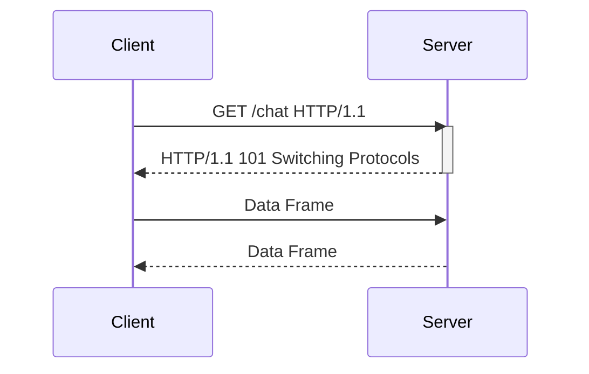

## Introduction to WebSockets and Their Vulnerabilities

WebSockets provide a full-duplex communication channel over a single TCP connection between a client and a server. They enable real-time data exchange, making them ideal for applications like live chat, online gaming, and collaborative tools. However, this real-time communication capability also introduces new security challenges, particularly around the WebSocket handshake and the messages exchanged over the connection.

### What is a WebSocket?

A WebSocket is a protocol providing full-duplex communication channels over a single TCP connection. Unlike HTTP, which is a request-response protocol, WebSockets allow both the client and the server to send data at any time after the initial handshake.

#### How Does WebSocket Work?

1. **Initial Handshake**: The WebSocket handshake starts with an HTTP request from the client to the server. The server responds with an HTTP upgrade response, switching the protocol to WebSocket.
2. **Data Exchange**: Once the handshake is completed, the client and server can send data frames to each other without the overhead of HTTP headers.



### WebSocket Handshake

The WebSocket handshake is crucial because it establishes the connection and sets up the parameters for the subsequent data exchange. The handshake involves an HTTP request from the client and an HTTP response from the server.

#### Example of WebSocket Handshake

**Client Request:**

```http
GET /chat HTTP/1.1
Host: example.com
Upgrade: websocket
Connection: Upgrade
Sec-WebSocket-Key: dGhlIHNhbXBsZSBub25jZQ==
Sec-WebSocket-Version: 13
Origin: http://example.com
```

**Server Response:**

```http
HTTP/1.1 101 Switching Protocols
Upgrade: websocket
Connection: Upgrade
Sec-WebSocket-Accept: s3pPLMBiTxaQ9kYGzzWXzKrnUj4=
```

### Vulnerabilities in WebSocket Handshake

One of the primary vulnerabilities in WebSocket-based applications is the potential for Cross-Site Scripting (XSS) attacks. If the application does not properly sanitize input, an attacker can inject malicious scripts into the WebSocket messages, which can then be executed in the context of the victim's browser.

#### Real-World Example: CVE-2021-3180

In 2021, a vulnerability was discovered in the WebSocket implementation of a popular web conferencing platform. The vulnerability allowed attackers to inject arbitrary JavaScript into WebSocket messages, leading to a full XSS attack. This vulnerability was assigned the CVE identifier CVE-2021-3180.

### Lab Setup: Manipulating the WebSocket Handshake

To understand and exploit vulnerabilities in WebSocket handshakes, we will use the Web Security Academy provided by PortSwigger. The lab titled "Manipulating the WebSocket Handshake to Exploit Vulnerabilities" involves bypassing an aggressive but flawed XSS filter to trigger an alert pop-up in the support agent's browser.

#### Accessing the Lab

1. Visit the URL `https://portswigger.net/web-security`.
2. Click on the sign-up button to create an account.
3. Log in and navigate to the Academy section.
4. Search for "WebSockets" and select Lab No. 2 titled "Manipulating the WebSocket Handshake to Exploit Vulnerabilities."

### Analyzing the Live Chat Feature

The online shop in the lab has a live chat feature implemented using WebSockets. The chat feature has an aggressive but flawed XSS filter. Our goal is to bypass this filter and exploit the XSS vulnerability to trigger an alert pop-up in the support agent's browser.

#### Using Burp Suite

We will use Burp Suite to intercept and manipulate the WebSocket handshake and messages. Burp Suite is a powerful tool for testing web applications and can be used in both professional and community editions.

1. **Access the Lab**: Click on the live chat feature in the online shop.
2. **Intercept Requests**: Ensure that your requests are being intercepted by Burp Suite. You can use the built-in browser in Burp Suite to ensure all requests are captured.

### Bypassing the XSS Filter

The XSS filter in the live chat feature is designed to block common XSS payloads. However, it may not be perfect, and there might be ways to bypass it.

#### Common XSS Payloads

Some common XSS payloads include:

- `<script>alert('XSS')</script>`
- `javascript:alert('XSS')`
- `onmouseover=alert('XSS')`

However, these payloads are likely to be blocked by the aggressive XSS filter. We need to find a way to bypass the filter.

#### Bypass Techniques

1. **Encoding**: Encode the payload to avoid detection by the filter.
2. **Obfuscation**: Use obfuscation techniques to make the payload less recognizable.
3. **Alternative Attributes**: Use alternative attributes that are not blocked by the filter.

#### Example of Bypassing the Filter

Let's try encoding the payload to bypass the filter.

**Original Payload:**

```html
<script>alert('XSS')</script>
```

**Encoded Payload:**

```html
%3Cscript%3Ealert(%27XSS%27)%3C%2Fscript%3E
```

### Exploiting the Vulnerability

Once we have a payload that bypasses the filter, we can send it through the WebSocket connection to trigger the alert pop-up in the support agent's browser.

#### Sending the Payload

1. **Intercept the WebSocket Message**: Use Burp Suite to intercept the WebSocket message sent to the server.
2. **Modify the Message**: Replace the original message with the encoded payload.
3. **Send the Modified Message**: Forward the modified message to the server.

**Example of Modified WebSocket Message:**

```json
{
  "type": "message",
  "data": "%3Cscript%3Ealert(%27XSS%27)%3C%2Fscript%3E"
}
```

### Detection and Prevention

#### How to Detect WebSocket Vulnerabilities

1. **Automated Scanning**: Use automated scanning tools like Burp Suite, OWASP ZAP, or commercial scanners to identify potential vulnerabilities.
2. **Manual Testing**: Perform manual testing to verify the effectiveness of the XSS filter and to identify bypass techniques.

#### How to Prevent WebSocket Vulnerabilities

1. **Input Validation**: Implement strict input validation to ensure that only safe data is accepted.
2. **Content Security Policy (CSP)**: Use CSP to restrict the sources of executable scripts.
3. **Sanitization**: Sanitize user inputs to remove potentially harmful characters and scripts.

**Secure Code Example:**

**Vulnerable Code:**

```javascript
socket.on('message', function(data) {
  document.getElementById('chat').innerHTML = data;
});
```

**Secure Code:**

```javascript
socket.on('message', function(data) {
  const sanitizedData = DOMPurify.sanitize(data);
  document.getElementById('chat').innerHTML = sanitizedData;
});
```

### Conclusion

Understanding and exploiting vulnerabilities in WebSocket handshakes and messages is crucial for securing web applications. By learning how to bypass aggressive XSS filters and exploit vulnerabilities, we can better understand the importance of proper input validation and sanitization. Always ensure that your applications are secure by implementing robust security measures and regularly testing for vulnerabilities.

### Practice Labs

For hands-on practice with WebSocket vulnerabilities, consider the following labs:

- **PortSwigger Web Security Academy**: Offers a variety of labs focused on WebSocket security.
- **OWASP Juice Shop**: Provides a vulnerable web application for practicing various security exploits, including WebSocket vulnerabilities.
- **DVWA (Damn Vulnerable Web Application)**: A deliberately insecure web application for security testing and training.

By engaging with these labs, you can gain practical experience in identifying and mitigating WebSocket vulnerabilities.

---
<!-- nav -->
[[Web Security (PortSwigger)/14-WebSockets Vulnerabilities/02-Lab 2 Manipulating the WebSocket handshake to exploit vulnerabilities/01-Introduction to WebSockets Vulnerabilities|Introduction to WebSockets Vulnerabilities]] | [[Web Security (PortSwigger)/14-WebSockets Vulnerabilities/02-Lab 2 Manipulating the WebSocket handshake to exploit vulnerabilities/00-Overview|Overview]] | [[03-Understanding WebSockets Vulnerabilities|Understanding WebSockets Vulnerabilities]]
