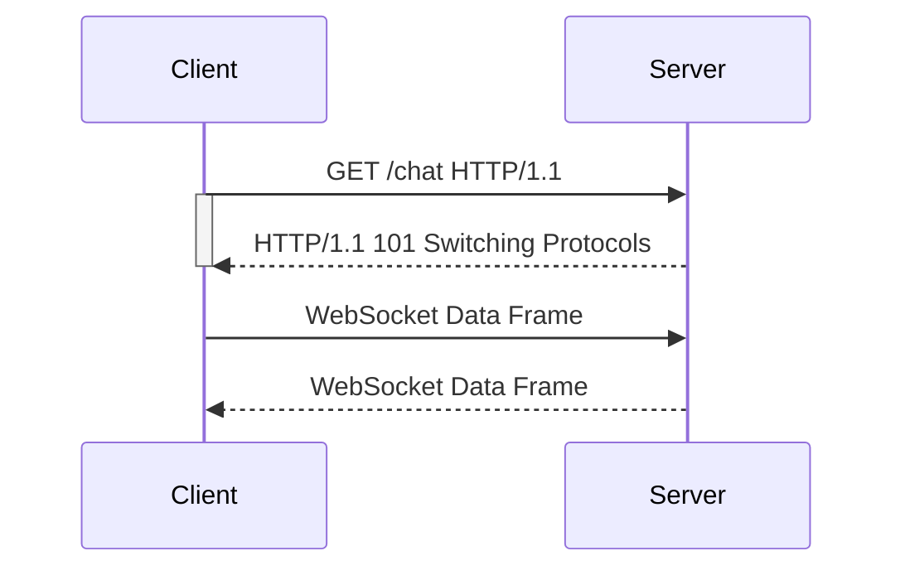

## Understanding WebSockets Vulnerabilities

### Introduction to WebSockets

WebSockets provide a full-duplex communication channel over a single TCP connection between a client and a server. This allows for real-time data exchange, which is essential for applications such as live chats, online gaming, and financial trading platforms. The WebSocket protocol operates over two main phases:

1. **Handshake Phase**: This phase uses HTTP to establish the WebSocket connection. Once established, the connection switches to a binary protocol for data transfer.
2. **Data Transfer Phase**: After the handshake, both the client and the server can send data frames to each other.

### WebSocket Handshake Process

The WebSocket handshake process involves the following steps:

1. **Client Request**: The client sends an HTTP request to the server with the `Upgrade` header set to `websocket`.
2. **Server Response**: The server responds with an HTTP status code of `101 Switching Protocols`, indicating that the connection will now use the WebSocket protocol.
3. **Established Connection**: Once the handshake is complete, the connection switches to the WebSocket protocol, allowing for real-time data exchange.



### Cross-Site Scripting (XSS) in WebSockets

Cross-Site Scripting (XSS) is a type of security vulnerability where an attacker injects malicious scripts into web pages viewed by other users. In the context of WebSockets, an attacker might attempt to inject malicious scripts through WebSocket messages.

#### Example Scenario

Consider a live chat application where users can send messages to each other. An attacker might attempt to inject a script tag into a message, hoping that it will execute in the context of other users' browsers.

```html
<script>alert('XSS');</script>
```

If the application does not properly sanitize user input, this script could execute, leading to potential security issues.

### Detecting and Blocking XSS Attempts

To protect against XSS attacks, the application should implement proper input validation and sanitization. Additionally, the server can monitor WebSocket traffic for suspicious patterns and block malicious activity.

#### Example of Detection Mechanism

In the given scenario, the server detected an attempted XSS attack and blacklisted the client's IP address. This mechanism helps prevent further attempts from the same source.

### Bypassing IP Block Listing Using X-Forwarded-For Header

One method attackers might use to bypass IP block listing is by manipulating the `X-Forwarded-For` header. This header is typically used by proxy servers to indicate the original IP address of the client.

#### How X-Forwarded-For Works

The `X-Forwarded-For` header is used to identify the originating IP address of a client connecting to a web server through a proxy server. The format of the header is as follows:

```
X-Forwarded-For: <client_IP>, <proxy_IP>
```

However, since this header is sent from the client side, it can be manipulated to any value.

#### Exploiting X-Forwarded-For

An attacker can set the `X-Forwarded-For` header to a different IP address to bypass the block listing mechanism. Here’s an example of how this can be done:

```http
POST /live-chat HTTP/1.1
Host: example.com
Referer: http://example.com/chat
X-Forwarded-For: 192.168.1.1
Content-Type: application/json
Content-Length: 14

{"message": "test"}
```

### Real-World Examples and Recent Breaches

Recent breaches involving WebSocket vulnerabilities include:

- **CVE-2021-21972**: A vulnerability in the WebSocket implementation of a popular chat application allowed attackers to inject malicious scripts through WebSocket messages.
- **CVE-2022-3019**: A misconfiguration in the WebSocket server allowed attackers to bypass IP block listing mechanisms by manipulating the `X-Forwarded-For` header.

### How to Prevent / Defend Against WebSocket Vulnerabilities

#### Secure Coding Practices

1. **Input Validation and Sanitization**: Ensure that all user inputs are validated and sanitized to prevent injection attacks.
2. **Use Content Security Policy (CSP)**: Implement CSP to restrict the sources from which scripts can be loaded, reducing the risk of XSS attacks.

```http
Content-Security-Policy: default-src 'self'; script-src 'self' https://trusted-source.com;
```

#### Configuration Hardening

1. **Disable Unnecessary Headers**: Disable unnecessary headers like `X-Forwarded-For` unless absolutely required.
2. **Implement Rate Limiting**: Implement rate limiting to prevent abuse of WebSocket connections.

#### Detection and Monitoring

1. **Monitor WebSocket Traffic**: Monitor WebSocket traffic for suspicious patterns and block malicious activity.
2. **Use Intrusion Detection Systems (IDS)**: Deploy IDS to detect and alert on potential security incidents.

### Complete Example of WebSocket Attack and Defense

#### Vulnerable Code

```javascript
// Vulnerable WebSocket server
const WebSocket = require('ws');
const wss = new WebSocket.Server({ port: 8080 });

wss.on('connection', function connection(ws) {
    ws.on('message', function incoming(message) {
        console.log('received: %s', message);
        // Send the message back to all clients
        wss.clients.forEach(function each(client) {
            if (client !== ws && client.readyState === WebSocket.OPEN) {
                client.send(message);
            }
        });
    });
});
```

#### Secure Code

```javascript
// Secure WebSocket server
const WebSocket = require('ws');
const wss = new WebSocket.Server({ port: 8080 });

wss.on('connection', function connection(ws) {
    ws.on('message', function incoming(message) {
        const sanitizedMessage = sanitizeInput(message);
        console.log('received: %s', sanitizedMessage);
        // Send the message back to all clients
        wss.clients.forEach(function each(client) {
            if (client !== ws && client.readyState === WebSocket.OPEN) {
                client.send(sanitizedMessage);
            }
        });
    });
});

function sanitizeInput(input) {
    return input.replace(/<script>/gi, '').replace(/<\/script>/gi, '');
}
```

### Hands-On Labs

For practical experience with WebSocket vulnerabilities, consider the following labs:

- **PortSwigger Web Security Academy**: Offers interactive labs on WebSocket security.
- **OWASP Juice Shop**: Provides a vulnerable application for testing WebSocket attacks.
- **DVWA (Damn Vulnerable Web Application)**: Contains scenarios for practicing WebSocket exploitation.

By thoroughly understanding and implementing these security measures, developers can significantly reduce the risk of WebSocket vulnerabilities in their applications.

---
<!-- nav -->
[[02-Introduction to WebSockets and Their Vulnerabilities|Introduction to WebSockets and Their Vulnerabilities]] | [[Web Security (PortSwigger)/14-WebSockets Vulnerabilities/02-Lab 2 Manipulating the WebSocket handshake to exploit vulnerabilities/00-Overview|Overview]] | [[04-Understanding WebSockets and Their Handshake Process|Understanding WebSockets and Their Handshake Process]]
