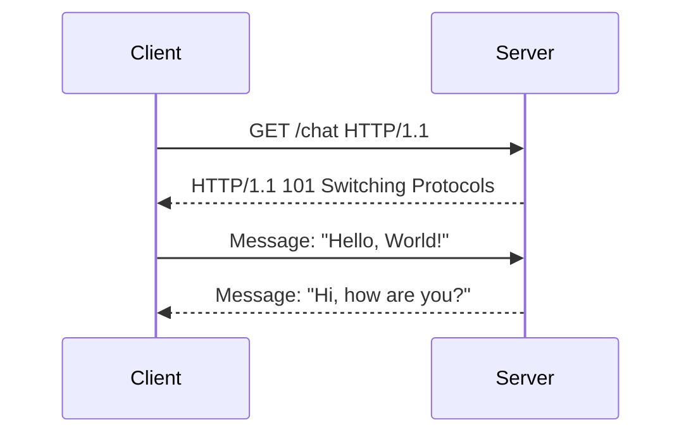

## Introduction to WebSockets

WebSockets provide a full-duplex communication channel over a single TCP connection. This allows for real-time data transfer between a client and a server, making it ideal for applications such as chat systems, live updates, and multiplayer games. Unlike traditional HTTP, which is stateless and requires a new connection for each request, WebSockets maintain a persistent connection, enabling efficient data exchange.

### How WebSockets Work

When a WebSocket connection is established, it starts with an HTTP handshake. The client sends an HTTP request with the `Upgrade` header set to `websocket`, and the `Connection` header set to `Upgrade`. If the server supports WebSockets, it responds with a `101 Switching Protocols` status code, indicating that the protocol has been upgraded to WebSocket.

```http
GET /chat HTTP/1.1
Host: websocket.academy.net
Upgrade: websocket
Connection: Upgrade
Sec-WebSocket-Key: dGhlIHNhbXBsZSBub25jZQ==
Sec-WebSocket-Version: 13
```

The server responds with:

```http
HTTP/1.1 101 Switching Protocols
Upgrade: websocket
Connection: Upgrade
Sec-WebSocket-Accept: s3pPLMBiTxaQ9kYGzzhZRbWXPNGu
```

Once the handshake is completed, the connection switches to the WebSocket protocol, allowing for bi-directional data transfer.

### Real-World Example: Chat Application

Consider a simple chat application where users can send messages to each other in real time. The WebSocket connection allows the server to push messages to clients as soon as they are received, providing a seamless user experience.

#### WebSocket Connection Flow



### Potential Vulnerabilities

Despite their benefits, WebSockets introduce several security vulnerabilities, including Cross-Site WebSocket Hijacking (CSWH).

---
<!-- nav -->
[[02-Introduction to WebSockets and Their Role in Modern Web Applications|Introduction to WebSockets and Their Role in Modern Web Applications]] | [[Web Security (PortSwigger)/14-WebSockets Vulnerabilities/03-Lab 3 Cross site WebSocket hijacking/00-Overview|Overview]] | [[04-Cross-Site WebSocket Hijacking (CSWH)|Cross-Site WebSocket Hijacking (CSWH)]]
