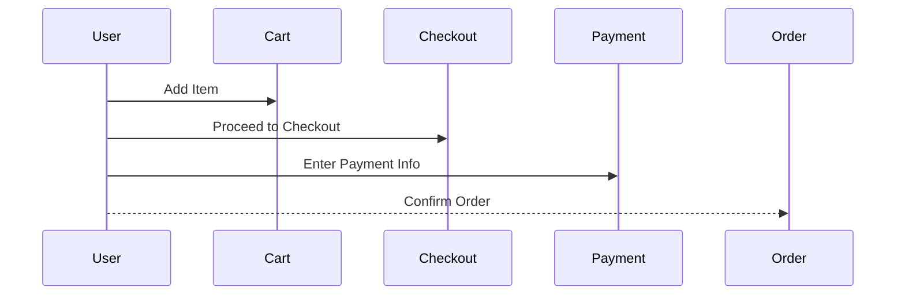

## Introduction to Business Logic Vulnerabilities

Business logic vulnerabilities are a class of security flaws that arise from errors or omissions in the design and implementation of an application’s business logic. These vulnerabilities can lead to significant security risks, such as unauthorized access, data manipulation, financial loss, and more. Unlike traditional vulnerabilities like SQL injection or cross-site scripting (XSS), business logic vulnerabilities are often more subtle and harder to detect because they rely on the specific rules and processes defined within the application.

### What Are Business Logic Vulnerabilities?

Business logic vulnerabilities occur when the application’s business rules and processes are not correctly enforced or are bypassed. This can happen due to:

- **Incorrect assumptions**: Developers may assume that users will interact with the application in a certain way, leading to unhandled edge cases.
- **Incomplete validation**: Input validation may be insufficient or missing, allowing malicious inputs to manipulate the application’s behavior.
- **Logical errors**: Mistakes in the implementation of business rules can result in unintended behavior.

### Why Are They Important?

Business logic vulnerabilities can have severe consequences, including:

- **Financial loss**: Exploiting these vulnerabilities can lead to unauthorized transactions, refunds, or other financial manipulations.
- **Data integrity issues**: Data can be manipulated in ways that compromise the integrity of the application.
- **Reputation damage**: Successful exploitation can harm the reputation of the organization.

### How to Find Business Logic Vulnerabilities

To effectively find business logic vulnerabilities, you need to thoroughly understand the application’s components and their interactions. Here’s a step-by-step guide:

#### Step 1: Map the Application

Mapping the application involves identifying all components and understanding how they operate. This includes:

- **Front-end components**: User interfaces, forms, buttons, etc.
- **Back-end components**: APIs, databases, server-side logic, etc.
- **Third-party services**: External APIs, payment gateways, etc.

#### Step 2: Access Code (if available)

If you have access to the source code, it provides a significant advantage. You can:

- **Review the code**: Understand the implementation details and identify potential flaws.
- **Identify assumptions**: Determine what assumptions the developers made during implementation.

#### Step 3: Determine Potential Business Flows

If you don’t have access to the code, you need to infer the business flows based on the observed functionality. This involves:

- **Analyzing requests**: Observe the flow of requests and responses to understand the intended business flow.
- **Identifying assumptions**: Determine the assumptions made by the developers or architects during the design phase.

#### Step 4: Test Each Component

Once you have a good understanding of the application and its components, you need to test each component with all possible use cases outside the intended business flow. This includes:

- **Out-of-sequence requests**: Test what happens when requests are sent out of sequence.
- **Invalid inputs**: Test with invalid or unexpected inputs to see how the application responds.
- **Edge cases**: Test scenarios that are at the boundaries of the intended use cases.

### Real-World Example: Purchase Process

Consider an e-commerce application where the purchase process involves several steps:

1. Add items to the cart.
2. Proceed to checkout.
3. Enter shipping information.
4. Enter payment information.
5. Confirm the order.

A developer might assume that users will follow these steps in order. However, an attacker could try to bypass some steps or send requests out of sequence to exploit the application.

#### Vulnerable Scenario



In this scenario, the developer assumes that the user will follow the steps in order. An attacker could bypass the shipping information step by sending a direct request to the payment step.

#### Exploit

An attacker could craft a request to the payment endpoint without going through the shipping step:

```http
POST /api/payment HTTP/1.1
Host: example.com
Content-Type: application/json

{
  "card_number": "1234567890123456",
  "cvv": "123",
  "amount": 100
}
```

The server might accept this request and process the payment without validating the shipping information, leading to a business logic vulnerability.

### How to Prevent / Defend

#### Detection

To detect business logic vulnerabilities, you can:

- **Automated tools**: Use static analysis tools to identify potential logical flaws in the code.
- **Manual review**: Conduct thorough manual reviews of the code and business logic.
- **Penetration testing**: Perform penetration tests to simulate attacks and identify vulnerabilities.

#### Prevention

To prevent business logic vulnerabilities, you can:

- **Code reviews**: Regularly conduct code reviews to catch logical errors.
- **Input validation**: Implement robust input validation to ensure that all inputs are handled correctly.
- **State management**: Maintain proper state management to enforce the correct sequence of operations.

#### Secure Coding Fixes

Here’s an example of how to fix the vulnerable scenario:

**Vulnerable Code**

```python
def process_payment(payment_info):
    # Process payment without checking shipping info
    return True
```

**Secure Code**

```python
def process_payment(payment_info, shipping_info):
    if not validate_shipping_info(shipping_info):
        raise ValueError("Shipping information is required")
    # Process payment
    return True
```

### Conclusion

Business logic vulnerabilities are a critical aspect of web application security. By thoroughly understanding the application’s components and testing them rigorously, you can identify and mitigate these vulnerabilities. Always ensure that your application enforces the correct business logic and handles all possible edge cases.

### Hands-On Labs

For practical experience in exploiting business logic vulnerabilities, consider the following labs:

- **PortSwigger Web Security Academy**: Offers various labs that cover different types of business logic vulnerabilities.
- **OWASP Juice Shop**: A deliberately insecure web application that includes business logic vulnerabilities.
- **DVWA (Damn Vulnerable Web Application)**: Provides a range of vulnerabilities, including business logic flaws.

These labs will help you gain hands-on experience and deepen your understanding of business logic vulnerabilities.

---
<!-- nav -->
[[01-Business Logic Vulnerabilities A Comprehensive Guide|Business Logic Vulnerabilities A Comprehensive Guide]] | [[Web Security (PortSwigger)/15-Business Logic Vulnerabilities/01-Business Logic Vulnerabilities Complete Guide/00-Overview|Overview]] | [[03-What is a Business Logic Vulnerability|What is a Business Logic Vulnerability]]
