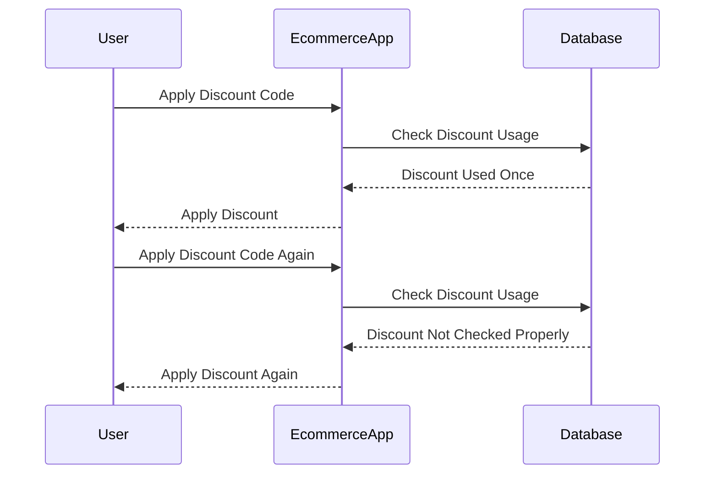
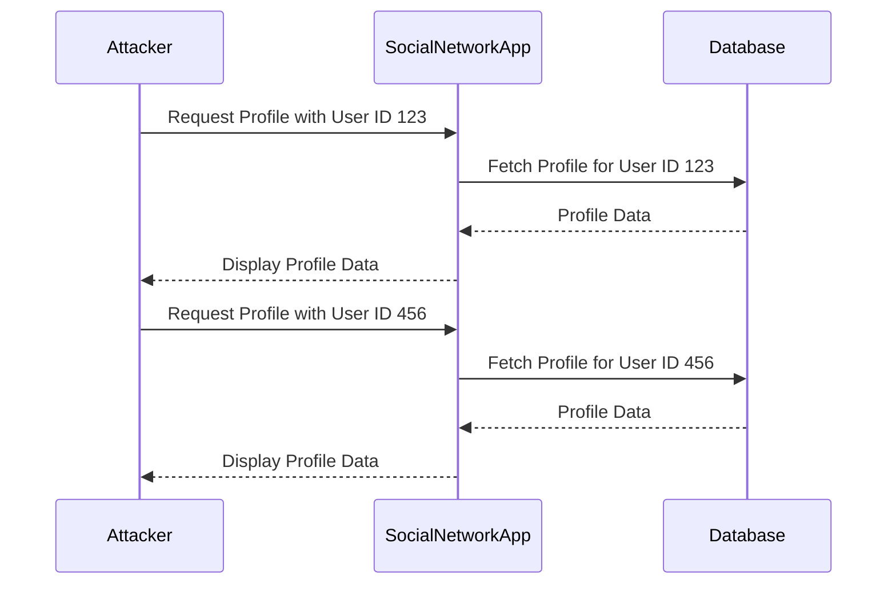

## What is a Business Logic Vulnerability?

Business logic vulnerabilities are flaws in the design and implementation of an application that allow an attacker to perform malicious actions. These vulnerabilities arise when the core business rules and processes are not properly enforced, leading to unintended behavior that can be exploited. Business logic vulnerabilities can range from minor inconveniences to severe security breaches, depending on the nature of the flaw and the context in which it occurs.

### Understanding Business Logic

Before diving into the specifics of business logic vulnerabilities, it’s essential to understand what business logic is. Business logic refers to the set of rules and processes that dictate how an application should behave to meet the business requirements. This includes:

- **Validation Rules**: Ensuring that inputs are valid and meet certain criteria.
- **Authorization Rules**: Determining whether a user is allowed to perform a specific action.
- **Transaction Processing**: Managing the sequence of operations that constitute a business transaction.
- **Data Integrity**: Ensuring that data remains consistent and accurate throughout the application.

### Types of Business Logic Vulnerabilities

There are several types of business logic vulnerabilities, each with its own characteristics and potential impacts. Some common types include:

1. **Logical Flaws**: These occur when the application does not correctly enforce the intended business rules. For example, a shopping cart might allow users to apply discounts multiple times, resulting in unauthorized savings.
   
2. **Access Control Issues**: These happen when the application fails to properly restrict access to certain features or data. For instance, an application might allow users to view other users' data if they can guess the correct URL.

3. **Input Validation Weaknesses**: These occur when the application does not adequately validate user inputs, allowing attackers to inject malicious data or manipulate the application's behavior.

4. **State Management Problems**: These arise when the application incorrectly manages the state of transactions or sessions, leading to inconsistencies or vulnerabilities.

### Real-World Examples

#### Example 1: Logical Flaw in Discount Application

Consider a scenario where an e-commerce website offers a discount code that can be applied once per user. However, due to a logical flaw, the application allows users to apply the same discount code multiple times, resulting in significant financial loss for the company.



#### Example 2: Access Control Issue in User Data Exposure

Imagine a social networking platform where users can view their profiles by navigating to a URL like `https://example.com/user/profile/<user_id>`. Due to a lack of proper access control, an attacker can simply change the `<user_id>` to view other users' profiles.



### Common Pitfalls

When designing and implementing business logic, developers often fall into several common pitfalls:

1. **Overlooking Edge Cases**: Developers may focus on the most common scenarios but fail to consider less frequent but critical edge cases.
2. **Complexity Overload**: Overly complex business logic can lead to errors and vulnerabilities, especially when multiple conditions and rules interact.
3. **Insufficient Testing**: Lack of thorough testing, particularly for security-related aspects, can result in undiscovered vulnerabilities.
4. **Inadequate Documentation**: Poorly documented business logic makes it difficult for developers to understand and maintain the system, increasing the likelihood of errors.

### How to Find and Exploit Business Logic Vulnerabilities

To identify and exploit business logic vulnerabilities, one must thoroughly test the application to uncover any flaws in the implementation of business rules. Here’s a step-by-step approach:

1. **Understand the Business Rules**: Gain a deep understanding of the intended business logic and the rules that govern the application’s behavior.
2. **Identify Potential Weak Points**: Look for areas where the application might not correctly enforce the business rules, such as input validation, access control, and transaction processing.
3. **Test the Application**: Perform extensive testing to verify that the application behaves as expected under various scenarios. This includes both positive and negative testing.
4. **Exploit Identified Vulnerabilities**: Once a vulnerability is identified, attempt to exploit it to understand the potential impact and the steps required to mitigate it.

#### Example: Exploiting a Logical Flaw

Let’s revisit the e-commerce discount code example. To exploit this vulnerability, an attacker could repeatedly apply the discount code to purchase items at a reduced price.

```http
POST /apply-discount HTTP/1.1
Host: example.com
Content-Type: application/json

{
  "discount_code": "SUMMER20"
}
```

The server responds with a success message, indicating that the discount has been applied. By sending this request multiple times, the attacker can continue to apply the discount, leading to financial loss for the company.

### How to Prevent / Defend Against Business Logic Vulnerabilities

Preventing and defending against business logic vulnerabilities requires a combination of secure coding practices, thorough testing, and robust security measures. Here are some key strategies:

1. **Implement Strong Input Validation**: Ensure that all user inputs are validated to prevent injection attacks and other forms of manipulation.
2. **Enforce Access Control**: Implement strict access control mechanisms to ensure that users can only access the resources and data they are authorized to access.
3. **Use Secure Coding Practices**: Follow secure coding guidelines to avoid common pitfalls and ensure that business logic is implemented correctly.
4. **Thoroughly Test the Application**: Conduct comprehensive testing, including both functional and security testing, to identify and address any vulnerabilities.
5. **Document Business Logic**: Maintain detailed documentation of the business logic to facilitate understanding and maintenance of the system.

#### Secure Coding Fix Example

Let’s take the e-commerce discount code example and show how to fix the vulnerability.

**Vulnerable Code:**

```python
def apply_discount(user_id, discount_code):
    if check_discount_usage(user_id, discount_code):
        apply_discount_to_cart(user_id)
        return "Discount Applied"
    else:
        return "Discount Already Used"
```

**Fixed Code:**

```python
def apply_discount(user_id, discount_code):
    if check_discount_usage(user_id, discount_code):
        apply_discount_to_cart(user_id)
        mark_discount_as_used(user_id, discount_code)
        return "Discount Applied"
    else:
        return "Discount Already Used"
```

In the fixed code, we added a function `mark_discount_as_used` to ensure that the discount code is marked as used after it is applied, preventing it from being used again.

### Detection and Prevention Techniques

To effectively detect and prevent business logic vulnerabilities, organizations can employ several techniques:

1. **Static Analysis Tools**: Use static analysis tools to scan the codebase for potential vulnerabilities and coding errors.
2. **Dynamic Analysis Tools**: Utilize dynamic analysis tools to test the application in real-time and identify runtime vulnerabilities.
3. **Penetration Testing**: Conduct regular penetration testing to simulate real-world attacks and identify vulnerabilities.
4. **Security Audits**: Perform periodic security audits to review the application’s security posture and identify areas for improvement.

### Conclusion

Business logic vulnerabilities are a significant threat to the security and integrity of web applications. By understanding the nature of these vulnerabilities, identifying potential weak points, and implementing robust security measures, organizations can protect their applications from exploitation. Thorough testing, secure coding practices, and continuous monitoring are essential components of a comprehensive defense strategy.

### Hands-On Labs

For practical experience in identifying and exploiting business logic vulnerabilities, consider the following hands-on labs:

- **PortSwigger Web Security Academy**: Offers a variety of labs focused on web security, including business logic vulnerabilities.
- **OWASP Juice Shop**: A deliberately insecure web application designed for security training purposes, featuring numerous business logic vulnerabilities.
- **DVWA (Damn Vulnerable Web Application)**: Another popular web application for security training, which includes business logic vulnerabilities among other types of vulnerabilities.

These labs provide a safe environment to practice and improve your skills in detecting and mitigating business logic vulnerabilities.

---
<!-- nav -->
[[02-Introduction to Business Logic Vulnerabilities|Introduction to Business Logic Vulnerabilities]] | [[Web Security (PortSwigger)/15-Business Logic Vulnerabilities/01-Business Logic Vulnerabilities Complete Guide/00-Overview|Overview]] | [[04-Automated Tools vs. Human Analysis|Automated Tools vs. Human Analysis]]
