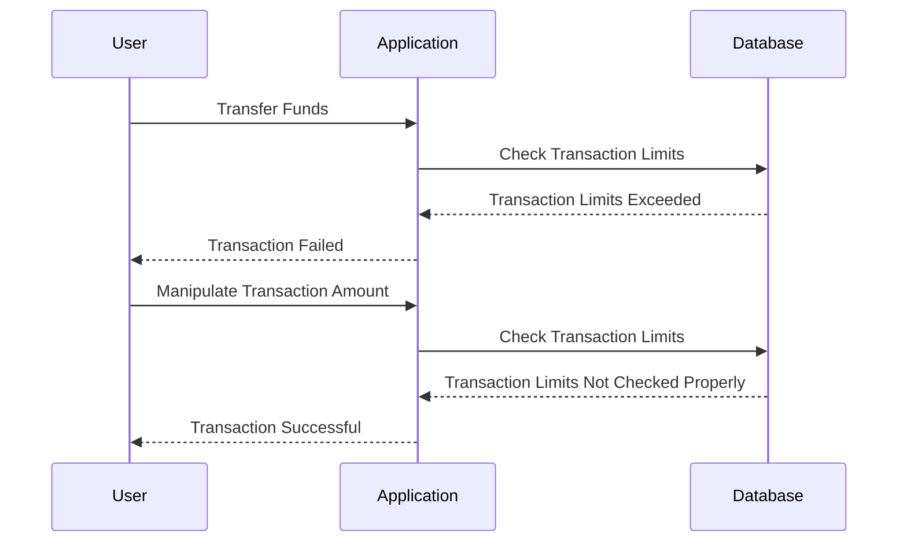

## Automated Tools vs. Human Analysis

Automated web application vulnerability scanners are powerful tools that can detect many types of vulnerabilities, such as SQL injection, XSS, and CSRF. However, they are largely ineffective at identifying business logic vulnerabilities. This is because business logic vulnerabilities require a deep understanding of the application’s intended behavior and the underlying business processes, which automated tools cannot provide.

### Limitations of Automated Scanners

Automated scanners work by sending various inputs to the application and analyzing the responses to identify potential vulnerabilities. While this approach is effective for detecting syntactic vulnerabilities, it falls short when it comes to business logic vulnerabilities. These vulnerabilities often involve complex interactions and dependencies that are not easily detectable through automated means.

### Importance of Manual Testing

Manual testing by skilled security professionals is essential for identifying business logic vulnerabilities. These professionals can analyze the application’s behavior and identify potential flaws that automated tools might miss. For example, a security tester might discover that an application allows users to manipulate their account balances by exploiting a flaw in the application’s business logic.

### Real-World Example: Manual Testing

Consider a banking application that allows users to transfer funds between accounts. An automated scanner might not detect a vulnerability that allows users to bypass transaction limits by manipulating the transaction amounts. However, a skilled security tester could identify this vulnerability by manually testing the application and analyzing its behavior.

In this scenario, the application fails to correctly enforce the transaction limits, leading to an exploitable vulnerability.

---
<!-- nav -->
[[03-What is a Business Logic Vulnerability|What is a Business Logic Vulnerability]] | [[Web Security (PortSwigger)/15-Business Logic Vulnerabilities/01-Business Logic Vulnerabilities Complete Guide/00-Overview|Overview]] | [[05-Business Logic Vulnerabilities|Business Logic Vulnerabilities]]
