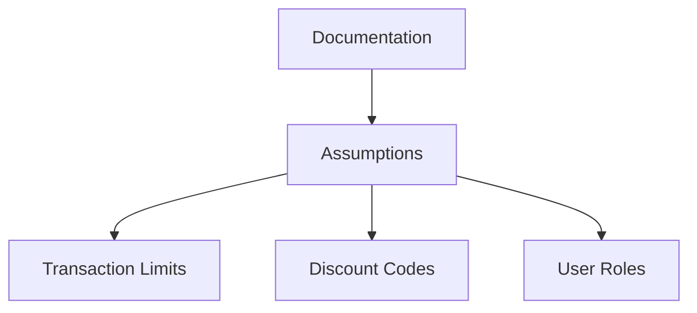
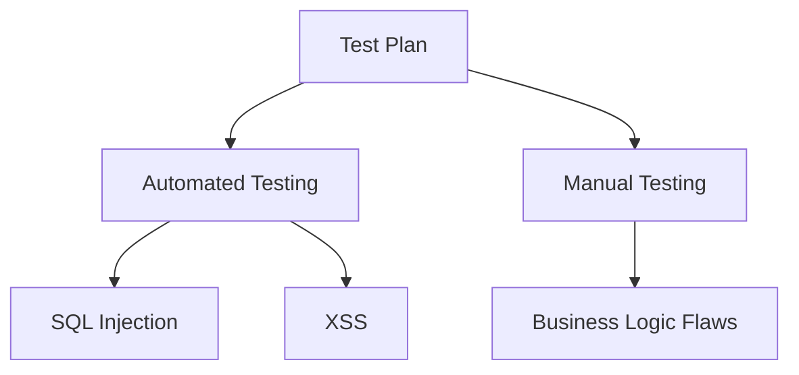
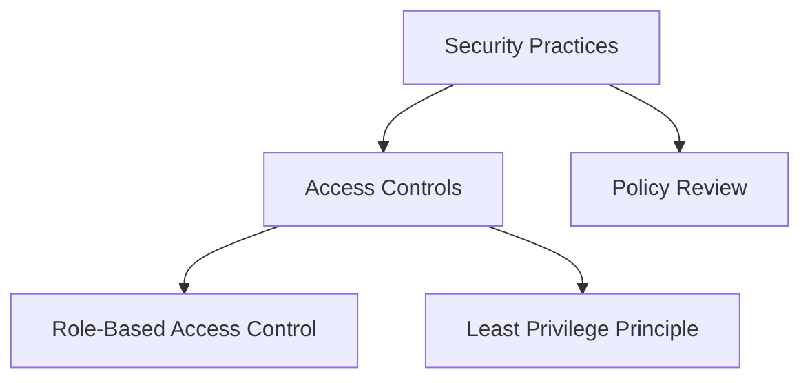
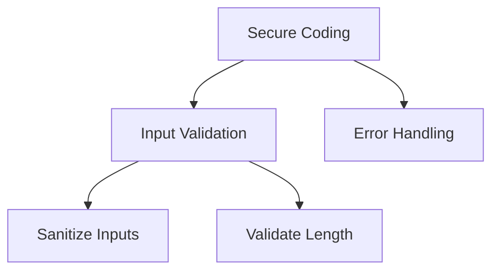
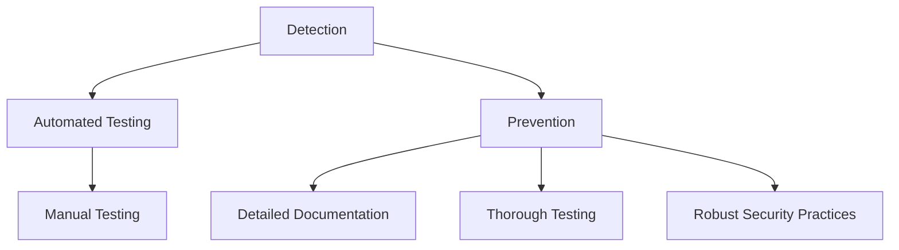

## How to Prevent Business Logic Vulnerabilities

Preventing business logic vulnerabilities requires a comprehensive approach that includes detailed documentation, thorough testing, and robust security practices. While there is no one-size-fits-all solution, there are several best practices that can significantly reduce the risk of introducing logic flaws into an application.

### Detailed Documentation

One of the most important steps in preventing business logic vulnerabilities is ensuring that there is detailed documentation of the application’s design. This documentation should outline every assumption that the designer has made and provide a clear understanding of the intended behavior of the application.

#### Example: Documentation of Assumptions

For example, the documentation might include assumptions about transaction limits, discount codes, and user roles. By clearly documenting these assumptions, developers and security testers can better understand the intended behavior of the application and identify potential flaws.

### Thorough Testing

Thorough testing is another critical component of preventing business logic vulnerabilities. This includes both automated testing and manual testing by skilled security professionals. Automated testing can help identify syntactic vulnerabilities, while manual testing can help identify more complex business logic vulnerabilities.

#### Example: Automated vs. Manual Testing

By combining automated and manual testing, organizations can more effectively identify and mitigate business logic vulnerabilities.

### Robust Security Practices

Robust security practices are also essential for preventing business logic vulnerabilities. This includes implementing strong access controls, enforcing least privilege principles, and regularly reviewing and updating security policies.

#### Example: Access Controls

By implementing strong access controls and regularly reviewing security policies, organizations can reduce the risk of introducing business logic vulnerabilities.

### Secure Coding Practices

Secure coding practices are also crucial for preventing business logic vulnerabilities. This includes using secure coding frameworks, following best practices for input validation, and implementing robust error handling mechanisms.

#### Example: Input Validation

By following secure coding practices, developers can reduce the risk of introducing business logic vulnerabilities.

### Detection and Prevention

Detecting and preventing business logic vulnerabilities requires a combination of detailed documentation, thorough testing, and robust security practices. By implementing these best practices, organizations can significantly reduce the risk of introducing logic flaws into their applications.

#### Example: Detection and Prevention

By combining these approaches, organizations can more effectively identify and mitigate business logic vulnerabilities.

### How to Prevent / Defend

#### Detection

Detecting business logic vulnerabilities requires a combination of automated and manual testing. Automated testing can help identify syntactic vulnerabilities, while manual testing by skilled security professionals can help identify more complex business logic vulnerabilities.

#### Prevention

Preventing business logic vulnerabilities requires a comprehensive approach that includes detailed documentation, thorough testing, and robust security practices. By implementing these best practices, organizations can significantly reduce the risk of introducing logic flaws into their applications.

#### Secure-Coding Fixes

Secure-coding fixes involve implementing robust input validation, using secure coding frameworks, and following best practices for error handling. By following these practices, developers can reduce the risk of introducing business logic vulnerabilities.

#### Configuration Hardening

Configuration hardening involves implementing strong access controls, enforcing least privilege principles, and regularly reviewing and updating security policies. By implementing these practices, organizations can reduce the risk of introducing business logic vulnerabilities.

#### Mitigations

Mitigating business logic vulnerabilities involves a combination of detailed documentation, thorough testing, and robust security practices. By implementing these best practices, organizations can significantly reduce the risk of introducing logic flaws into their applications.

### Conclusion

Business logic vulnerabilities are a critical category of security issues that require a deep understanding of the application’s intended behavior and the underlying business processes. While automated tools are largely ineffective at identifying these vulnerabilities, manual testing by skilled security professionals is essential. By implementing detailed documentation, thorough testing, and robust security practices, organizations can significantly reduce the risk of introducing business logic vulnerabilities.

### Practice Labs

For hands-on practice with business logic vulnerabilities, consider the following real-world labs:

- **PortSwigger Web Security Academy**: Offers a variety of labs that cover different types of business logic vulnerabilities.
- **OWASP Juice Shop**: Provides a vulnerable web application that includes business logic vulnerabilities.
- **DVWA (Damn Vulnerable Web Application)**: Includes a range of business logic vulnerabilities that can be exploited and mitigated.

By practicing with these labs, you can gain a deeper understanding of business logic vulnerabilities and how to prevent them.

---

This expanded chapter provides a comprehensive guide to understanding, identifying, and preventing business logic vulnerabilities. It covers the theoretical background, practical examples, and best practices for securing web applications against these vulnerabilities.

---
<!-- nav -->
[[05-Business Logic Vulnerabilities|Business Logic Vulnerabilities]] | [[Web Security (PortSwigger)/15-Business Logic Vulnerabilities/01-Business Logic Vulnerabilities Complete Guide/00-Overview|Overview]] | [[Web Security (PortSwigger)/15-Business Logic Vulnerabilities/01-Business Logic Vulnerabilities Complete Guide/07-Practice Questions & Answers|Practice Questions & Answers]]
