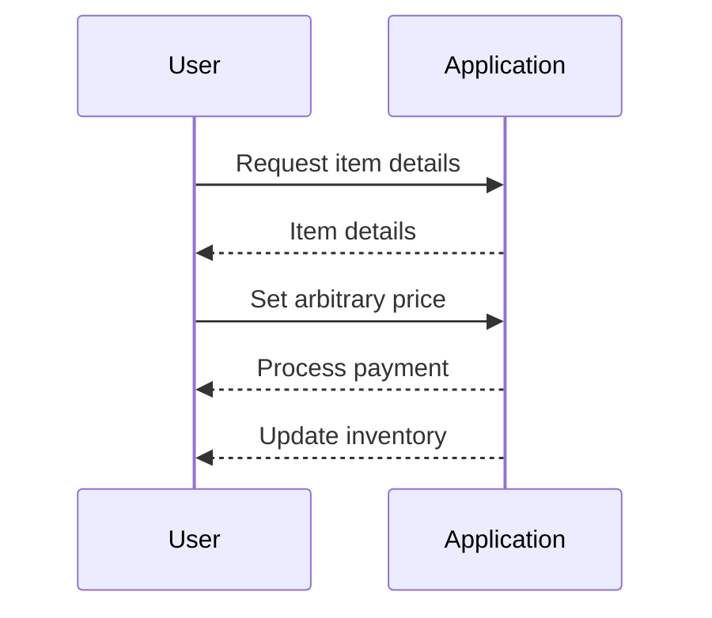
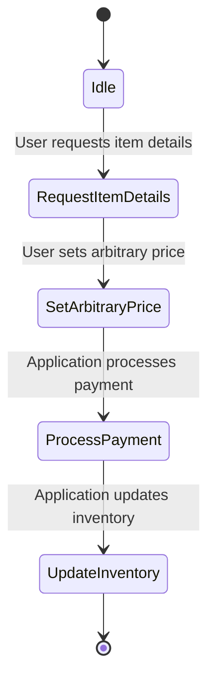

## Introduction to Business Logic Vulnerabilities

Business logic vulnerabilities are a class of security weaknesses that arise due to flaws in the application’s business rules or processes. These vulnerabilities often occur because the application does not correctly enforce the intended business rules, allowing attackers to manipulate the system in unintended ways. Business logic vulnerabilities can lead to significant financial losses, data breaches, and other serious consequences.

### What Are Business Logic Vulnerabilities?

Business logic vulnerabilities are flaws in the application's core functionality that allow attackers to perform actions that should not be possible according to the business rules. These vulnerabilities often stem from inadequate validation of user inputs, incorrect assumptions about user behavior, or insufficient enforcement of business constraints.

#### Why Do Business Logic Vulnerabilities Matter?

Business logic vulnerabilities matter because they can have severe financial and reputational impacts. For instance, an attacker might exploit a business logic vulnerability to purchase goods at a fraction of their intended price, leading to significant financial losses for the company. Additionally, such vulnerabilities can undermine customer trust and result in legal repercussions.

### How Do Business Logic Vulnerabilities Work?

To understand how business logic vulnerabilities work, consider a scenario where an e-commerce website allows users to purchase items. The application should ensure that the purchase price matches the advertised price. However, if the application fails to validate the purchase price correctly, an attacker could manipulate the system to buy items at a much lower price.

#### Example Scenario: Lightweight Leather Jacket Purchase

In the given scenario, the target goal is to exploit a business logic flaw in order to buy a specific item (lightweight leather jacket) for a price that is not listed in the application. This means that the application does not adequately validate the user input related to the purchase price, allowing the attacker to set an arbitrary price.

### Real-World Examples of Business Logic Vulnerabilities

Business logic vulnerabilities have been observed in various real-world scenarios. Here are some notable examples:

#### Example 1: Uber Surge Pricing Manipulation

In 2016, researchers discovered a way to manipulate Uber's surge pricing mechanism. By creating fake rides and canceling them at the last minute, attackers could artificially inflate the demand for rides, causing surge prices to skyrocket. This allowed attackers to earn significant profits by providing rides during high-demand periods.

#### Example 2: Ticket Scalping

Ticket scalping is another example of a business logic vulnerability. Ticketing websites often fail to enforce strict limits on the number of tickets a user can purchase. Attackers can exploit this by purchasing large quantities of tickets and reselling them at inflated prices, leading to financial losses for the event organizers.

### Background Theory

To fully understand business logic vulnerabilities, it is essential to delve into the underlying principles and theories.

#### Business Rules and Constraints

Business rules define the acceptable behavior within an application. These rules are typically derived from the business requirements and should be enforced consistently throughout the application. Constraints, on the other hand, are limitations placed on user inputs to ensure that they conform to the business rules.

#### Input Validation

Input validation is a critical aspect of preventing business logic vulnerabilities. Applications must validate all user inputs to ensure that they meet the required criteria. This includes checking for the correct format, range, and consistency of the inputs.

### Detailed Explanation of the Scenario

Let's break down the scenario described in the lecture transcript.

#### Scenario Overview

The scenario involves an e-commerce website where users can purchase items. The application fails to validate the purchase price correctly, allowing an attacker to set an arbitrary price. The goal is to exploit this vulnerability to buy a lightweight leather jacket for a price that is not listed in the application.

#### Steps to Exploit the Vulnerability

1. **Log into the Account**: Use the provided credentials to log into the account.
2. **Identify the Vulnerable Workflow**: Determine the steps involved in the purchasing process.
3. **Manipulate the Purchase Price**: Modify the purchase price to an arbitrary value that is lower than the intended price.
4. **Complete the Purchase**: Submit the modified purchase request to complete the transaction.

### Code Example

Here is a simplified example of how the vulnerability might manifest in code:

```python
# Vulnerable code snippet
def process_purchase(item_id, quantity, price):
    # Fetch item details from database
    item = get_item_details(item_id)
    
    # Calculate total cost
    total_cost = quantity * price
    
    # Process payment
    process_payment(total_cost)
    
    # Update inventory
    update_inventory(item_id, quantity)

# Secure code snippet
def process_purchase(item_id, quantity, price):
    # Fetch item details from database
    item = get_item_details(item_id)
    
    # Validate price against advertised price
    if price != item['price']:
        raise ValueError("Invalid purchase price")
    
    # Calculate total cost
    total_cost = quantity * price
    
    # Process payment
    process_payment(total_cost)
    
    # Update inventory
    update_inventory(item_id, quantity)
```

### Mermaid Diagrams

#### Sequence Diagram

A sequence diagram can help visualize the interaction between the user and the application during the purchase process.



#### State Machine Diagram

A state machine diagram can illustrate the different states of the purchase process and the transitions between them.



### Common Pitfalls

When dealing with business logic vulnerabilities, several common pitfalls can lead to security issues:

1. **Insufficient Input Validation**: Failing to validate user inputs can allow attackers to manipulate the system in unintended ways.
2. **Incorrect Assumptions**: Making incorrect assumptions about user behavior can lead to vulnerabilities. For example, assuming that users will not attempt to manipulate the system can result in inadequate security measures.
3. **Inconsistent Enforcement of Business Rules**: Failing to enforce business rules consistently throughout the application can create vulnerabilities.

### How to Prevent / Defend

To prevent business logic vulnerabilities, it is essential to implement robust security measures. Here are some strategies:

#### Detection

Detection involves identifying potential business logic vulnerabilities through automated and manual testing methods.

1. **Automated Testing**: Use tools like static analysis and dynamic analysis to identify potential vulnerabilities.
2. **Manual Testing**: Conduct thorough manual testing to verify that the application enforces business rules correctly.

#### Prevention

Prevention involves implementing security measures to ensure that the application enforces business rules correctly.

1. **Input Validation**: Validate all user inputs to ensure that they meet the required criteria.
2. **Consistent Enforcement of Business Rules**: Ensure that business rules are enforced consistently throughout the application.
3. **Secure Coding Practices**: Follow secure coding practices to minimize the risk of introducing vulnerabilities.

#### Secure-Coding Fixes

Here is an example of how to fix the vulnerability in the code:

```python
# Vulnerable code snippet
def process_purchase(item_id, quantity, price):
    # Fetch item details from database
    item = get_item_details(item_id)
    
    # Calculate total cost
    total_cost = quantity * price
    
    # Process payment
    process_payment(total_cost)
    
    # Update inventory
    update_inventory(item_id, quantity)

# Secure code snippet
def process_purchase(item_id, quantity, price):
    # Fetch item details from database
    item = get_item_details(item_id)
    
    # Validate price against advertised price
    if price != item['price']:
        raise ValueError("Invalid purchase price")
    
    # Calculate total cost
    total_cost = quantity * price
    
    # Process payment
    process_payment(total_cost)
    
    # Update inventory
    update_inventory(item_id, quantity)
```

### Conclusion

Business logic vulnerabilities are a significant threat to the security and integrity of web applications. By understanding the underlying principles and implementing robust security measures, developers can prevent these vulnerabilities and protect their applications from exploitation.

### Practice Labs

For hands-on practice with business logic vulnerabilities, consider the following labs:

- **PortSwigger Web Security Academy**: Offers a variety of labs that cover business logic vulnerabilities in depth.
- **OWASP Juice Shop**: A deliberately insecure web application that includes business logic vulnerabilities for educational purposes.
- **DVWA (Damn Vulnerable Web Application)**: Another popular web application that includes business logic vulnerabilities for testing and learning.

By engaging with these labs, you can gain practical experience in identifying and mitigating business logic vulnerabilities.

---
<!-- nav -->
[[Web Security (PortSwigger)/15-Business Logic Vulnerabilities/03-Lab 2 High level logic vulnerability/00-Overview|Overview]] | [[02-Business Logic Vulnerabilities|Business Logic Vulnerabilities]]
