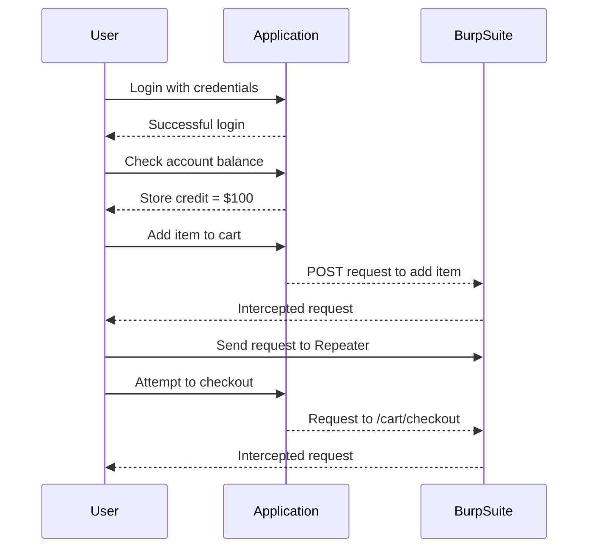

## Business Logic Vulnerabilities

### Introduction to Business Logic Vulnerabilities

Business logic vulnerabilities occur when an application's business rules are not correctly enforced, allowing attackers to manipulate the application in unintended ways. These vulnerabilities often arise due to insufficient validation of inputs, lack of proper authorization checks, or inadequate enforcement of business rules. Understanding these vulnerabilities is crucial for securing web applications against sophisticated attacks.

### Background Theory

#### What is Business Logic?

Business logic refers to the set of rules and processes that govern how an application should behave. These rules define how data should be processed, how transactions should be handled, and how users should interact with the system. In a web application, business logic typically includes operations such as purchasing items, managing accounts, and processing payments.

#### Why Business Logic Matters

Business logic is critical because it ensures that the application behaves as intended. Without proper enforcement of business logic, an attacker can manipulate the application to perform actions that were not anticipated by the developers. This can lead to financial losses, data breaches, and other serious consequences.

### Real-World Examples

#### Recent CVEs and Breaches

One notable example of a business logic vulnerability is the case of a payment processing system that allowed attackers to bypass the minimum payment amount. This vulnerability was exploited to make purchases for significantly less than the actual cost, resulting in substantial financial losses for the company. Another example is a hotel booking system that allowed attackers to book rooms for negative prices, effectively stealing money from the hotel.

### Detailed Walkthrough

Let's walk through the scenario described in the lecture transcript to understand how business logic vulnerabilities can be exploited.

#### Scenario Setup

The scenario involves a web application where users can purchase items using store credit. The user has been provided with credentials to log in and attempt to purchase an item that costs $1,337. However, the user only has $100 in store credit, making it impossible to purchase the item at its current price.

#### Step-by-Step Analysis

1. **Logging In**
   - The user logs in using the provided credentials (`username: peter`, `password: peter`).
   - After logging in, the user checks their account and finds that they have $100 in store credit.

2. **Adding Item to Cart**
   - The user adds the desired item to the cart.
   - The application sends a POST request to add the item to the cart.
   - The request is intercepted by Burp Suite and sent to Repeater for further analysis.

3. **Checkout Process**
   - The user attempts to check out and purchase the item.
   - The application sends a request to `/cart/checkout`.
   - The request includes a CSRF token but does not contain any client-supplied input that could change the price of the item.

#### Analyzing the Requests



### Identifying the Vulnerability

In this scenario, the vulnerability lies in the fact that the application does not properly enforce the business rule that the total cost of the purchase must be covered by the available store credit. An attacker could exploit this by manipulating the request to reduce the price of the item or by bypassing the store credit check altogether.

### Exploiting the Vulnerability

To exploit this vulnerability, an attacker could modify the request to the `/cart/checkout` endpoint to include a lower price for the item. For example, the attacker could change the price from $1,337 to $100.

#### Example of Exploitation

```http
POST /cart/checkout HTTP/1.1
Host: example.com
Content-Type: application/x-www-form-urlencoded
Cookie: session=abc123
CSRF-Token: 1234567890

item_id=1&price=100
```

### How to Prevent / Defend

#### Detection

To detect business logic vulnerabilities, organizations should implement automated testing tools that can identify deviations from expected behavior. Tools like Burp Suite, OWASP ZAP, and static code analyzers can help identify potential issues.

#### Prevention

1. **Enforce Business Rules**
   - Ensure that all business rules are strictly enforced. For example, validate that the total cost of the purchase is covered by the available store credit.
   - Use server-side validation to ensure that client-supplied inputs are not manipulated.

2. **Secure Coding Practices**
   - Implement secure coding practices to prevent common vulnerabilities such as SQL injection, cross-site scripting (XSS), and cross-site request forgery (CSRF).

3. **Configuration Hardening**
   - Harden the application configuration to minimize the attack surface. For example, disable unnecessary features and services.

4. **Regular Audits and Penetration Testing**
   - Conduct regular security audits and penetration testing to identify and mitigate business logic vulnerabilities.

### Secure Code Fix

#### Vulnerable Code

```python
def checkout(item_id, price):
    # Check if the user has enough store credit
    if get_store_credit() >= price:
        # Process the purchase
        process_purchase(item_id, price)
    else:
        raise InsufficientFundsError("Insufficient store credit")
```

#### Fixed Code

```python
def checkout(item_id, price):
    # Validate the price input
    if not isinstance(price, int) or price <= 0:
        raise ValueError("Invalid price")

    # Check if the user has enough store credit
    if get_store_credit() >= price:
        # Process the purchase
        process_purchase(item_id, price)
    else:
        raise InsufficientFundsError("Insufficient store credit")
```

### Conclusion

Business logic vulnerabilities are a significant threat to web applications. By understanding the underlying principles and implementing robust security measures, organizations can protect their applications from exploitation. Regular testing, secure coding practices, and configuration hardening are essential steps in mitigating these vulnerabilities.

### Practice Labs

For hands-on practice with business logic vulnerabilities, consider the following labs:

- **PortSwigger Web Security Academy**: Offers a variety of labs that cover different types of business logic vulnerabilities.
- **OWASP Juice Shop**: A deliberately insecure web application that includes several business logic vulnerabilities.
- **DVWA (Damn Vulnerable Web Application)**: Provides a range of vulnerabilities, including business logic flaws, for educational purposes.

By engaging with these labs, you can gain practical experience in identifying and mitigating business logic vulnerabilities.

---
<!-- nav -->
[[Web Security (PortSwigger)/15-Business Logic Vulnerabilities/03-Lab 2 High level logic vulnerability/01-Introduction to Business Logic Vulnerabilities|Introduction to Business Logic Vulnerabilities]] | [[Web Security (PortSwigger)/15-Business Logic Vulnerabilities/03-Lab 2 High level logic vulnerability/00-Overview|Overview]] | [[Web Security (PortSwigger)/15-Business Logic Vulnerabilities/03-Lab 2 High level logic vulnerability/03-Practice Questions & Answers|Practice Questions & Answers]]
