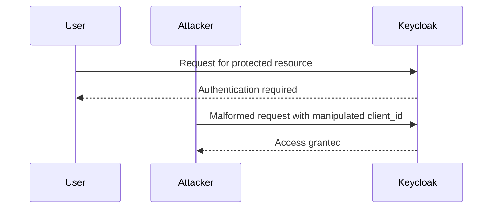
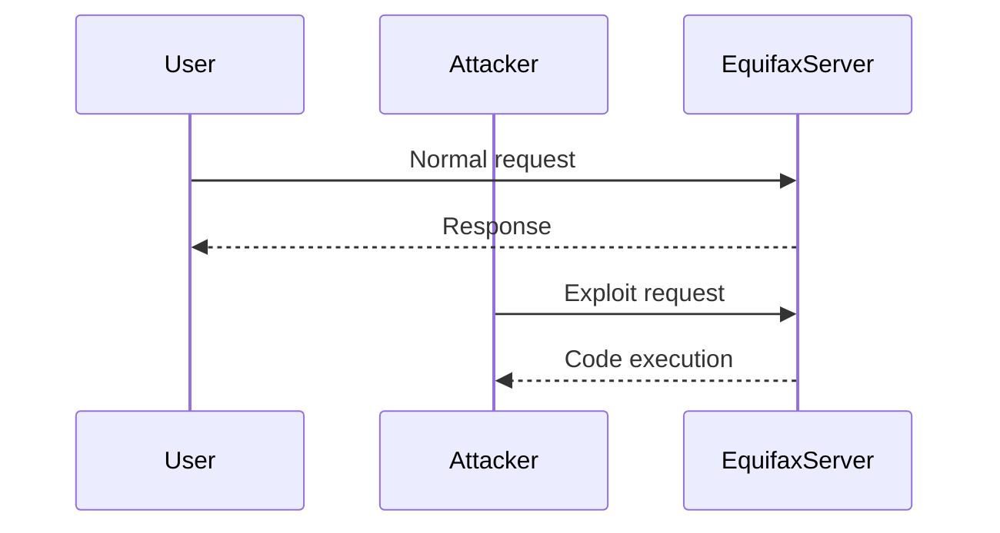
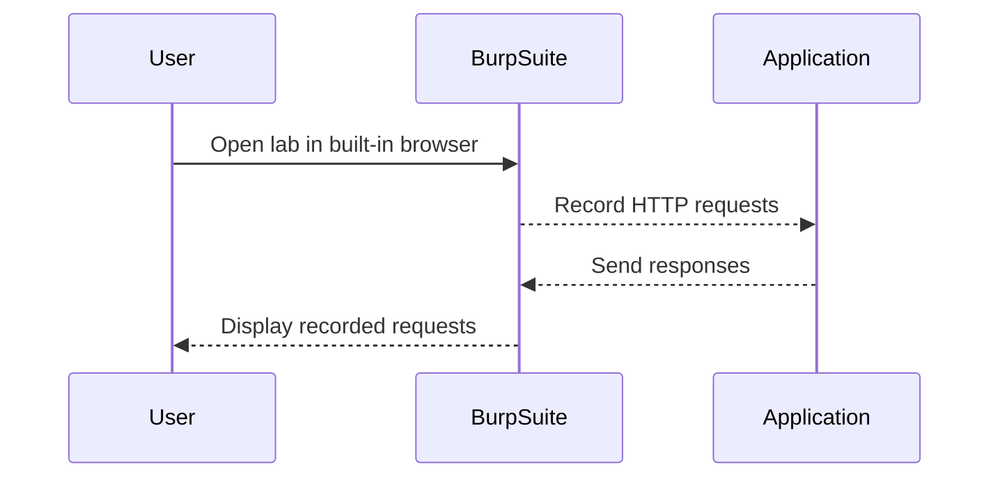

## Introduction to Business Logic Vulnerabilities

Business logic vulnerabilities occur when the application's business rules are not properly enforced, leading to unintended behavior that can be exploited by attackers. These vulnerabilities often arise due to inconsistent security controls, where certain actions are allowed in one context but not in another. In this chapter, we will delve into the details of such vulnerabilities, focusing on the specific scenario presented in the lab titled "Inconsistent Security Controls."

### What Are Business Logic Vulnerabilities?

Business logic vulnerabilities are flaws in the application's core business processes that allow attackers to perform unauthorized actions. These vulnerabilities typically stem from:

- **Inconsistent Access Control**: Different parts of the application enforce different levels of access control, leading to gaps that can be exploited.
- **Missing Validation**: Critical inputs are not validated properly, allowing attackers to manipulate them.
- **Incorrect Assumptions**: Developers make incorrect assumptions about user behavior or data integrity, which can be exploited.

### Why Do Business Logic Vulnerabilities Matter?

Business logic vulnerabilities can lead to significant security risks, including:

- **Data Leakage**: Unauthorized access to sensitive information.
- **Financial Losses**: Manipulation of financial transactions.
- **Service Disruption**: Denial of service through abuse of business logic.

### How Do Business Logic Vulnerabilities Work?

To understand how these vulnerabilities work, consider a scenario where an application allows users to perform certain actions based on their role. However, if the application does not consistently enforce these roles across all functionalities, an attacker might be able to bypass the intended restrictions.

### Real-World Examples

#### Example 1: CVE-2021-21972

In 2021, a business logic vulnerability was discovered in the popular open-source project Keycloak. The vulnerability allowed attackers to bypass authentication checks by manipulating the `client_id` parameter. This led to unauthorized access to protected resources.



#### Example 2: Breach at Equifax

In 2017, Equifax suffered a massive data breach due to a business logic vulnerability in their Apache Struts framework. Attackers exploited a flaw that allowed them to execute arbitrary code on the server, leading to the theft of sensitive personal data.



### Lab Overview: Inconsistent Security Controls

In this lab, we will explore a scenario where the application's business logic allows arbitrary users to access administrative functionality that should only be available to company employees. The goal is to exploit this logic flaw to access the admin panel and delete the user named Carlos.

### Setting Up the Lab Environment

To access the lab, follow these steps:

1. Visit the Web Security Academy website at [portswigger.net/web-security](https://portswigger.net/web-security).
2. Sign up for an account if you haven't already.
3. Log in to your account.
4. Navigate to the "Academy" section.
5. Select "All Labs."
6. Search for "business logic vulnerabilities" labs.
7. Select "Lab Number Three: Inconsistent Security Controls."

### Exploring the Lab Scenario

The lab environment is set up with an application that has an admin panel accessible via a specific URL. The admin panel should only be accessible to company employees, but due to inconsistent security controls, any user can access it.

#### Identifying the Admin Panel

To find the admin panel, we can use Burp Suite's built-in browser and recording capabilities. Here’s how to proceed:

1. Open the lab in the built-in browser.
2. Use Burp Suite to record all HTTP requests made during navigation.
3. Look for patterns in the requests that might indicate the presence of an admin panel.



### Analyzing the HTTP Requests

Once we have recorded the HTTP requests, we can analyze them to identify the admin panel. Typically, the admin panel might be accessed via a URL like `/admin` or `/dashboard`.

#### Example HTTP Request

Here is an example of an HTTP request to access the admin panel:

```http
GET /admin HTTP/1.1
Host: vulnerable-app.example.com
Cookie: session=abc123
```

#### Example HTTP Response

And here is the corresponding HTTP response:

```http
HTTP/1.1 200 OK
Content-Type: text/html; charset=UTF-8
Set-Cookie: session=abc123; Path=/; HttpOnly
Content-Length: 1234

<!DOCTYPE html>
<html>
<head>
    <title>Admin Dashboard</title>
</head>
<body>
    <h1>Welcome to the Admin Dashboard</h1>
    <!-- More HTML content -->
</body>
</html>
```

### Exploiting the Vulnerability

Now that we have identified the admin panel, we can attempt to access it and perform unauthorized actions. In this case, the goal is to delete the user named Carlos.

#### Steps to Exploit

1. **Access the Admin Panel**: Use the identified URL to access the admin panel.
2. **Locate the Delete Functionality**: Find the option to delete users within the admin panel.
3. **Delete Carlos**: Perform the deletion action.

#### Example HTTP Request to Delete Carlos

Here is an example of an HTTP request to delete the user Carlos:

```http
POST /admin/delete_user HTTP/1.1
Host: vulnerable-app.example.com
Cookie: session=abc123
Content-Type: application/x-www-form-urlencoded
Content-Length: 12

username=Carlos
```

#### Example HTTP Response After Deletion

And here is the corresponding HTTP response after the deletion:

```http
HTTP/1.1 200 OK
Content-Type: text/html; charset=UTF-8
Set-Cookie: session=abc123; Path=/; HttpOnly
Content-Length: 1234

<!DOCTYPE html>
<html>
<head>
    <title>User Deleted</title>
</head>
<body>
    <h1>User Carlos has been deleted.</h1>
    <!-- More HTML content -->
</body>
</html>
```

### Common Pitfalls and Mistakes

When dealing with business logic vulnerabilities, several common pitfalls can lead to exploitation:

- **Incomplete Role Checking**: Not checking the user's role consistently across all functionalities.
- **Hardcoded Values**: Using hardcoded values instead of dynamic checks, which can be bypassed.
- **Missing Input Validation**: Failing to validate input parameters, allowing attackers to inject malicious data.

### How to Prevent / Defend Against Business Logic Vulnerabilities

To prevent business logic vulnerabilities, follow these best practices:

#### Secure Coding Practices

1. **Consistent Role Checking**: Ensure that role checks are performed consistently across all functionalities.
2. **Dynamic Input Validation**: Validate all input parameters dynamically to prevent injection attacks.
3. **Least Privilege Principle**: Grant users the minimum privileges necessary to perform their tasks.

#### Example of Secure Code

Here is an example of secure code that enforces consistent role checking:

```python
def delete_user(username):
    if not current_user.is_admin():
        raise PermissionError("You do not have permission to delete users.")
    
    # Proceed with deleting the user
    user = User.objects.get(username=username)
    user.delete()
```

#### Example of Vulnerable Code

Here is an example of vulnerable code that fails to enforce consistent role checking:

```python
def delete_user(username):
    # Missing role check
    user = User.objects.get(username=username)
    user.delete()
```

#### Configuration Hardening

1. **Disable Unnecessary Features**: Disable features that are not required for the application's functionality.
2. **Use Strong Authentication Mechanisms**: Implement strong authentication mechanisms to ensure that only authorized users can access sensitive functionalities.
3. **Regular Audits**: Conduct regular security audits to identify and mitigate potential business logic vulnerabilities.

#### Detection and Monitoring

1. **Logging and Monitoring**: Implement logging and monitoring to detect unusual activities that might indicate exploitation of business logic vulnerabilities.
2. **Security Scanners**: Use security scanners to identify potential vulnerabilities in the application's business logic.
3. **Penetration Testing**: Regularly conduct penetration testing to simulate real-world attacks and identify weaknesses in the application's security.

### Conclusion

Business logic vulnerabilities are a critical aspect of web security that can lead to significant security risks if not properly addressed. By understanding the underlying principles, identifying common pitfalls, and implementing robust defense mechanisms, developers can significantly reduce the likelihood of such vulnerabilities being exploited.

### Practice Labs

For hands-on practice with business logic vulnerabilities, consider the following labs:

- **PortSwigger Web Security Academy**: Offers a variety of labs that cover different aspects of web security, including business logic vulnerabilities.
- **OWASP Juice Shop**: A deliberately insecure web application that includes various business logic vulnerabilities for educational purposes.
- **DVWA (Damn Vulnerable Web Application)**: Another popular web application that includes numerous vulnerabilities, including business logic flaws.

By engaging with these labs, you can gain practical experience in identifying and mitigating business logic vulnerabilities in real-world applications.

---
<!-- nav -->
[[Web Security (PortSwigger)/15-Business Logic Vulnerabilities/04-Lab 3 Inconsistent security controls/00-Overview|Overview]] | [[02-Business Logic Vulnerabilities Inconsistent Security Controls|Business Logic Vulnerabilities Inconsistent Security Controls]]
