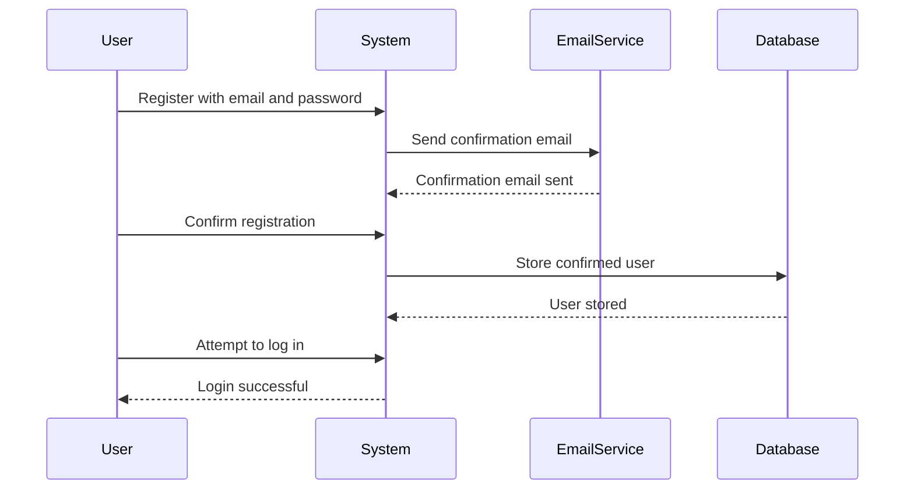

## Business Logic Vulnerabilities: Inconsistent Security Controls

### Introduction to Business Logic Vulnerabilities

Business logic vulnerabilities occur when the application's business rules are not correctly enforced, leading to unintended behavior that can be exploited by attackers. These vulnerabilities often arise due to inconsistencies in how different parts of the system enforce security controls. Understanding these vulnerabilities is crucial for securing web applications against sophisticated attacks.

### Scenario: Inconsistent Security Controls in User Registration

Let's delve into a specific scenario involving inconsistent security controls during user registration. The goal is to understand how an attacker might exploit such inconsistencies and how to prevent them.

#### Step-by-Step Analysis

1. **Adding a User Without Confirmation**:
    - An attacker attempts to register a new user without completing the email confirmation process.
    - The attacker uses an email address `test@dontwanttocry.com` and sets the password as `test`.
    - Upon clicking the "Register" button, the system prompts the user to check their email for a registration link.

2. **Attempting to Log In Without Confirmation**:
    - The attacker tries to log in using the same credentials (`test` and `test`) before confirming the registration.
    - The system denies access, indicating that the user needs to confirm their registration via email.

3. **Using a Controlled Email Address**:
    - To bypass the email confirmation issue, the attacker uses an email address provided by the Web Security Academy, which includes an integrated email client.
    - The attacker registers with a new email address and confirms the registration through the provided email client.

#### Code Example: User Registration Process

Here is a simplified example of how the user registration process might look in code:

```python
class UserRegistration:
    def __init__(self, email, password):
        self.email = email
        self.password = password
        self.confirmed = False

    def send_confirmation_email(self):
        # Simulate sending an email with a confirmation link
        print(f"Confirmation email sent to {self.email}")

    def confirm_registration(self):
        # Simulate confirming the registration
        self.confirmed = True
        print("Registration confirmed")

    def login(self):
        if self.confirmed:
            print("Login successful")
        else:
            print("Please confirm your registration first")

# Example usage
user = UserRegistration("test@dontwanttocry.com", "test")
user.send_confirmation_email()
user.login()  # Should fail because registration is not confirmed
```

### Real-World Examples

#### Recent Breaches and CVEs

- **CVE-2021-3116**: A business logic flaw in a payment processing system allowed attackers to manipulate transaction amounts.
- **CVE-2022-22965**: A vulnerability in a healthcare application allowed unauthorized access to patient records due to inconsistent enforcement of access controls.

### How to Prevent / Defend

#### Detection

- **Automated Testing Tools**: Use tools like Burp Suite, OWASP ZAP, or custom scripts to simulate various attack scenarios.
- **Logging and Monitoring**: Implement comprehensive logging and monitoring to detect unusual patterns in user behavior.

#### Prevention

- **Consistent Enforcement of Security Controls**: Ensure that all parts of the system enforce the same security policies.
- **Code Reviews and Penetration Testing**: Regularly review code and conduct penetration testing to identify and fix business logic vulnerabilities.

#### Secure Coding Fixes

##### Vulnerable Code

```python
def register_user(email, password):
    user = UserRegistration(email, password)
    user.send_confirmation_email()
    return user
```

##### Fixed Code

```python
def register_user(email, password):
    user = UserRegistration(email, password)
    user.send_confirmation_email()
    user.confirm_registration()  # Ensure registration is confirmed before allowing access
    return user
```

### Mermaid Diagrams

#### Sequence Diagram: User Registration Process



### Conclusion

Inconsistent security controls in user registration processes can lead to significant vulnerabilities. By understanding the underlying mechanisms and implementing consistent security measures, developers can significantly reduce the risk of exploitation. Regular testing and code reviews are essential to maintaining robust security in web applications.

### Practice Labs

For hands-on practice with business logic vulnerabilities, consider the following labs:

- **PortSwigger Web Security Academy**: Offers interactive labs on various web security topics, including business logic vulnerabilities.
- **OWASP Juice Shop**: A deliberately insecure web app for practicing web security skills.
- **DVWA (Damn Vulnerable Web Application)**: Provides a range of vulnerabilities, including business logic flaws, for educational purposes.

By engaging with these resources, you can gain practical experience in identifying and mitigating business logic vulnerabilities.

---
<!-- nav -->
[[Web Security (PortSwigger)/15-Business Logic Vulnerabilities/04-Lab 3 Inconsistent security controls/01-Introduction to Business Logic Vulnerabilities|Introduction to Business Logic Vulnerabilities]] | [[Web Security (PortSwigger)/15-Business Logic Vulnerabilities/04-Lab 3 Inconsistent security controls/00-Overview|Overview]] | [[Web Security (PortSwigger)/15-Business Logic Vulnerabilities/04-Lab 3 Inconsistent security controls/03-Business Logic Vulnerabilities|Business Logic Vulnerabilities]]
