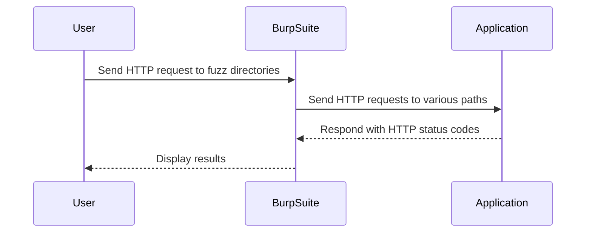
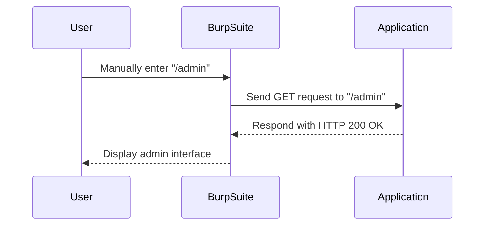
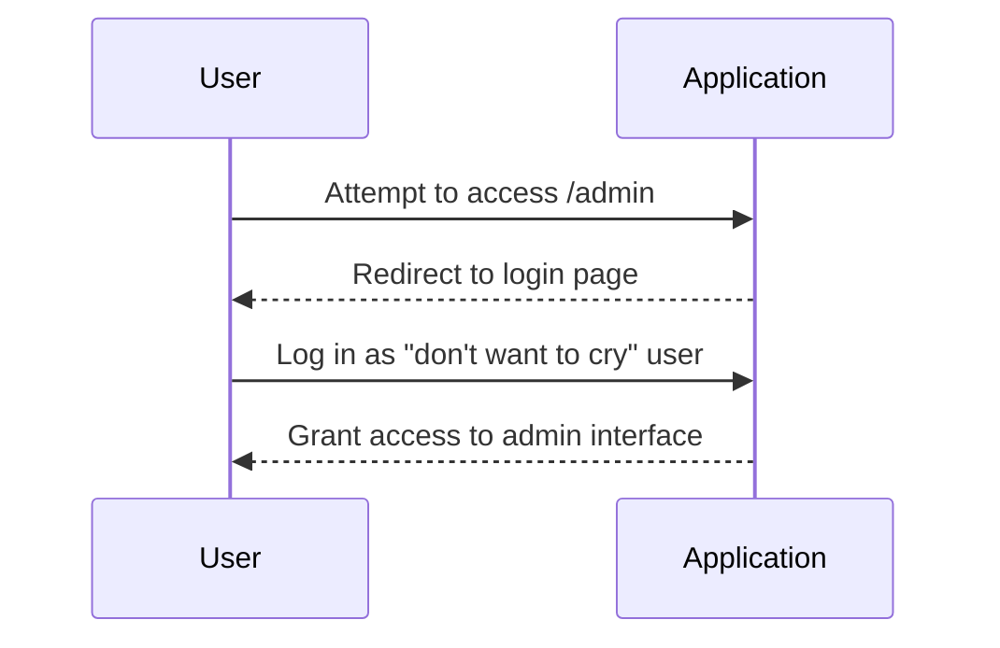
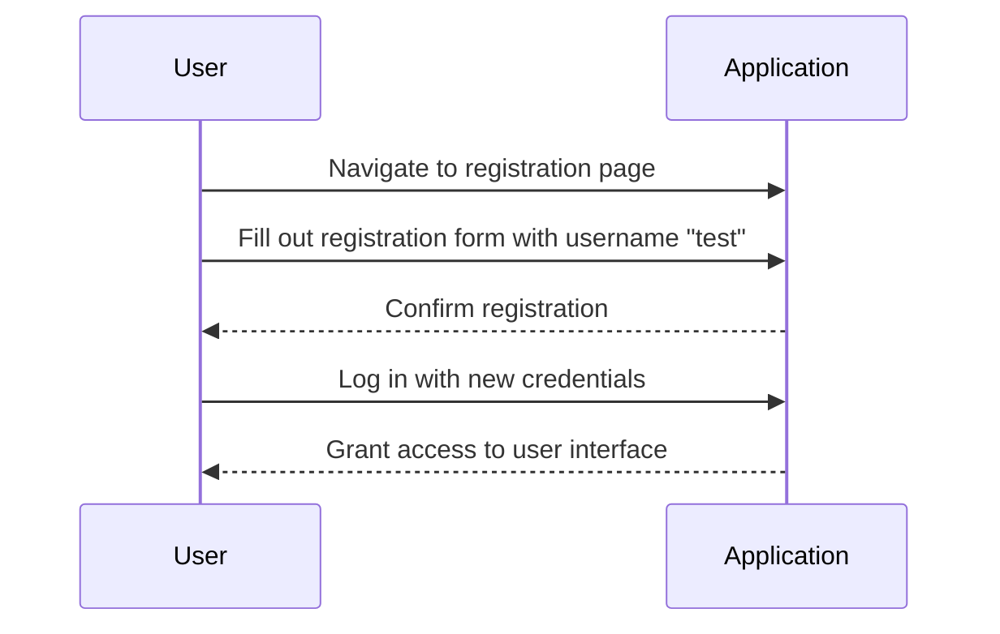

## Business Logic Vulnerabilities

Business logic vulnerabilities occur when the underlying business rules and processes of an application are not properly enforced, leading to unintended behavior that can be exploited by attackers. These vulnerabilities often arise due to inconsistent security controls, misconfigurations, or logical flaws in the application's design. This chapter will delve into the details of such vulnerabilities, focusing on the scenario described in the lecture transcript, and provide comprehensive explanations, examples, and preventive measures.

### Understanding Business Logic Vulnerabilities

#### What Are Business Logic Vulnerabilities?

Business logic vulnerabilities are flaws in the application’s business rules and processes that allow attackers to perform unauthorized actions. These vulnerabilities can lead to various security issues, including data theft, financial loss, and service disruption.

#### Why Do They Matter?

These vulnerabilities matter because they can bypass traditional security mechanisms like authentication and authorization. Attackers can exploit these flaws to manipulate the application in ways that were not intended by the developers. This can result in significant damage to the organization and its customers.

#### How Do They Work Under the Hood?

Business logic vulnerabilities typically arise due to:

1. **Inconsistent Security Controls**: Different parts of the application may enforce different levels of security, leading to gaps that attackers can exploit.
2. **Logical Flaws**: Misunderstandings or oversights in the implementation of business rules can create opportunities for exploitation.
3. **Misconfigurations**: Incorrect settings or configurations can weaken the security of the application.

### Example Scenario: Hidden Admin Panel

Let's explore the scenario described in the lecture transcript in detail.

#### Initial Setup

The scenario involves an application with a hidden admin panel. The goal is to identify and access this panel to understand the potential vulnerabilities.



#### Fuzzing Directories

Fuzzing directories involves sending HTTP requests to various paths to identify hidden directories or endpoints. In this case, the user is manually fuzzing the application using Burp Suite Community Edition.



#### Accessing the Admin Interface

Upon accessing the `/admin` endpoint, the user discovers that the admin interface is only accessible if logged in as a specific type of user, referred to as a "don't want to cry" user.



### Exploiting the Vulnerability

To exploit this vulnerability, the attacker needs to either compromise the "don't want to cry" user account or find a way to become part of that category of users.

#### Compromising the User Account

One approach is to attempt to register a new user and see if it allows the attacker to gain access to the admin interface.



### Real-World Examples

#### Recent CVEs and Breaches

Several recent CVEs and breaches highlight the importance of securing business logic:

1. **CVE-2021-44228 (Log4Shell)**: Although primarily a remote code execution vulnerability, it also highlights the importance of securing business logic to prevent unauthorized access and manipulation.
2. **Capital One Data Breach (2019)**: This breach involved exploiting a misconfiguration in the web application firewall, leading to unauthorized access to sensitive data.

### How to Prevent / Defend

#### Detection

To detect business logic vulnerabilities, organizations should:

1. **Conduct Regular Security Audits**: Regularly review and test the application’s business logic to identify potential flaws.
2. **Use Automated Tools**: Utilize tools like Burp Suite, OWASP ZAP, and static/dynamic analysis tools to identify inconsistencies and logical flaws.

#### Prevention

To prevent business logic vulnerabilities, organizations should:

1. **Implement Consistent Security Controls**: Ensure that all parts of the application enforce consistent security controls.
2. **Review and Test Business Rules**: Regularly review and test the application’s business rules to ensure they are correctly implemented and enforced.
3. **Use Role-Based Access Control (RBAC)**: Implement RBAC to ensure that users have the appropriate level of access based on their roles.

#### Secure Coding Fixes

Here is an example of how to implement secure coding practices to prevent business logic vulnerabilities:

**Vulnerable Code:**

```python
def check_admin_access(user):
    if user.role == "admin":
        return True
    else:
        return False
```

**Secure Code:**

```python
def check_admin_access(user):
    if user.role == "admin" and user.status == "active":
        return True
    else:
        return False
```

In the secure code, an additional check is added to ensure that the user is both an admin and active, reducing the risk of unauthorized access.

### Complete Example

#### Full HTTP Request and Response

**HTTP Request:**

```http
GET /admin HTTP/1.1
Host: example.com
User-Agent: Mozilla/5.0
Accept: */*
Authorization: Bearer <token>
```

**HTTP Response:**

```http
HTTP/1.1 200 OK
Date: Mon, 23 Jan 2023 12:00:00 GMT
Server: Apache/2.4.41 (Ubuntu)
Content-Type: text/html; charset=UTF-8
Content-Length: 1234
Connection: close

<!DOCTYPE html>
<html>
<head>
    <title>Admin Interface</title>
</head>
<body>
    <h1>Welcome to the Admin Interface</h1>
    <!-- Admin interface content -->
</body>
</html>
```

### Hands-On Labs

For hands-on practice, consider the following labs:

- **PortSwigger Web Security Academy**: Offers a variety of labs that cover business logic vulnerabilities and other web security topics.
- **OWASP Juice Shop**: A deliberately insecure web application for practicing web security skills.
- **DVWA (Damn Vulnerable Web Application)**: Another popular web application for learning and testing web security concepts.

### Conclusion

Business logic vulnerabilities are a critical aspect of web security that can lead to significant security risks if not properly addressed. By understanding the underlying principles, detecting and preventing these vulnerabilities, and implementing secure coding practices, organizations can significantly reduce the risk of exploitation.

---
<!-- nav -->
[[02-Business Logic Vulnerabilities Inconsistent Security Controls|Business Logic Vulnerabilities Inconsistent Security Controls]] | [[Web Security (PortSwigger)/15-Business Logic Vulnerabilities/04-Lab 3 Inconsistent security controls/00-Overview|Overview]] | [[Web Security (PortSwigger)/15-Business Logic Vulnerabilities/04-Lab 3 Inconsistent security controls/04-Practice Questions & Answers|Practice Questions & Answers]]
