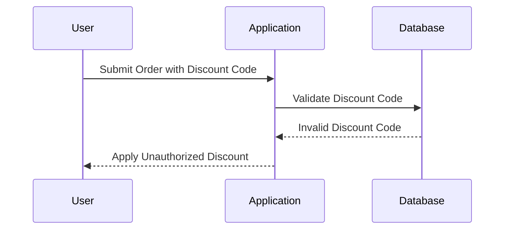
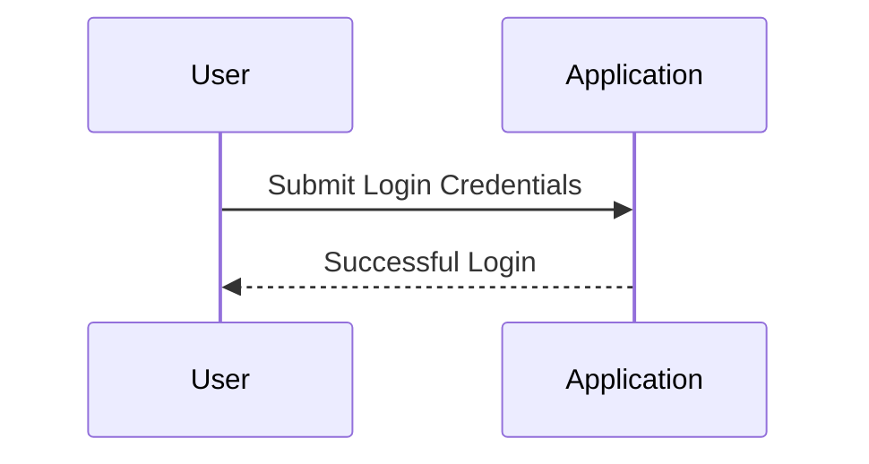
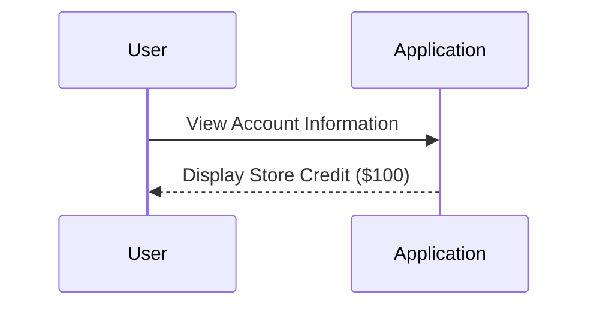

## Introduction to Business Logic Vulnerabilities

Business logic vulnerabilities occur when the application's business rules are not correctly enforced, leading to unintended behavior that can be exploited by attackers. These vulnerabilities often arise due to insufficient validation or incorrect assumptions about user behavior. In this chapter, we will delve deep into the concept of business logic vulnerabilities, focusing specifically on the scenario where the enforcement of business rules is flawed.

### What Are Business Logic Vulnerabilities?

Business logic vulnerabilities are flaws in the application’s business rules that allow attackers to manipulate the system in ways that were not intended by the developers. These vulnerabilities can lead to financial loss, data theft, and other serious consequences. The key aspect of these vulnerabilities is that they are often not detected by traditional security measures because they rely on the correct implementation of business rules rather than technical security mechanisms.

### Why Do Business Logic Vulnerabilities Matter?

Business logic vulnerabilities matter because they can have significant financial and reputational impacts on organizations. Unlike many other types of vulnerabilities, which are often technical in nature, business logic vulnerabilities are rooted in the application’s core functionality. This makes them harder to detect and mitigate, as they require a deep understanding of both the application’s business processes and its technical implementation.

### How Do Business Logic Vulnerabilities Work?

Business logic vulnerabilities typically arise when the application fails to enforce its business rules correctly. This can happen due to various reasons such as:

- **Insufficient Validation**: The application does not validate input data thoroughly, allowing attackers to bypass intended constraints.
- **Incorrect Assumptions**: The application assumes certain behaviors that users may not adhere to, leading to unexpected outcomes.
- **Complex Business Rules**: Complex business rules can be difficult to implement correctly, increasing the likelihood of errors.

### Real-World Example: CVE-2021-30116

A real-world example of a business logic vulnerability is CVE-2021-30116, which affected the WooCommerce plugin for WordPress. This vulnerability allowed attackers to manipulate the order total, resulting in unauthorized discounts. The issue arose because the plugin did not properly validate the discount codes applied to orders, leading to potential financial loss for merchants.



### Lab Setup: Accessing the Exercise

To access the exercise, follow these steps:

1. Visit the URL `portswigger.net/web-security`.
2. Click on the sign-up button to create an account if you don’t already have one.
3. Log in to your account.
4. Navigate to the Academy section.
5. Select all labs.
6. Search for "business logic vulnerabilities".
7. Select lab number four titled "flawed enforcement of business rules".

### Target Goal: Exploiting the Logic Flaw

The target goal of this lab is to exploit the logic flaw in the purchasing workflow to buy a lightweight leather jacket for less than the intended price. To achieve this, you need to:

1. Log in as a user.
2. Identify the vulnerability in the purchasing workflow.
3. Exploit the vulnerability to purchase the item at a reduced price.

### Logging In

First, log in to your account using the provided credentials. The username is `wiener` and the password is `Peter`.



### Analyzing the Store Credit

Once logged in, you will see that the store credit available is $100. This is the amount you can spend on purchases within the application.



### Identifying the Vulnerability

To identify the vulnerability, you need to analyze the purchasing workflow. This involves understanding how the application enforces its business rules and identifying any weaknesses in this process.

#### Step-by-Step Analysis

1. **View the Item**: Navigate to the item you want to purchase, which is the lightweight leather jacket.
2. **Add to Cart**: Add the item to your cart.
3. **Proceed to Checkout**: Proceed to the checkout page and review the total cost.
4. **Identify Weaknesses**: Look for any weaknesses in the application’s enforcement of business rules, such as insufficient validation of input data or incorrect assumptions about user behavior.

### Exploiting the Vulnerability

Once you have identified the vulnerability, you can exploit it to purchase the item at a reduced price. This typically involves manipulating the application’s inputs to bypass the intended constraints.

#### Example Exploit

Suppose the application allows you to apply a discount code during the checkout process. If the application does not properly validate the discount code, you can exploit this to apply an unauthorized discount.


### Full HTTP Request and Response

Here is an example of the full HTTP request and response for applying a discount code:

```http
POST /checkout HTTP/1.1
Host: example.com
Content-Type: application/x-www-form-urlencoded
Content-Length: 34

item=lightweight-leather-jacket&discount_code=INVALIDCODE
```

```http
HTTP/1.1 200 OK
Date: Mon, 23 Jan 2023 12:00:00 GMT
Server: Apache/2.4.41 (Ubuntu)
Content-Type: text/html; charset=UTF-8
Content-Length: 1234

<!DOCTYPE html>
<html>
<head>
    <title>Checkout</title>
</head>
<body>
    <h1>Checkout</h1>
    <p>Your order has been processed.</p>
    <p>Total: $50.00</p>
</body>
</html>
```

### How to Prevent / Defend Against Business Logic Vulnerabilities

To prevent business logic vulnerabilities, it is essential to ensure that the application’s business rules are correctly enforced. Here are some best practices:

#### Secure Coding Practices

1. **Validate Input Data**: Ensure that all input data is validated thoroughly to prevent unauthorized manipulation.
2. **Use Strong Authentication Mechanisms**: Implement strong authentication mechanisms to prevent unauthorized access.
3. **Implement Proper Authorization Checks**: Ensure that proper authorization checks are in place to prevent unauthorized actions.

#### Configuration Hardening

1. **Enable Security Features**: Enable security features such as input validation, output encoding, and secure session management.
2. **Configure Error Handling**: Configure error handling to prevent sensitive information from being exposed in error messages.
3. **Monitor and Audit Logs**: Monitor and audit logs to detect any suspicious activity.

#### Detection and Mitigation

1. **Static Code Analysis**: Use static code analysis tools to detect potential business logic vulnerabilities in the codebase.
2. **Dynamic Testing**: Perform dynamic testing to identify runtime vulnerabilities.
3. **Penetration Testing**: Conduct penetration testing to simulate real-world attacks and identify vulnerabilities.

### Secure-Coding Fixes

Here is an example of a vulnerable code snippet and its secure counterpart:

#### Vulnerable Code

```python
def apply_discount(code):
    if code == "DISCOUNT10":
        return 10
    else:
        return 0
```

#### Secure Code

```python
def apply_discount(code):
    if code == "DISCOUNT10":
        return 10
    elif code == "DISCOUNT20":
        return 20
    else:
        return 0
```

### Hands-On Labs

For hands-on practice, you can use the following labs:

- **PortSwigger Web Security Academy**: Offers a variety of labs that cover different aspects of web security, including business logic vulnerabilities.
- **OWASP Juice Shop**: A deliberately insecure web application that teaches web security concepts through practical exercises.
- **DVWA (Damn Vulnerable Web Application)**: A PHP/MySQL web application that is intentionally vulnerable for educational purposes.

### Conclusion

Business logic vulnerabilities are a critical aspect of web security that can have significant financial and reputational impacts on organizations. By understanding the underlying principles and implementing best practices, you can effectively prevent and mitigate these vulnerabilities. Always remember to validate input data, use strong authentication mechanisms, and implement proper authorization checks to ensure the security of your applications.

---
<!-- nav -->
[[Web Security (PortSwigger)/15-Business Logic Vulnerabilities/05-Lab 4 Flawed enforcement of business rules/00-Overview|Overview]] | [[02-Adding the Product to Cart|Adding the Product to Cart]]
