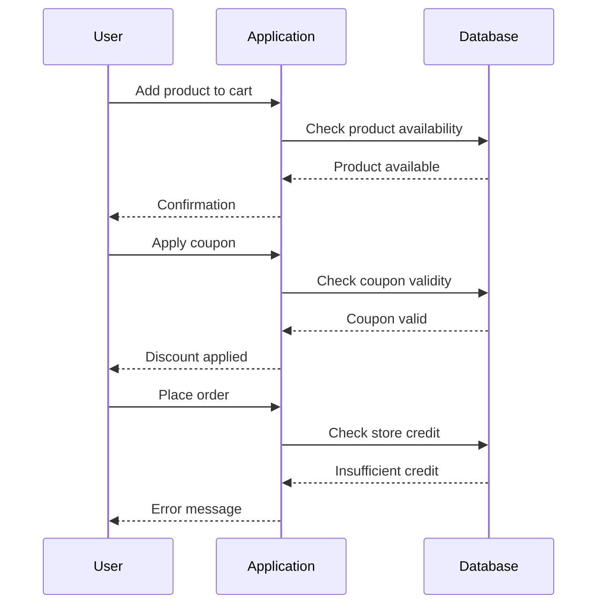

## Placing the Order

1. Attempt to place the order.
2. Send the request to a repeater tool for further analysis.
```

### HTTP Requests and Responses

Let's examine the HTTP requests and responses involved in these steps.

#### Request to Add the Product to Cart

```http
POST /cart/add HTTP/1.1
Host: example.com
Content-Type: application/x-www-form-urlencoded
Cookie: session=abc123

product_id=1&quantity=1
```

#### Response to Add the Product to Cart

```http
HTTP/1.1 200 OK
Content-Type: application/json
Set-Cookie: session=abc123; Path=/; HttpOnly

{
    "status": "success",
    "message": "Product added to cart"
}
```

#### Request to Apply the Coupon

```http
POST /cart/apply_coupon HTTP/1.1
Host: example.com
Content-Type: application/x-www-form-urlencoded
Cookie: session=abc123

coupon_code=NEWCUSTOMER
```

#### Response to Apply the Coupon

```http
HTTP/1.1 200 OK
Content-Type: application/json
Set-Cookie: session=abc123; Path=/; HttpOnly

{
    "status": "success",
    "message": "Coupon applied successfully",
    "discount_amount": 5
}
```

#### Request to Place the Order

```http
POST /checkout/place_order HTTP/1.1
Host: example.com
Content-Type: application/x-www-form-urlencoded
Cookie: session=abc123

csrf_token=xyz789
```

#### Response to Place the Order

```http
HTTP/1.1 400 Bad Request
Content-Type: application/json
Set-Cookie: session=abc123; Path=/; HttpOnly

{
    "status": "error",
    "message": "Not enough store credit for this purchase"
}
```

### Business Logic Vulnerability Analysis

The primary issue in this scenario is the lack of proper enforcement of business rules. Specifically, the application does not adequately check whether the user has sufficient store credit to cover the discounted price of the jacket.

#### Sequence Diagram



### Real-World Examples

Business logic vulnerabilities have been exploited in numerous real-world scenarios. One notable example is the [CVE-2021-3156](https://nvd.nist.gov/vuln/detail/CVE-2021-3156), also known as "PrintNightmare," which affected Microsoft Print Spooler services. This vulnerability allowed attackers to execute arbitrary code due to improper validation of input parameters.

Another example is the [Equifax breach in 2017](https://www.equifax.com/data-breach/), where a vulnerability in Apache Struts led to the exposure of sensitive personal information of millions of customers. This breach highlighted the importance of enforcing strict business rules and validating inputs.

### How to Prevent / Defend

To prevent business logic vulnerabilities, it is crucial to implement robust validation and enforcement mechanisms. Here are some best practices:

#### Secure Coding Practices

1. **Input Validation**: Ensure that all inputs are validated against expected formats and ranges.
2. **Access Control**: Implement role-based access control to restrict actions based on user roles.
3. **Transaction Integrity**: Use transactions to ensure that all steps in a business process are completed successfully.

#### Example: Secure Code Implementation

Consider the following insecure code snippet:

```python
def apply_coupon(coupon_code, user_id):
    # Insecure code
    if coupon_code == "NEWCUSTOMER":
        discount = 5
        update_cart(user_id, discount)
```

Here is the secure version:

```python
def apply_coupon(coupon_code, user_id):
    # Secure code
    if validate_coupon(coupon_code):
        discount = calculate_discount(coupon_code)
        if has_sufficient_credit(user_id, discount):
            update_cart(user_id, discount)
        else:
            raise InsufficientCreditError("Not enough store credit")
    else:
        raise InvalidCouponError("Invalid coupon code")
```

#### Configuration Hardening

1. **Disable Unnecessary Features**: Disable any features that are not required for the application.
2. **Use Strong Authentication Mechanisms**: Implement strong authentication mechanisms such as multi-factor authentication.
3. **Regular Audits**: Conduct regular security audits to identify and mitigate potential vulnerabilities.

### Conclusion

Business logic vulnerabilities can have severe consequences if not properly addressed. By implementing robust validation and enforcement mechanisms, developers can significantly reduce the risk of such vulnerabilities. Regular security audits and adherence to secure coding practices are essential to maintaining the integrity and security of web applications.

### Practice Labs

For hands-on practice with business logic vulnerabilities, consider the following labs:

- **PortSwigger Web Security Academy**: Offers a comprehensive set of labs covering various web security topics, including business logic vulnerabilities.
- **OWASP Juice Shop**: A deliberately insecure web application designed for security training purposes.
- **DVWA (Damn Vulnerable Web Application)**: Another popular web application for learning about web security vulnerabilities.

By engaging with these labs, you can gain practical experience in identifying and mitigating business logic vulnerabilities.

---
<!-- nav -->
[[04-Business Logic Vulnerabilities|Business Logic Vulnerabilities]] | [[Web Security (PortSwigger)/15-Business Logic Vulnerabilities/05-Lab 4 Flawed enforcement of business rules/00-Overview|Overview]] | [[Web Security (PortSwigger)/15-Business Logic Vulnerabilities/05-Lab 4 Flawed enforcement of business rules/06-Practice Questions & Answers|Practice Questions & Answers]]
