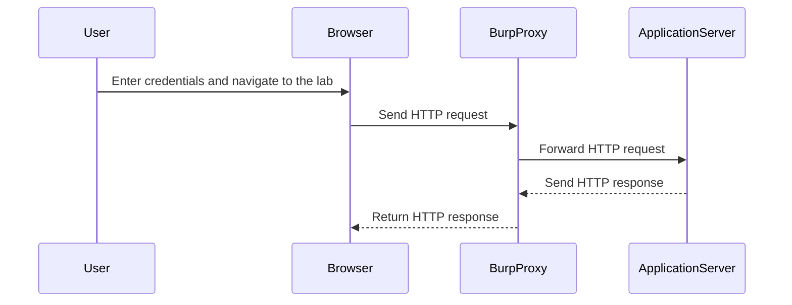

## Understanding the Lab Environment

The lab environment we will be working with is part of the Web Security Academy on PortSwigger.net. This particular lab, titled "Low-Level Logic Flaw," is designed to demonstrate how business logic vulnerabilities can be exploited in a real-world scenario.

### Accessing the Lab

To access the lab, follow these steps:

1. **Sign Up**: If you do not have an account on PortSwigger Web Security Academy, visit [PortSwigger.net/WebSecurity](https://portswigger.net/web-security) and click on the sign-up button to create an account.
2. **Log In**: Once you have an account, log in to the Web Security Academy.
3. **Navigate to Labs**: Click on the "Academy" tab and select "All Labs."
4. **Search for the Lab**: Use the search function to find the "Business Logic Vulnerabilities" module and select "Lab Number Five: Low-Level Logic Flaw."

### Lab Overview

The goal of this lab is to exploit a logic flaw in the purchasing workflow to buy a lightweight leader jacket for an unintended price. To achieve this, you will need to manipulate the application’s business rules to bypass the intended pricing structure.

### Provided Credentials

You will be provided with the following credentials to log into your own account:

- **Username**: `user`
- **Password**: `password`

### Using Burp Suite

For this lab, you will be using Burp Suite Professional, which includes the Intruder functionality. Burp Suite is a powerful toolkit for web application security testing, and it will help you identify and exploit the logic flaw in the purchasing workflow.

### Accessing the Lab Environment

Once you have logged in, you will see the built-in browser in Burp Suite, which will automatically capture all your requests through the Burp Proxy. This setup will allow you to analyze and manipulate the HTTP requests and responses to identify the logic flaw.

---
<!-- nav -->
[[Web Security (PortSwigger)/15-Business Logic Vulnerabilities/06-Lab 5 Low level logic flaw/03-Business Logic Vulnerabilities|Business Logic Vulnerabilities]] | [[Web Security (PortSwigger)/15-Business Logic Vulnerabilities/06-Lab 5 Low level logic flaw/00-Overview|Overview]] | [[Web Security (PortSwigger)/15-Business Logic Vulnerabilities/06-Lab 5 Low level logic flaw/05-Practice Questions & Answers|Practice Questions & Answers]]
