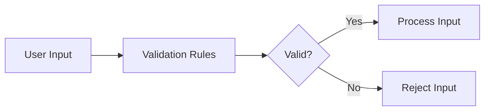
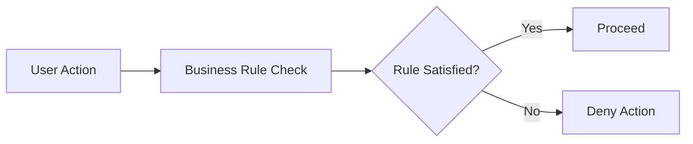

## Introduction to Business Logic Vulnerabilities

Business logic vulnerabilities occur when an application fails to properly enforce the intended business rules, allowing attackers to manipulate the system in unintended ways. These vulnerabilities often arise due to inconsistent handling of exceptional input, leading to unexpected behavior that can be exploited for malicious purposes. In this chapter, we will delve into the specifics of such vulnerabilities, using the example of inconsistent handling of exceptional input in an account registration process.

### What Are Business Logic Vulnerabilities?

Business logic vulnerabilities are flaws in the implementation of business rules within an application. These rules define how the application should behave under various conditions. When these rules are not correctly enforced, attackers can exploit the gaps to achieve unauthorized actions, such as privilege escalation, data manipulation, or financial fraud.

#### Why Do They Matter?

These vulnerabilities matter because they can lead to significant security risks. Unlike traditional vulnerabilities like SQL injection or cross-site scripting, business logic flaws are often more subtle and harder to detect. They can result in severe consequences, including financial loss, data breaches, and reputational damage.

### Example Scenario: Inconsistent Handling of Exceptional Input

In the given scenario, the application does not adequately validate user input during the account registration process. This allows an attacker to exploit a logic flaw to gain access to administrative functionality. Specifically, the goal is to exploit this flaw to escalate privileges to an administrator and delete a user named Carlos.

### Background Theory

To understand the root cause of this vulnerability, we need to explore the principles of input validation and business rule enforcement.

#### Input Validation

Input validation is the process of ensuring that user-provided data conforms to expected formats and constraints. Proper input validation helps prevent many types of attacks, including injection attacks and buffer overflows.



#### Business Rule Enforcement

Business rules define the expected behavior of an application under different scenarios. These rules should be consistently applied across all parts of the application to ensure that the system behaves as intended.



### Real-World Examples

Recent real-world examples of business logic vulnerabilities include:

- **CVE-2021-21972**: A vulnerability in the Microsoft Exchange Server allowed attackers to bypass authentication and gain unauthorized access to administrative functions.
- **CVE-2022-22965**: A flaw in the Atlassian Confluence application allowed attackers to execute arbitrary code by exploiting a business logic flaw in the file upload feature.

### Detailed Walkthrough

Let's walk through the specific steps to exploit the inconsistency in the account registration process.

#### Step 1: Access the Lab

First, log in to the Web Security Academy at `https://portswigger.net/web-security`. Navigate to the "Academy" section, select "All Labs," and search for "Business Logic Vulnerabilities." Locate Lab Number Six titled "Inconsistent Handling of Exceptional Input."

#### Step 2: Analyze the Registration Process

The registration process likely involves several steps, such as providing a username, email, and password. The application may also perform checks to ensure that the provided data meets certain criteria.

##### Example Registration Form

```html
<form action="/register" method="POST">
    <input type="text" name="username" placeholder="Username" required>
    <input type="email" name="email" placeholder="Email" required>
    <input type="password" name="password" placeholder="Password" required>
    <button type="submit">Register</button>
</form>
```

#### Step 3: Identify Weaknesses in Input Validation

Inspect the server-side code to identify weaknesses in input validation. For instance, the application might not properly validate the `username` field, allowing special characters or reserved keywords.

##### Vulnerable Code Example

```python
def register_user(username, email, password):
    if not validate_username(username):
        return "Invalid username"
    if not validate_email(email):
        return "Invalid email"
    if not validate_password(password):
        return "Invalid password"
    # Proceed with registration
```

#### Step 4: Exploit the Flaw

By providing specially crafted input, such as a reserved keyword or a string that bypasses validation, an attacker can potentially escalate their privileges.

##### Exploitation Example

```http
POST /register HTTP/1.1
Host: example.com
Content-Type: application/x-www-form-urlencoded

username=admin&email=attacker@example.com&password=secret
```

### Full HTTP Request and Response

#### Request

```http
POST /register HTTP/1.1
Host: example.com
Content-Type: application/x-www-form-urlencoded
Content-Length: 43

username=admin&email=attacker@example.com&password=secret
```

#### Response

```http
HTTP/1.1 200 OK
Date: Tue, 14 Mar 2023 12:00:00 GMT
Server: Apache/2.4.41 (Ubuntu)
Content-Length: 22
Content-Type: text/html; charset=UTF-8

Registration successful!
```

### How to Prevent / Defend

#### Detection

To detect business logic vulnerabilities, conduct thorough code reviews and use static analysis tools. Additionally, perform penetration testing to identify potential flaws.

#### Prevention

1. **Consistent Input Validation**: Ensure that all user inputs are validated against strict criteria.
2. **Role-Based Access Control (RBAC)**: Implement RBAC to restrict access based on user roles.
3. **Logging and Monitoring**: Maintain detailed logs of user activities and monitor for suspicious behavior.

##### Secure Code Example

```python
def register_user(username, email, password):
    if not validate_username(username):
        return "Invalid username"
    if not validate_email(email):
        return "Invalid email"
    if not validate_password(password):
        return "Invalid password"
    # Proceed with registration
    if is_admin_role(username):
        return "Access denied"
    # Proceed with normal registration
```

### Common Pitfalls

- **Incomplete Validation**: Failing to validate all fields can leave the application vulnerable.
- **Hardcoded Values**: Using hardcoded values for validation can be easily bypassed.
- **Trust User Input**: Always assume user input is malicious and validate accordingly.

### Hands-On Practice

For hands-on practice, use the following labs:

- **PortSwigger Web Security Academy**: Offers a variety of labs focused on business logic vulnerabilities.
- **OWASP Juice Shop**: Provides a simulated web application with numerous security flaws to explore.

### Conclusion

Business logic vulnerabilities are a critical aspect of web security that require careful attention. By understanding the principles of input validation and business rule enforcement, and by implementing robust security measures, developers can significantly reduce the risk of exploitation. Regular testing and monitoring are essential to maintaining a secure application environment.

---
<!-- nav -->
[[Web Security (PortSwigger)/15-Business Logic Vulnerabilities/07-Lab 6 Inconsistent handling of exceptional input/00-Overview|Overview]] | [[02-Business Logic Vulnerabilities Inconsistent Handling of Exceptional Input|Business Logic Vulnerabilities Inconsistent Handling of Exceptional Input]]
