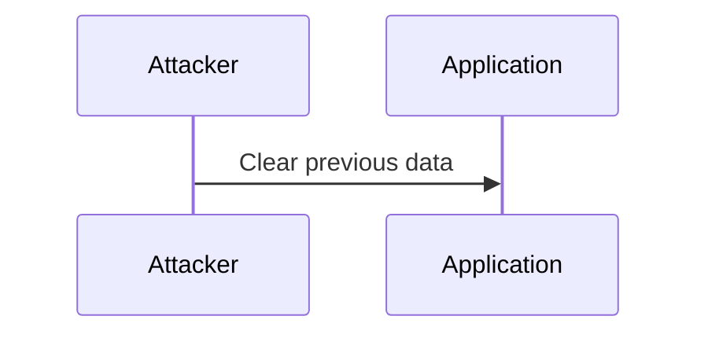
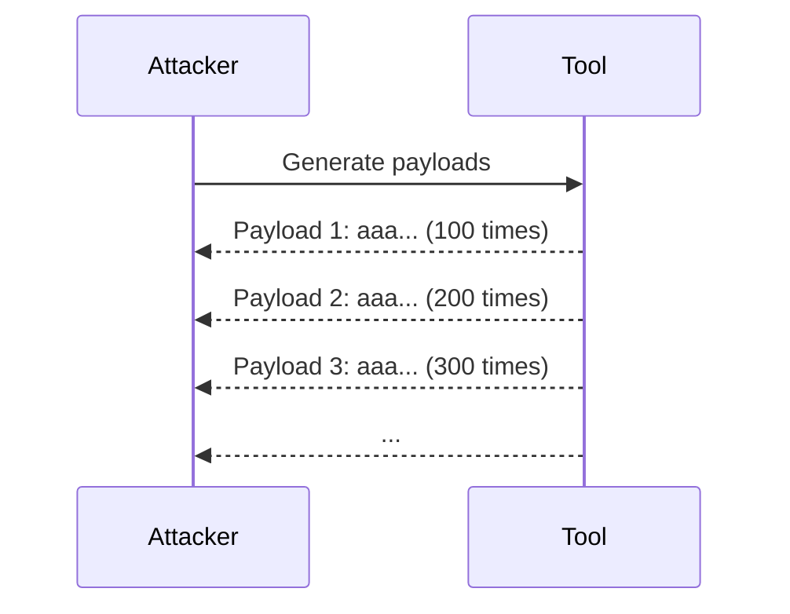
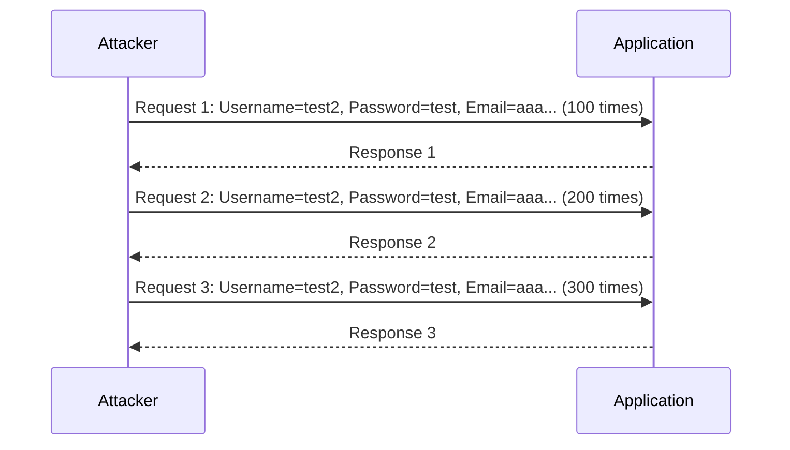
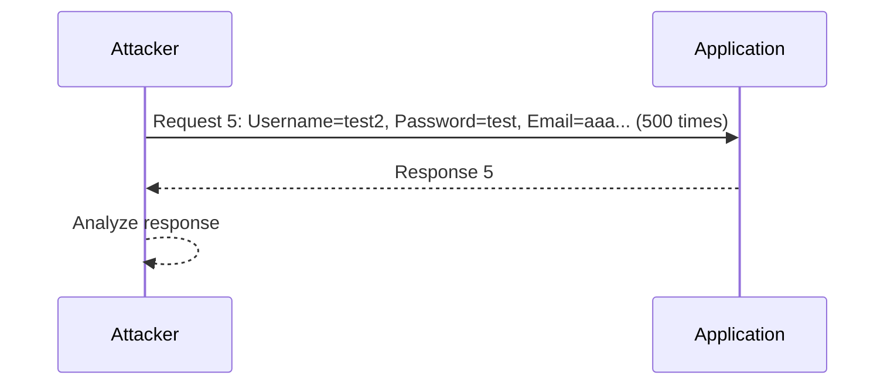

## Business Logic Vulnerabilities: Inconsistent Handling of Exceptional Input

### Introduction to Business Logic Vulnerabilities

Business logic vulnerabilities occur when the application's business rules are not correctly implemented, leading to unintended behavior that can be exploited by attackers. These vulnerabilities often arise due to inconsistent handling of exceptional input, which can result in unexpected outcomes such as unauthorized access, data manipulation, or financial loss.

In this section, we will explore a specific type of business logic vulnerability related to inconsistent handling of exceptional input, particularly focusing on the handling of email addresses during user registration. We will delve into the mechanics of the vulnerability, provide real-world examples, and discuss how to prevent and defend against such attacks.

### Understanding the Scenario

The scenario described in the lecture involves a user registration process where the application does not validate the length of the email address properly. This allows an attacker to register multiple accounts using extremely long email addresses, potentially bypassing intended limitations or causing other unintended behavior.

#### Step-by-Step Mechanics

1. **Clearing Previous Data**: Before starting the attack, the attacker clears any previous data to ensure a clean environment.
2. **Generating Payloads**: The attacker uses a tool to generate payloads with varying lengths of email addresses.
3. **Sending Requests**: The attacker sends multiple requests with increasing lengths of email addresses.
4. **Analyzing Responses**: The attacker analyzes the responses to determine if the application is validating the email address length correctly.

Let's break down each step in more detail:

#### Clearing Previous Data

Before initiating the attack, it is crucial to clear any previous data to avoid interference from past attempts. This ensures that the results are accurate and not influenced by residual data.



#### Generating Payloads

The attacker generates payloads with varying lengths of email addresses. The tool used in this case adds the character 'a' 100 times in the first request and increases the character count by 100 in each subsequent request.



#### Sending Requests

The attacker sends these payloads to the application and monitors the responses. Each request contains a username, password, and the generated email address.



#### Analyzing Responses

The attacker analyzes the responses to determine if the application is validating the email address length correctly. If the application does not return an error for excessively long email addresses, it indicates a potential vulnerability.



### Real-World Examples

#### Recent CVEs and Breaches

One notable example of a business logic vulnerability involving email address handling is the breach at Equifax in 2017. Although not directly related to email address length, the breach highlighted the importance of proper validation and handling of user inputs.

Another example is the CVE-2021-21972, which affected the WordPress plugin "WP GDPR Compliance." This vulnerability allowed attackers to bypass email address validation, leading to unauthorized access and data manipulation.

### Complete Example

Let's walk through a complete example of the attack and the corresponding HTTP requests and responses.

#### HTTP Request and Response

The attacker sends a POST request to the registration endpoint with a username, password, and an extremely long email address.

```http
POST /register HTTP/1.1
Host: example.com
Content-Type: application/x-www-form-urlencoded
Content-Length: 1024

username=test2&password=test&email=aaa... (500 times)
```

The server responds with a successful registration message.

```http
HTTP/1.1 200 OK
Date: Mon, 20 Mar 2023 12:00:00 GMT
Server: Apache/2.4.41 (Ubuntu)
Content-Type: text/html; charset=UTF-8
Content-Length: 1024

<!DOCTYPE html>
<html>
<head>
    <title>Registration Successful</title>
</head>
<body>
    <h1>Registration Successful</h1>
    <p>Your account has been created successfully.</p>
</body>
</html>
```

### Pitfalls and Common Mistakes

#### Lack of Validation

One of the most common mistakes is the lack of proper validation on user inputs. In this case, the application fails to validate the length of the email address, allowing attackers to exploit this vulnerability.

#### Inconsistent Handling

Inconsistent handling of exceptional input can lead to unexpected behavior. For example, if the application validates the email address length in one part of the code but not in another, it can create a vulnerability.

### How to Prevent / Defend

#### Detection

To detect such vulnerabilities, organizations should perform regular security audits and penetration testing. Automated tools can help identify inconsistencies in input handling.

#### Prevention

1. **Input Validation**: Ensure that all user inputs are validated according to the expected format and length.
2. **Consistent Handling**: Implement consistent handling of exceptional input across all parts of the application.
3. **Secure Coding Practices**: Follow secure coding practices to prevent common vulnerabilities.

#### Secure Code Fix

Here is an example of how to implement proper validation in a secure manner:

**Vulnerable Code**

```python
def register_user(username, password, email):
    # No validation on email length
    user = User(username=username, password=password, email=email)
    user.save()
```

**Fixed Code**

```python
def register_user(username, password, email):
    if len(email) > 254:
        raise ValueError("Email address is too long")
    user = User(username=username, password=password, email=email)
    user.save()
```

### Configuration Hardening

Ensure that the application's configuration is hardened to prevent exploitation of business logic vulnerabilities. This includes setting appropriate limits on input lengths and enabling logging and monitoring to detect suspicious activity.

### Hands-On Labs

For hands-on practice, consider the following labs:

- **PortSwigger Web Security Academy**: Offers a variety of labs covering different types of business logic vulnerabilities.
- **OWASP Juice Shop**: Provides a vulnerable web application for practicing various security techniques.
- **DVWA (Damn Vulnerable Web Application)**: A deliberately insecure web application for practicing web security.

By thoroughly understanding and implementing the preventive measures discussed, organizations can significantly reduce the risk of business logic vulnerabilities and protect their applications from exploitation.

---
<!-- nav -->
[[Web Security (PortSwigger)/15-Business Logic Vulnerabilities/07-Lab 6 Inconsistent handling of exceptional input/01-Introduction to Business Logic Vulnerabilities|Introduction to Business Logic Vulnerabilities]] | [[Web Security (PortSwigger)/15-Business Logic Vulnerabilities/07-Lab 6 Inconsistent handling of exceptional input/00-Overview|Overview]] | [[Web Security (PortSwigger)/15-Business Logic Vulnerabilities/07-Lab 6 Inconsistent handling of exceptional input/03-Business Logic Vulnerabilities|Business Logic Vulnerabilities]]
