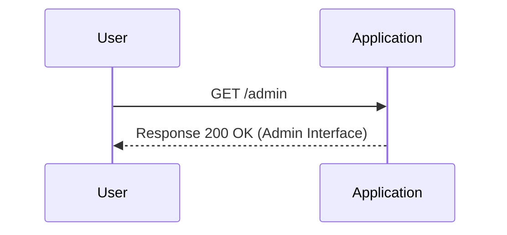
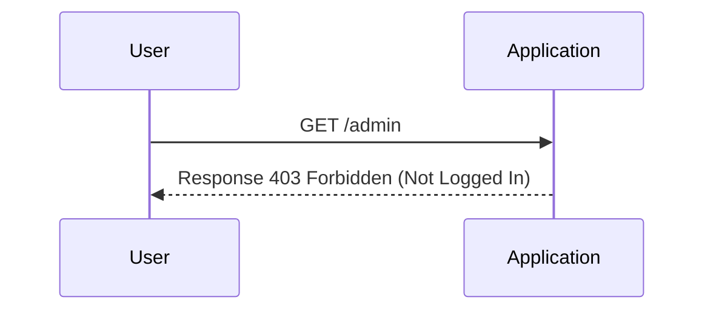
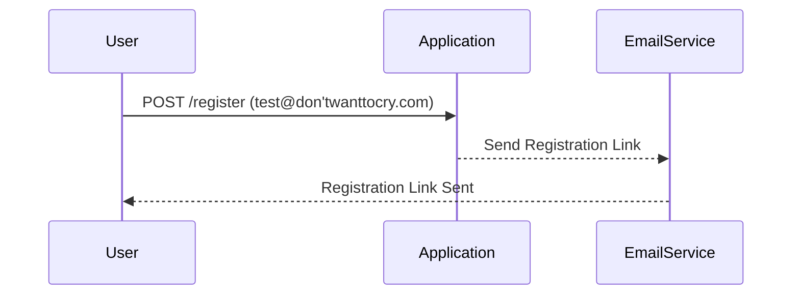
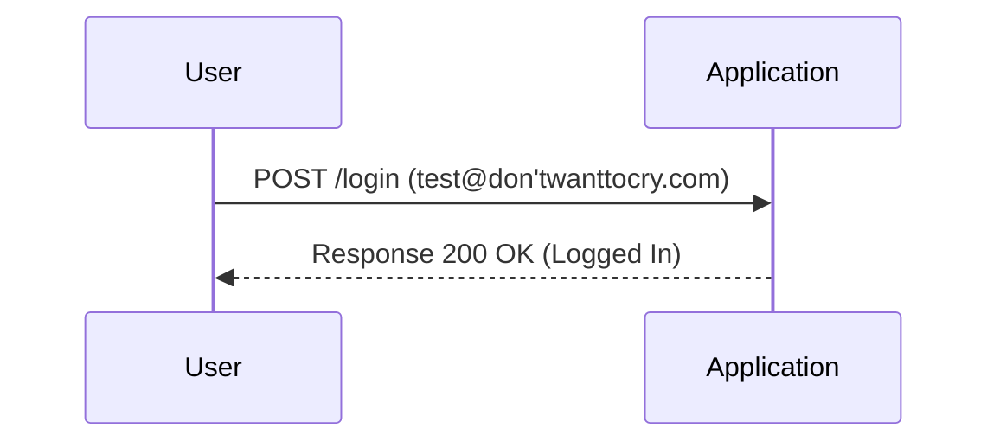
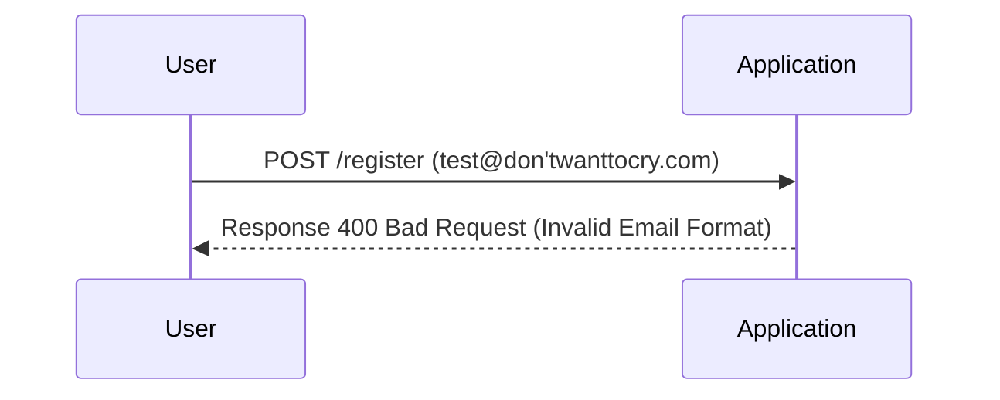
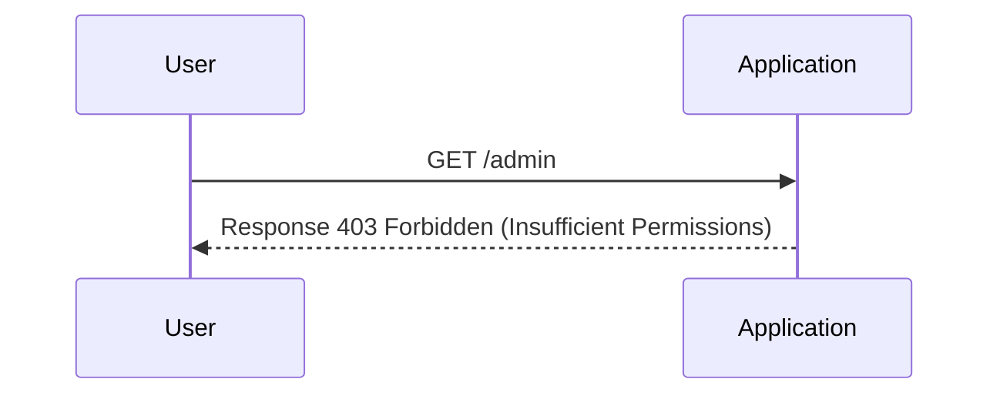
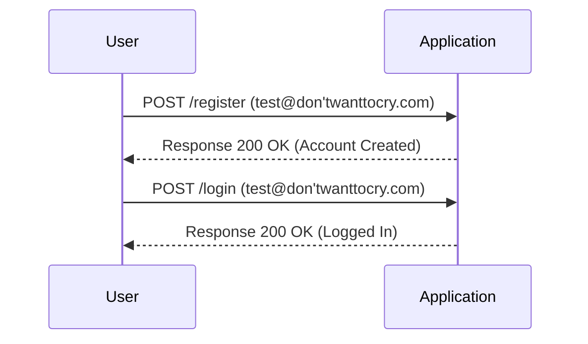

## Business Logic Vulnerabilities

### Introduction to Business Logic Vulnerabilities

Business logic vulnerabilities occur when the underlying business rules and processes of an application are not correctly implemented or enforced. These vulnerabilities can lead to significant security risks, such as unauthorized access, data manipulation, and financial loss. Understanding and identifying these vulnerabilities is crucial for securing web applications.

### Identifying Business Logic Vulnerabilities

In the context of web security, business logic vulnerabilities often arise due to inconsistent handling of exceptional input. This means that the application does not properly validate or handle unexpected inputs, leading to unintended behavior. 

#### Example Scenario: Admin Interface Access

Let's consider the scenario described in the lecture transcript:

1. **Initial Discovery**:
    - Using Burp Suite Professional, one can discover hidden directories by navigating to `Target` > `Application` > `Engagement Tools` > `Discover Content`.
    - Alternatively, manually probing the application for hidden directories can be effective.
    - In this case, the `/admin` directory was discovered by simply appending `/admin` to the base URL.

```markdown


2. **Access Control Check**:
    - The application checks if the user is logged in and if their domain matches `don'twanttocry.com`.
    - This indicates that the admin interface is restricted to users from a specific domain.

```markdown


3. **Registration Process**:
    - To gain access, the user attempts to register with an email address from the `don'twanttocry.com` domain.
    - The application sends a registration link to the provided email address.

```markdown


4. **Bypassing Validation**:
    - The user attempts to log in without clicking the registration link, exploiting the lack of proper validation.

```markdown


### Real-World Examples

#### Recent CVEs and Breaches

- **CVE-2021-44228 (Log4Shell)**: This vulnerability allowed attackers to execute arbitrary code by manipulating logging messages. While not directly related to business logic, it highlights the importance of validating input across all parts of an application.
- **Equifax Data Breach (2017)**: A failure to patch a known vulnerability led to the exposure of sensitive personal information. This breach underscores the critical nature of consistent and thorough input validation.

### How to Prevent / Defend

#### Detection

- **Static Analysis**: Use tools like SonarQube or Fortify to identify potential business logic vulnerabilities in the codebase.
- **Dynamic Analysis**: Employ tools like Burp Suite or OWASP ZAP to test the application for unexpected behaviors and inconsistencies.

#### Prevention

1. **Input Validation**:
    - Ensure that all inputs are validated against expected formats and ranges.
    - Use regular expressions and validation libraries to enforce constraints.

```markdown


2. **Role-Based Access Control (RBAC)**:
    - Implement RBAC to restrict access based on user roles and permissions.
    - Ensure that the application enforces these controls consistently.

```markdown


3. **Secure Coding Practices**:
    - Follow secure coding guidelines to avoid common pitfalls.
    - Use frameworks and libraries that provide built-in security features.

```markdown


### Complete Example

#### Vulnerable Code

```python
@app.route('/register', methods=['POST'])
def register():
    email = request.form['email']
    # No validation or verification of email domain
    if '@' in email:
        # Create user account
        return "Account created"
    else:
        return "Invalid email format"

@app.route('/admin')
def admin():
    if current_user.is_authenticated and current_user.email.endswith('@don\'twanttocry.com'):
        return "Admin interface"
    else:
        return "Unauthorized", 403
```

#### Secure Code

```python
import re

@app.route('/register', methods=['POST'])
def register():
    email = request.form['email']
    if re.match(r"[^@]+@don'twanttocry\.com$", email):
        # Create user account
        return "Account created"
    else:
        return "Invalid email format"

@app.route('/admin')
def admin():
    if current_user.is_authenticated and current_user.email.endswith('@don\'twanttocry.com'):
        return "Admin interface"
    else:
        return "Unauthorized",  403
```

### Hands-On Labs

For practical experience with business logic vulnerabilities, consider the following labs:

- **PortSwigger Web Security Academy**: Offers detailed modules on business logic vulnerabilities and how to exploit them.
- **OWASP Juice Shop**: Provides a vulnerable web application for practicing various types of attacks, including business logic vulnerabilities.
- **DVWA (Damn Vulnerable Web Application)**: Another excellent resource for learning about and practicing web security vulnerabilities.

By thoroughly understanding and implementing these practices, you can significantly reduce the risk of business logic vulnerabilities in your web applications.

---
<!-- nav -->
[[02-Business Logic Vulnerabilities Inconsistent Handling of Exceptional Input|Business Logic Vulnerabilities Inconsistent Handling of Exceptional Input]] | [[Web Security (PortSwigger)/15-Business Logic Vulnerabilities/07-Lab 6 Inconsistent handling of exceptional input/00-Overview|Overview]] | [[04-Common Pitfalls and How to Avoid Them|Common Pitfalls and How to Avoid Them]]
