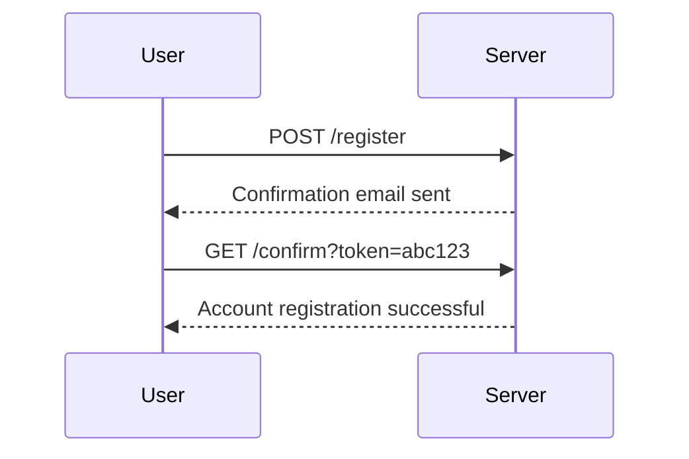
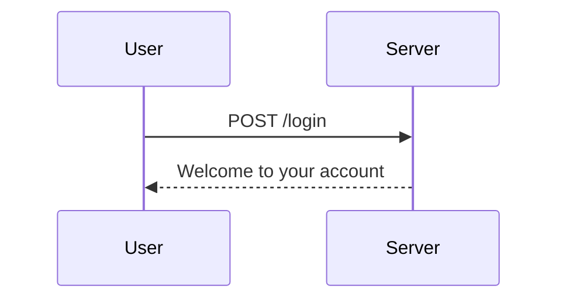

## Testing for Business Logic Vulnerabilities

Testing for business logic vulnerabilities involves thorough testing of the application's logic to ensure it enforces business rules correctly.

### Example Scenario: Registration and Login Process

Let's consider the scenario described in the lecture transcript:

1. **Registration**:
    - User registers with an email address and password.
    - The application sends a confirmation email to the provided email address.
    - The user clicks the confirmation link to activate their account.

2. **Login**:
    - User logs in with their email address and password.
    - The application verifies the credentials and displays the account page.

### Detailed Steps and Code Examples

#### Registration Process

```http
POST /register HTTP/1.1
Host: example.com
Content-Type: application/x-www-form-urlencoded

username=testone&email=attacker@exploitserver.net&password=test
```

The server responds with a confirmation email:

```http
HTTP/1.1 200 OK
Content-Type: text/html

<!DOCTYPE html>
<html>
<head>
<title>Confirmation Email Sent</title>
</head>
<body>
<p>A confirmation email has been sent to attacker@exploitserver.net.</p>
</body>
</html>
```

#### Confirmation Link

The user clicks the confirmation link:

```http
GET /confirm?token=abc123 HTTP/1.1
Host: example.com
```

The server responds with:

```http
HTTP/1.1 200 OK
Content-Type: text/html

<!DOCTYPE html>
<html>
<head>
<title>Account Registration Successful</title>
</head>
<body>
<p>Your account has been successfully registered.</p>
</body>
</html>
```

#### Login Process

The user attempts to log in:

```http
POST /login HTTP/1.1
Host: example.com
Content-Type: application/x-www-form-urlencoded

username=attacker@exploitserver.net&password=test
```

The server responds with:

```http
HTTP/1.1 200 OK
Content-Type: text/html

<!DOCTYPE html>
<html>
<head>
<title>Welcome to Your Account</title>
</head>
<body>
<p>Welcome, attacker@exploitserver.net!</p>
</body>
</html>
```

### Potential Vulnerabilities

#### Inconsistent Handling of Exceptional Input

Inconsistent handling of exceptional input can lead to vulnerabilities. For example, if the application does not properly handle invalid email addresses or passwords, it might allow unauthorized access.

#### CSRF Token Handling

Cross-Site Request Forgery (CSRF) tokens are used to protect against CSRF attacks. If the application does not properly validate CSRF tokens, it can be exploited.

### Mermaid Diagrams

#### Registration Flow



#### Login Flow



---
<!-- nav -->
[[Web Security (PortSwigger)/15-Business Logic Vulnerabilities/07-Lab 6 Inconsistent handling of exceptional input/06-Practice Labs|Practice Labs]] | [[Web Security (PortSwigger)/15-Business Logic Vulnerabilities/07-Lab 6 Inconsistent handling of exceptional input/00-Overview|Overview]] | [[Web Security (PortSwigger)/15-Business Logic Vulnerabilities/07-Lab 6 Inconsistent handling of exceptional input/08-Conclusion|Conclusion]]
