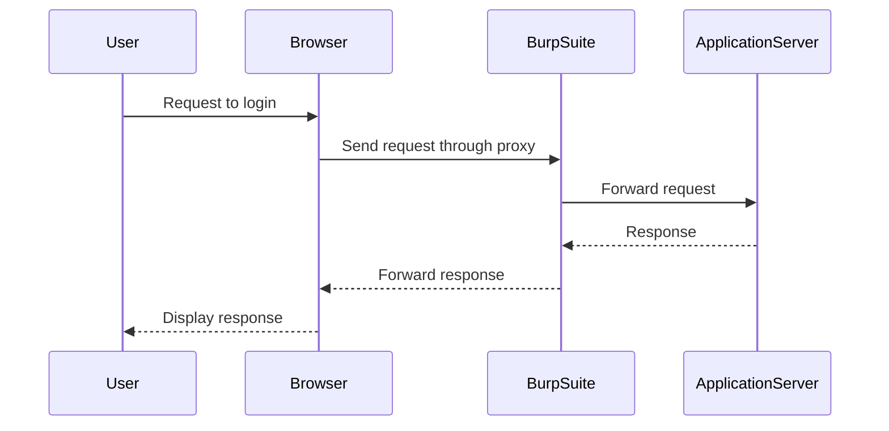

## Lab Setup and Environment

To access the lab, follow these steps:

1. **Sign Up for PortSwigger Web Security Academy**:
    - Visit [portswigger.net/web-security](https://portswigger.net/web-security).
    - Click on the sign-up button to create an account.
    - Log in to your account.

2. **Access the Lab**:
    - Click on "Academy".
    - Select "All Labs".
    - Search for "business logic vulnerabilities".
    - Go to lab number seven titled "Weak Isolation on Dual Use Endpoint".

### Using Burp Suite

The lab uses Burp Suite for intercepting and manipulating HTTP requests. Ensure that your browser is configured to use Burp Suite as a proxy.

---
<!-- nav -->
[[03-How to Prevent  Defend Against Business Logic Vulnerabilities|How to Prevent  Defend Against Business Logic Vulnerabilities]] | [[Web Security (PortSwigger)/15-Business Logic Vulnerabilities/08-Lab 7 Weak isolation on dual use endpoint/00-Overview|Overview]] | [[Web Security (PortSwigger)/15-Business Logic Vulnerabilities/08-Lab 7 Weak isolation on dual use endpoint/05-Practice Labs|Practice Labs]]
