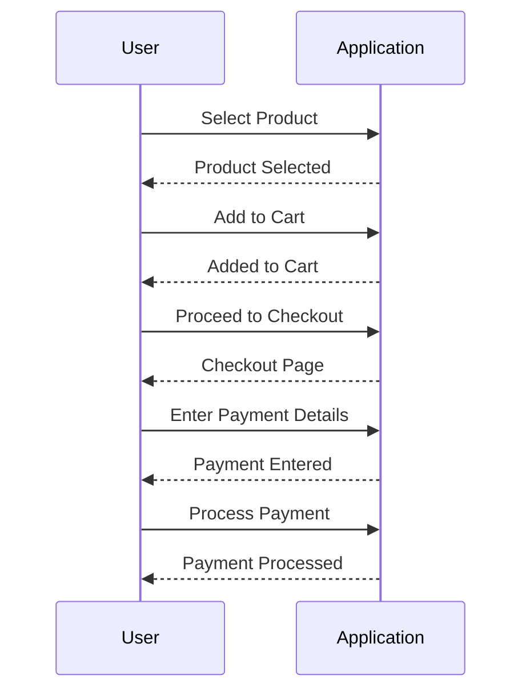
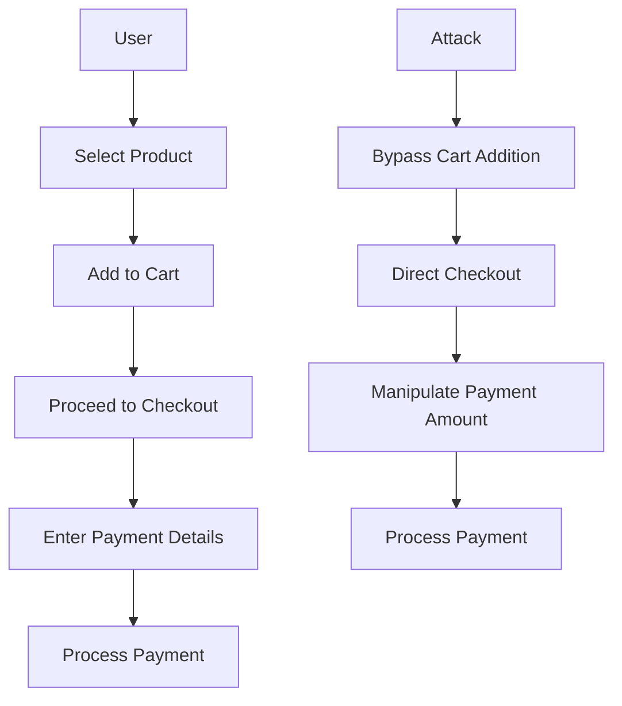

## Introduction to Business Logic Vulnerabilities

Business logic vulnerabilities occur when an application's core business rules are not properly enforced, allowing attackers to manipulate the application in unintended ways. These vulnerabilities often arise due to insufficient validation of user inputs, improper handling of workflow states, or inadequate enforcement of business rules. In this chapter, we will delve deep into the specific vulnerability known as "Insufficient Workflow Validation," which is a critical aspect of business logic security.

### What is Insufficient Workflow Validation?

Insufficient workflow validation occurs when an application fails to correctly validate the sequence of steps required to complete a transaction or process. This can allow attackers to bypass certain steps, leading to unauthorized actions such as fraudulent purchases or data manipulation.

#### Why Does It Matter?

Workflow validation is crucial because it ensures that transactions follow the intended sequence of steps. Without proper validation, attackers can exploit the system by manipulating the workflow to their advantage. This can result in significant financial losses, data breaches, and reputational damage.

#### How Does It Work Under the Hood?

In a typical e-commerce scenario, the workflow might involve several steps such as:

1. **Product Selection**: The user selects a product to purchase.
2. **Cart Addition**: The selected product is added to the shopping cart.
3. **Checkout Process**: The user proceeds to checkout, entering payment details.
4. **Payment Processing**: The payment is processed, and the order is confirmed.

If the application does not properly validate the sequence of these steps, an attacker could bypass some steps, leading to unauthorized actions.

### Real-World Examples

#### Recent Breaches and CVEs

One notable example of insufficient workflow validation is the breach at Equifax in 2017 (CVE-2017-5638). The attackers exploited a vulnerability in the Apache Struts framework, which allowed them to bypass certain workflow steps and gain unauthorized access to sensitive data.

Another example is the breach at Target in 2013, where attackers exploited a vulnerability in the payment processing workflow, allowing them to steal credit card information from millions of customers.

### Background Theory

To understand insufficient workflow validation, it is essential to grasp the underlying principles of workflow management and validation.

#### Workflow Management

Workflow management involves defining and enforcing the sequence of steps required to complete a transaction or process. This includes:

- **State Transitions**: Each step in the workflow represents a state, and transitions between states must be validated.
- **Input Validation**: User inputs at each step must be validated to ensure they meet the required criteria.
- **Access Control**: Access to certain steps should be restricted based on user roles and permissions.

#### Workflow Validation

Workflow validation ensures that the sequence of steps follows the intended path. This involves:

- **Sequence Checking**: Verifying that each step is completed in the correct order.
- **State Verification**: Ensuring that the current state is valid and that transitions to the next state are allowed.
- **Input Consistency**: Checking that inputs at each step are consistent with the overall workflow.

### Step-by-Step Mechanics

Let's walk through the mechanics of exploiting insufficient workflow validation using the example provided in the lecture.

#### Setup and Initial Steps

1. **Account Creation**:
    - Visit `https://portswigger.net/web-security` and sign up for an account.
    - Log in using the provided credentials.

2. **Accessing the Lab**:
    - Navigate to the Academy section.
    - Search for "business logic vulnerabilities" and select lab number eight titled "Insufficient Workflow Validation."

#### Exploitation Process

1. **Logging In**:
    - Use the provided credentials to log in to the application.
    - The credentials are:
        - Username: `your_username`
        - Password: `Peter`

2. **Identifying the Flaw**:
    - The application allows users to purchase a "lightweight lead leather jacket."
    - The goal is to purchase the jacket for less than the listed price.

3. **Manipulating the Workflow**:
    - Observe the workflow steps involved in purchasing the jacket.
    - Identify any steps that are not properly validated.

4. **Exploiting the Flaw**:
    - Manipulate the workflow to bypass certain steps and purchase the jacket for a reduced price.

### Complete Example

Let's consider a complete example of how this exploitation might look in practice.

#### Raw HTTP Requests and Responses

```http
POST /login HTTP/1.1
Host: example.com
Content-Type: application/x-www-form-urlencoded

username=your_username&password=Peter
```

```http
HTTP/1.1 200 OK
Date: Mon, 23 Jan 2023 12:00:00 GMT
Content-Type: text/html; charset=UTF-8

<!DOCTYPE html>
<html>
<head>
<title>Login Successful</title>
</head>
<body>
<p>Welcome, your_username!</p>
</body>
</html>
```

#### Workflow Steps

1. **Select Product**:
    - User selects the "lightweight lead leather jacket."
    - HTTP Request:
        ```http
        GET /product/lightweight-lead-leather-jacket HTTP/1.1
        Host: example.com
        ```

2. **Add to Cart**:
    - User adds the product to the cart.
    - HTTP Request:
        ```http
        POST /cart/add HTTP/1.1
        Host: example.com
        Content-Type: application/json

        {
            "productId": "lightweight-lead-leather-jacket",
            "quantity": 1
        }
        ```

3. **Proceed to Checkout**:
    - User proceeds to checkout.
    - HTTP Request:
        ```http
        GET /checkout HTTP/1.1
        Host: example.com
        ```

4. **Enter Payment Details**:
    - User enters payment details.
    - HTTP Request:
        ```http
        POST /checkout/payment HTTP/1.1
        Host: example.com
        Content-Type: application/json

        {
            "cardNumber": "1234567890123456",
            "expiryDate": "12/23",
            "cvv": "123"
        }
        ```

5. **Process Payment**:
    - Payment is processed.
    - HTTP Request:
        ```http
        POST /checkout/process-payment HTTP/1.1
        Host: example.com
        Content-Type: application/json

        {
            "amount": 100
        }
        ```

#### Exploitation

To exploit the insufficient workflow validation, the attacker might manipulate the workflow by bypassing certain steps.

1. **Bypass Cart Addition**:
    - Directly proceed to checkout without adding the product to the cart.
    - HTTP Request:
        ```http
        GET /checkout HTTP/1.1
        Host: example.com
        ```

2. **Manipulate Payment Amount**:
    - Enter a lower amount during payment processing.
    - HTTP Request:
        ```http
        POST /checkout/process-payment HTTP/1.1
        Host: example.com
        Content-Type: application/json

        {
            "amount": 50
        }
        ```

### Mermaid Diagrams

#### Workflow Sequence Diagram



#### Attack Chain Diagram



### Common Mistakes and Pitfalls

#### Mistakes

1. **Improper Input Validation**: Failing to validate user inputs at each step of the workflow.
2. **Inadequate State Transitions**: Not properly validating state transitions between workflow steps.
3. **Lack of Access Control**: Failing to restrict access to certain steps based on user roles and permissions.

#### Pitfalls

1. **Overlooking Edge Cases**: Not considering all possible edge cases and scenarios in the workflow.
2. **Relying on Client-Side Validation**: Relying solely on client-side validation without server-side validation.
3. **Ignoring Security Best Practices**: Ignoring established security best practices and guidelines for workflow validation.

### Detection and Prevention

#### How to Detect

1. **Automated Scanning Tools**: Use automated scanning tools to identify potential workflow validation issues.
2. **Manual Testing**: Perform manual testing to verify that the workflow follows the intended sequence of steps.
3. **Code Review**: Conduct code reviews to ensure that proper validation is implemented at each step of the workflow.

#### How to Prevent

1. **Implement Proper Validation**: Ensure that proper validation is implemented at each step of the workflow.
2. **Use Access Control**: Restrict access to certain steps based on user roles and permissions.
3. **Follow Security Best Practices**: Follow established security best practices and guidelines for workflow validation.

### Secure Coding Fixes

#### Vulnerable Code

```python
def process_payment(user_id, amount):
    # Check if user exists
    if not user_exists(user_id):
        return "User does not exist"

    # Process payment
    update_payment(user_id, amount)
    return "Payment processed successfully"
```

#### Secure Code

```python
def process_payment(user_id, amount):
    # Check if user exists
    if not user_exists(user_id):
        return "User does not exist"

    # Validate amount
    if amount < 0:
        return "Invalid amount"

    # Check if user has items in cart
    if not has_items_in_cart(user_id):
        return "No items in cart"

    # Process payment
    update_payment(user_id, amount)
    return "Payment processed successfully"
```

### Configuration Hardening

#### Secure Configuration Example

```json
{
    "workflow": {
        "steps": [
            {
                "name": "select_product",
                "validate": true
            },
            {
                "name": "add_to_cart",
                "validate": true
            },
            {
                "name": "proceed_to_checkout",
                "validate": true
            },
            {
                "name": "enter_payment_details",
                "validate": true
            },
            {
                "name": "process_payment",
                "validate": true
            }
        ]
    }
}
```

### Practice Labs

For hands-on practice with business logic vulnerabilities, consider the following labs:

- **PortSwigger Web Security Academy**: Offers a variety of labs focused on business logic vulnerabilities, including insufficient workflow validation.
- **OWASP Juice Shop**: Provides a vulnerable web application for practicing various types of attacks, including business logic vulnerabilities.
- **DVWA (Damn Vulnerable Web Application)**: Includes several labs focused on business logic vulnerabilities and other web security topics.

By thoroughly understanding and practicing the concepts covered in this chapter, you will be well-equipped to identify and mitigate business logic vulnerabilities in real-world applications.

---
<!-- nav -->
[[Web Security (PortSwigger)/15-Business Logic Vulnerabilities/09-Lab 8 Insufficient workflow validation/00-Overview|Overview]] | [[02-Business Logic Vulnerabilities Insufficient Workflow Validation|Business Logic Vulnerabilities Insufficient Workflow Validation]]
