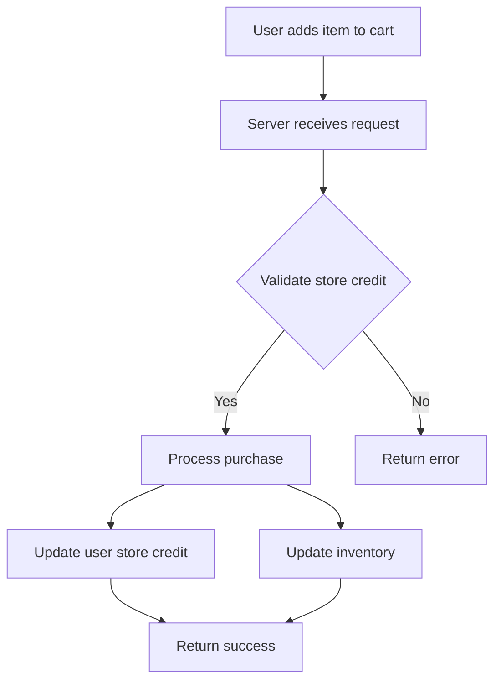

## Business Logic Vulnerabilities

Business logic vulnerabilities occur when the underlying business rules or workflows of an application are not properly enforced or validated. These vulnerabilities can lead to unauthorized actions, such as purchasing items without sufficient credit, manipulating financial transactions, or bypassing access controls. In this section, we will delve deep into insufficient workflow validation, a common type of business logic vulnerability, and explore how to identify, exploit, and defend against it.

### Understanding Business Logic

Business logic refers to the set of rules and processes that govern the behavior of an application. These rules define how data should be processed, how transactions should be handled, and how different components of the system interact with each other. For example, in an e-commerce application, business logic might include rules for calculating discounts, managing inventory, and processing payments.

#### Example: E-Commerce Application

Consider an e-commerce application where users can purchase items using store credit. The business logic might include the following rules:

1. **Store Credit Validation**: Before allowing a purchase, the application must verify that the user has sufficient store credit.
2. **Inventory Management**: The application must ensure that the requested item is available in stock.
3. **Transaction Processing**: After a successful purchase, the application must update the user's store credit and reduce the inventory count.

### Identifying Insufficient Workflow Validation

Insufficient workflow validation occurs when the application fails to enforce these business rules correctly. This can happen due to various reasons, such as:

- **Incomplete Validation**: The application may not check all necessary conditions before allowing a transaction.
- **Logical Flaws**: The application may contain logical errors that allow unauthorized actions.
- **Inconsistent State**: The application may fail to maintain consistent state across different operations.

#### Example: Store Credit Validation

Let's revisit the example from the lecture transcript. The application allows users to purchase items using store credit. The business logic should validate that the user has sufficient store credit before completing the purchase. However, if the application fails to enforce this rule correctly, an attacker can exploit this vulnerability.

### Exploiting Insufficient Workflow Validation

To exploit insufficient workflow validation, an attacker needs to understand the underlying business logic and identify the points where validation is weak or missing. In the given example, the attacker can manipulate the `storeCredit` parameter to bypass the validation.

#### Step-by-Step Exploitation

1. **Add Item to Cart**:
   - Add the desired item (e.g., leather jacket) to the cart.
   - Send the request to the server to add the item to the cart.

```http
POST /cart/add HTTP/1.1
Host: example.com
Content-Type: application/json

{
    "itemId": "leather-jacket",
    "quantity": 1
}
```

2. **Perform Purchase Request**:
   - Send a request to the server to complete the purchase.
   - Manipulate the `storeCredit` parameter to bypass the validation.

```http
POST /purchase HTTP/1.1
Host: example.com
Content-Type: application/json

{
    "itemId": "leather-jacket",
    "quantity": 1,
    "storeCredit": true
}
```

3. **Verify Exploit Success**:
   - Check if the purchase was successful despite insufficient store credit.
   - Verify that the application did not update the user's store credit or inventory correctly.

### Real-World Examples

#### Recent CVEs and Breaches

- **CVE-2021-3129**: A vulnerability in a financial application allowed attackers to bypass transaction limits by manipulating input parameters.
- **Breaches at Retailers**: Several retailers have been affected by business logic vulnerabilities that allowed attackers to purchase items without sufficient payment.

### How to Prevent / Defend

#### Detection

- **Static Analysis**: Use static analysis tools to identify potential logical flaws in the code.
- **Dynamic Analysis**: Perform dynamic analysis to simulate attacks and identify weaknesses in the business logic.
- **Logging and Monitoring**: Implement comprehensive logging and monitoring to detect suspicious activities and unauthorized actions.

#### Prevention

- **Complete Validation**: Ensure that all necessary conditions are checked before allowing a transaction.
- **Consistent State Management**: Maintain consistent state across different operations to prevent inconsistencies.
- **Secure Coding Practices**: Follow secure coding practices to avoid logical flaws and ensure proper validation.

#### Secure Code Fix

Here is an example of how to fix the vulnerability in the given scenario:

##### Vulnerable Code

```python
def process_purchase(item_id, quantity, store_credit):
    if store_credit:
        # Process the purchase
        return "Purchase successful"
    else:
        return "Insufficient store credit"
```

##### Fixed Code

```python
def process_purchase(item_id, quantity, store_credit):
    if store_credit and has_sufficient_store_credit(user_id):
        # Process the purchase
        update_user_store_credit(user_id, quantity)
        update_inventory(item_id, quantity)
        return "Purchase successful"
    else:
        return "Insufficient store credit"
```

### Complete Example

#### Full HTTP Request and Response

##### Request

```http
POST /purchase HTTP/1.1
Host: example.com
Content-Type: application/json

{
    "itemId": "leather-jacket",
    "quantity": 1,
    "storeCredit": true
}
```

##### Response

```http
HTTP/1.1 200 OK
Content-Type: application/json

{
    "message": "Purchase successful"
}
```

### Mermaid Diagrams

#### Business Flow Diagram



### Practice Labs

For hands-on practice with business logic vulnerabilities, consider the following labs:

- **PortSwigger Web Security Academy**: Offers exercises on business logic flaws and insufficient workflow validation.
- **OWASP Juice Shop**: Provides a vulnerable e-commerce application for testing and exploitation.
- **DVWA (Damn Vulnerable Web Application)**: Includes scenarios for testing business logic vulnerabilities.

By thoroughly understanding and practicing the identification, exploitation, and defense of business logic vulnerabilities, you can significantly enhance the security of web applications.

---
<!-- nav -->
[[02-Business Logic Vulnerabilities Insufficient Workflow Validation|Business Logic Vulnerabilities Insufficient Workflow Validation]] | [[Web Security (PortSwigger)/15-Business Logic Vulnerabilities/09-Lab 8 Insufficient workflow validation/00-Overview|Overview]] | [[Web Security (PortSwigger)/15-Business Logic Vulnerabilities/09-Lab 8 Insufficient workflow validation/04-Practice Questions & Answers|Practice Questions & Answers]]
