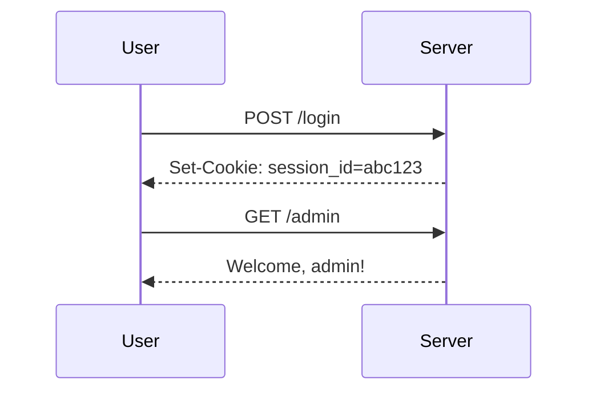
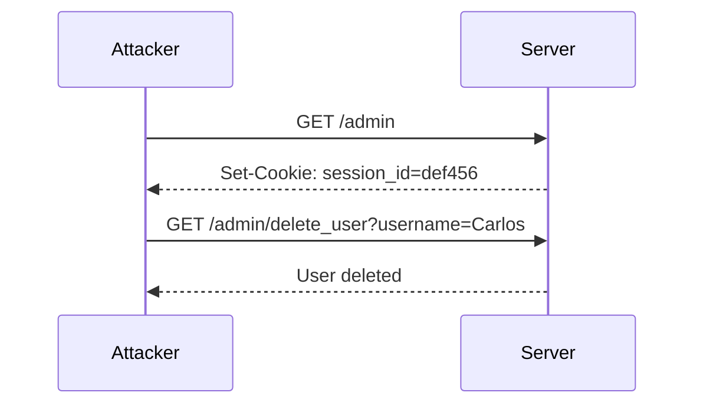

## Introduction to Business Logic Vulnerabilities

Business logic vulnerabilities occur when the application's core business rules are not properly enforced, leading to unintended behavior that can be exploited by attackers. These vulnerabilities often arise due to flawed assumptions about the sequence of events, improper validation of inputs, or inadequate enforcement of business rules. In this chapter, we will delve deep into a specific type of business logic vulnerability: **Authentication Bypass via Flawed State Machine**.

### What is a State Machine?

A state machine is a model of computation used to design algorithms and computer programs. It consists of a finite set of states, transitions between those states, and actions performed upon entering or exiting a state. In the context of web applications, state machines are often used to manage user sessions, authentication processes, and other critical workflows.

#### Why State Machines Matter

State machines are crucial because they help ensure that certain sequences of events occur in a specific order. For instance, in an authentication process, a user should first provide their credentials, then be authenticated, and finally gain access to protected resources. If the state machine is flawed, an attacker might be able to bypass certain steps and gain unauthorized access.

### Real-World Example: CVE-2021-3129

One real-world example of a business logic vulnerability involving a flawed state machine is CVE-2021-3129, which affected the Jenkins Continuous Integration server. The vulnerability allowed attackers to bypass authentication by manipulating the session state. Specifically, the issue arose because Jenkins did not properly enforce the state transitions required for authentication, allowing attackers to craft malicious requests that would be treated as valid sessions.

### Lab Setup: Authentication Bypass via Flawed State Machine

To understand and exploit this vulnerability, we will use the Web Security Academy provided by PortSwigger. The lab titled "Authentication Bypass via flawed state machine" is designed to demonstrate how a flawed state machine can be exploited to bypass authentication.

#### Accessing the Lab

1. **Sign Up**: If you do not have an account on the Web Security Academy, visit `https://portswigger.net/web-security` and click on the sign-up button.
2. **Log In**: Once you have an account, log in and navigate to the Academy section.
3. **Select Lab**: Search for "business logic vulnerabilities" and find lab number nine titled "Authentication Bypass via flawed state machine".

### Understanding the Lab Environment

The lab environment simulates a web application with a flawed state machine in its authentication process. The goal is to exploit this flaw to bypass authentication, access the admin interface, and delete the user named "Carlos".

#### Initial Setup

1. **Credentials**: The lab provides initial credentials to log into your own account. These credentials are essential for understanding the normal workflow and identifying potential flaws.

```plaintext
Username: your_username
Password: your_password
```

2. **Accessing the Lab**: Once logged in, you will see the built-in browser in Burp Suite, which will automatically intercept and display all HTTP requests and responses.

### Analyzing the Normal Workflow

Before attempting to exploit the vulnerability, it is crucial to understand the normal workflow of the authentication process.

#### Step-by-Step Analysis

1. **Login Request**: The first step is to send a login request with the provided credentials.

```http
POST /login HTTP/1.1
Host: vulnerable-app.example.com
Content-Type: application/x-www-form-urlencoded
Content-Length: 29

username=your_username&password=your_password
```

2. **Response**: Upon successful authentication, the server responds with a session cookie.

```http
HTTP/1.1 200 OK
Set-Cookie: session_id=abc123; Path=/; HttpOnly
Content-Type: text/html
```

3. **Access Protected Resources**: With the session cookie, you can now access protected resources, such as the admin interface.

```http
GET /admin HTTP/1.1
Host: vulnerable-app.example.com
Cookie: session_id=abc123
```

### Identifying the Flaw

The vulnerability arises because the state machine does not properly enforce the sequence of events required for authentication. Specifically, the server may accept certain requests without proper validation, allowing an attacker to bypass the authentication process.

#### Common Pitfalls

1. **Improper Session Management**: The server may not properly validate session cookies, allowing attackers to reuse or manipulate them.
2. **Inadequate Input Validation**: The server may not validate input parameters thoroughly, allowing attackers to inject malicious data.
3. **Flawed State Transitions**: The server may allow transitions between states that should not be possible, leading to unauthorized access.

### Exploiting the Vulnerability

To exploit the vulnerability, we need to identify and manipulate the flawed state transitions in the authentication process.

#### Step-by-Step Exploit

1. **Craft Malicious Request**: Identify a request that bypasses the normal authentication process. For example, you might try accessing the admin interface directly without providing credentials.

```http
GET /admin HTTP/1.1
Host: vulnerable-app.example.com
```

2. **Observe Response**: The server may respond with a session cookie or other indicators that the request was accepted.

```http
HTTP/1.1 200 OK
Set-Cookie: session_id=def456; Path=/; HttpOnly
Content-Type: text/html
```

3. **Access Protected Resources**: With the new session cookie, you can now access protected resources.

```http
GET /admin/delete_user?username=Carlos HTTP/1.1
Host: vulnerable-app.example.com
Cookie: session_id=def456
```

### How to Prevent / Defend

To prevent business logic vulnerabilities involving flawed state machines, several measures can be taken:

#### Secure Coding Practices

1. **Proper Session Management**: Ensure that session cookies are properly validated and managed. Use secure flags like `HttpOnly` and `Secure`.
2. **Input Validation**: Validate all input parameters thoroughly to prevent injection attacks.
3. **Enforce State Transitions**: Ensure that the state machine enforces proper transitions and does not allow unauthorized access.

#### Secure Configuration

1. **Session Timeout**: Configure session timeouts to invalidate idle sessions.
2. **Secure Headers**: Use secure headers like `Strict-Transport-Security` and `Content-Security-Policy`.

#### Detection and Monitoring

1. **Logging and Monitoring**: Implement logging and monitoring to detect unusual activity.
2. **Automated Scanning**: Use automated scanning tools to identify potential vulnerabilities.

### Complete Example

Let's walk through a complete example of the exploit and the corresponding secure fix.

#### Vulnerable Code

```python
# Vulnerable code snippet
def authenticate(username, password):
    if username == "admin" and password == "admin":
        return True
    return False

def handle_request(request):
    if request.path == "/admin":
        if authenticate(request.username, request.password):
            return "Welcome, admin!"
        else:
            return "Unauthorized"
```

#### Secure Code

```python
# Secure code snippet
def authenticate(username, password):
    if username == "admin" and password == "admin":
        return True
    return False

def handle_request(request):
    if request.path == "/admin":
        if request.session_id and validate_session(request.session_id):
            return "Welcome, admin!"
        elif authenticate(request.username, request.password):
            session_id = generate_session_id()
            set_cookie(session_id)
            return "Welcome, admin!"
        else:
            return "Unauthorized"
```

### Mermaid Diagrams

#### Normal Workflow



#### Exploit Workflow



### Conclusion

Business logic vulnerabilities involving flawed state machines can lead to serious security issues, including authentication bypass. By understanding the normal workflow, identifying potential flaws, and implementing secure coding practices, you can prevent such vulnerabilities and ensure the security of your web applications.

### Practice Labs

For hands-on practice, consider the following labs:

- **PortSwigger Web Security Academy**: Offers a variety of labs to practice exploiting and defending against business logic vulnerabilities.
- **OWASP Juice Shop**: Provides a vulnerable web application to practice various security techniques.
- **DVWA (Damn Vulnerable Web Application)**: A deliberately insecure web application for practicing penetration testing.

By mastering these concepts and practicing with real-world examples, you can significantly enhance your skills in web security.

---
<!-- nav -->
[[Web Security (PortSwigger)/15-Business Logic Vulnerabilities/10-Lab 9 Authentication bypass via flawed state machine/00-Overview|Overview]] | [[02-Business Logic Vulnerabilities Authentication Bypass via Flawed State Machine|Business Logic Vulnerabilities Authentication Bypass via Flawed State Machine]]
